# 1. The three planes (the single most important rule)

Image bytes **never** transit the JSON control plane, in either direction.

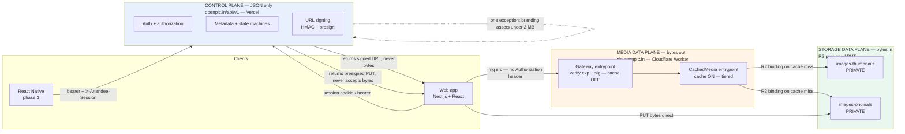

| Plane   | Host                | Carries         | Auth                                                                                 |
| ------- | ------------------- | --------------- | ------------------------------------------------------------------------------------ |
| Control | `openpic.in/api/v1` | JSON            | Better Auth session · bearer · attendee session · internal HMAC · provider signature |
| Media   | `pic.openpic.in`    | image bytes out | path-bound HMAC `?exp=&sig=`                                                         |
| Storage | R2 presigned        | image bytes in  | presigned S3 signature                                                               |

---

## 2. Full component map

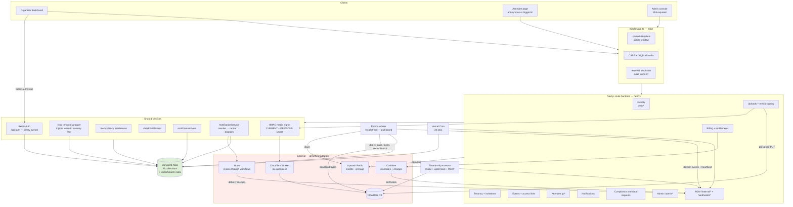

---

## 3. Every request goes through the same gauntlet

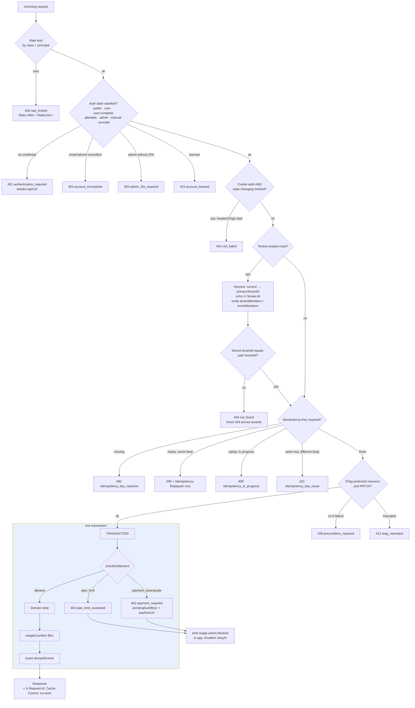

---

## 4. The product, end to end

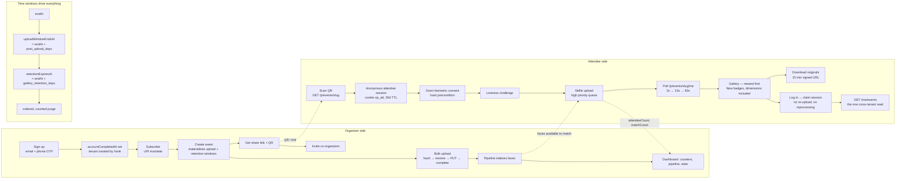

### Event timeline and the notifications each boundary fires

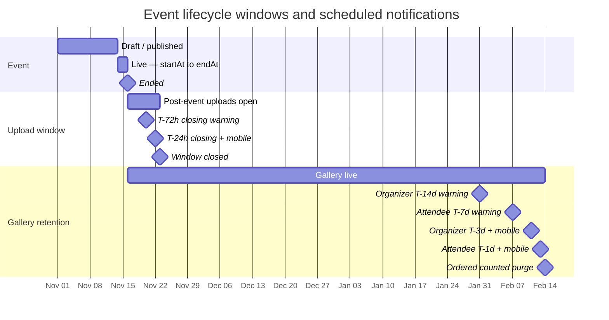

---

## 5. Tenancy, identity and authorization

<details open>
<summary><strong>Scope model — where every collection lives</strong></summary>

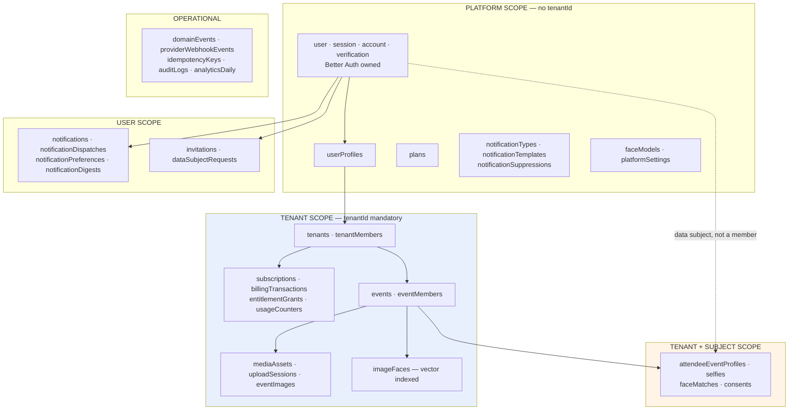

**Why `tenantId` and not `userId`:** a co-organizer's uploads must bill the organizer. With `tenantId` on the event, cost attribution is _a field in the document being written_, not a rule someone can forget.

</details>

<details>
<summary><strong>Authorization resolution — roles are re-read every request, never cached in the session</strong></summary>

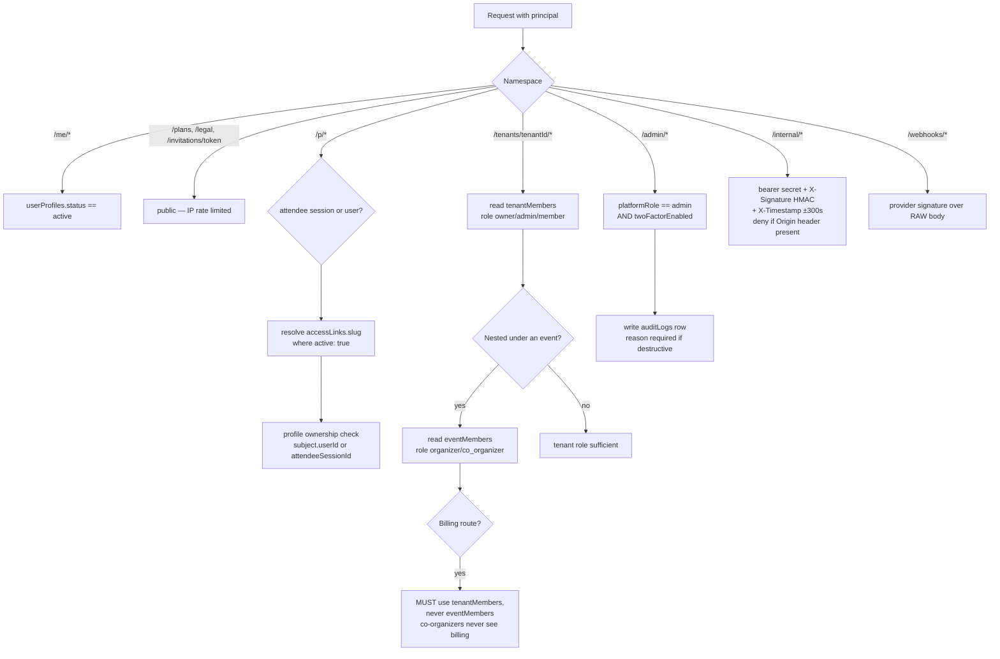

</details>

<details>
<summary><strong>Core data model — ER diagram</strong></summary>

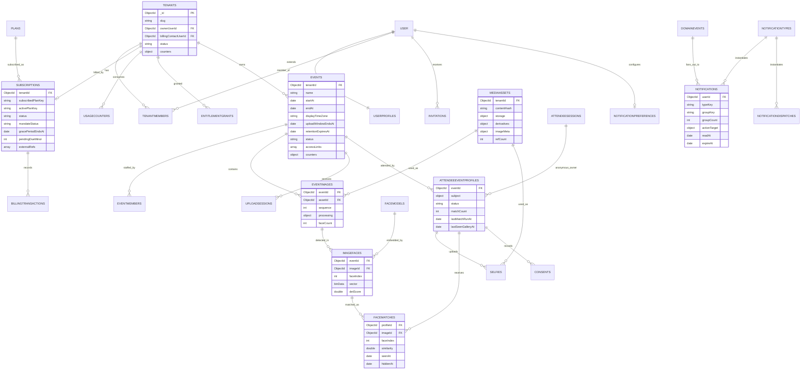

</details>

---

## 6. Upload pipeline — four phases, bytes bypass the server

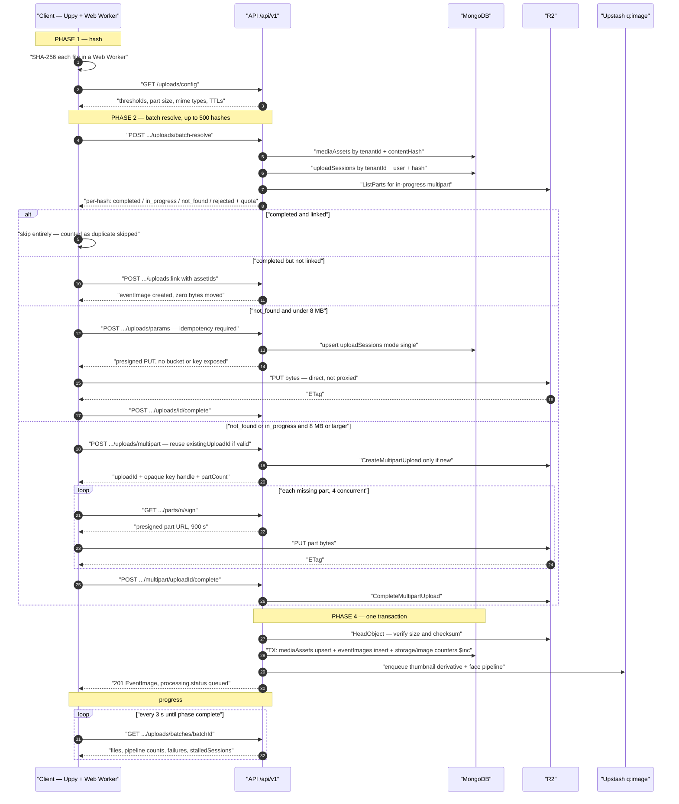

<details>
<summary><strong>Upload session and batch state machines</strong></summary>

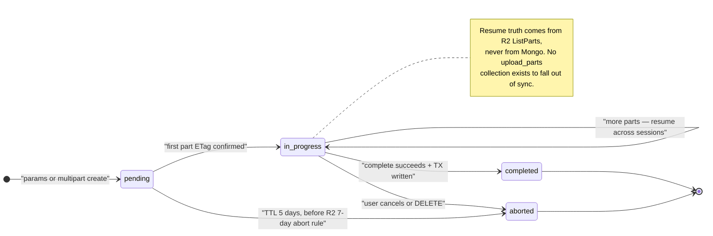

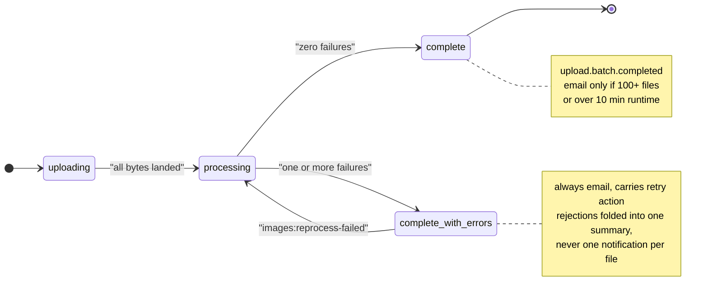

</details>

---

## 7. Face recognition — the vector search runs inside MongoDB

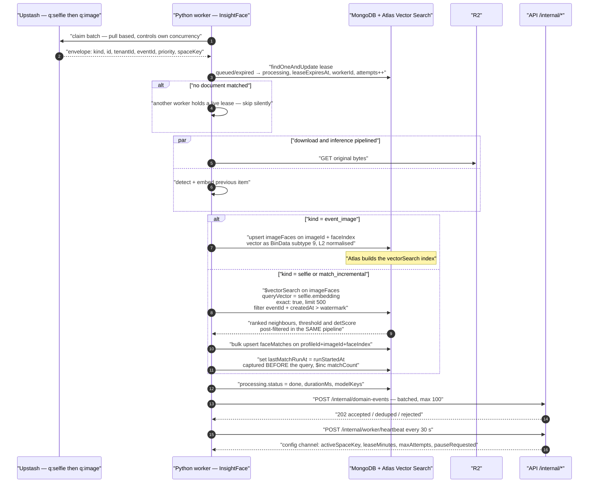

<details open>
<summary><strong>Why selfie → imageFaces and never the reverse</strong></summary>

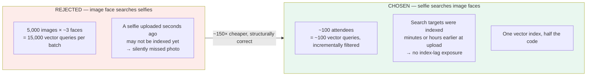

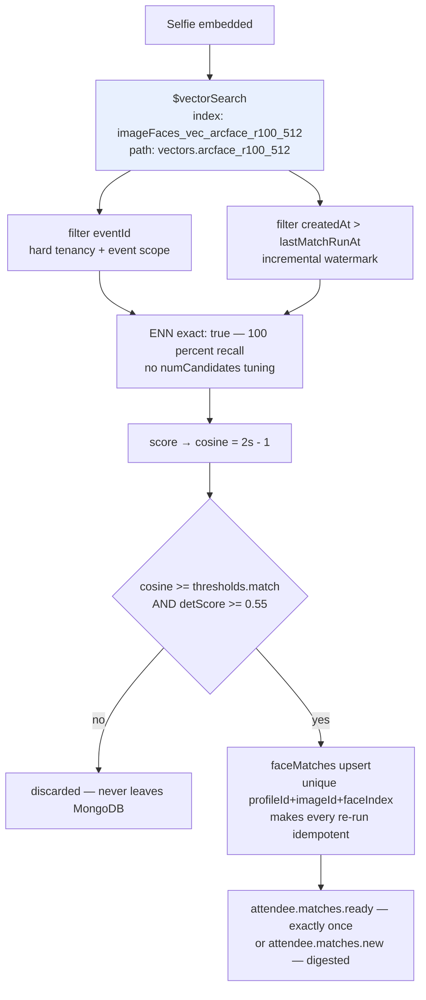

**Contract:** the worker receives **decisions, not candidate sets**. Loading vectors into Python to compare them is a contract violation.

</details>

<details>
<summary><strong>Processing state machine, leases and the sweep</strong></summary>

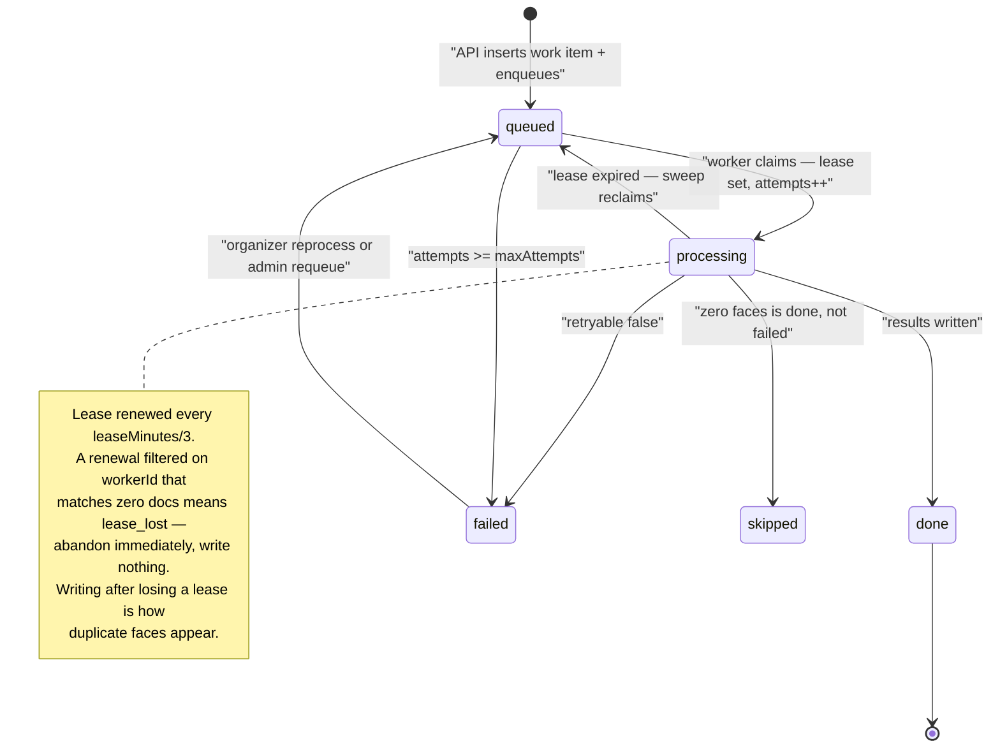

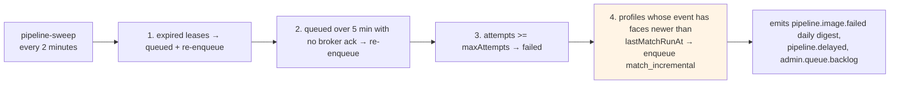

Step 4 is the entire mechanism behind `attendee.matches.new` — no scheduling collection, just an indexed query.

</details>

---

## 8. Attendee experience

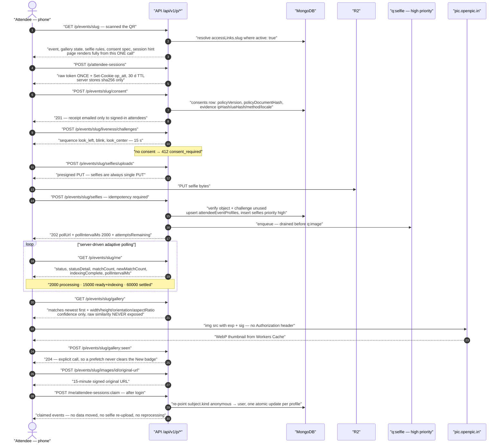

<details open>
<summary><strong>Participation status and polling cadence</strong></summary>

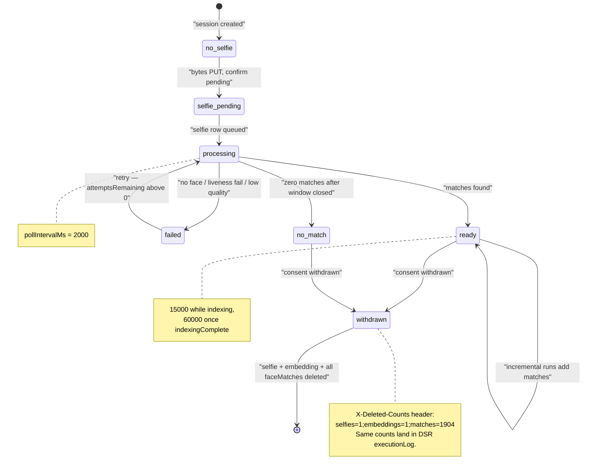

</details>

<details>
<summary><strong>Consent is a hard gate — no selfie endpoint is reachable without it</strong></summary>

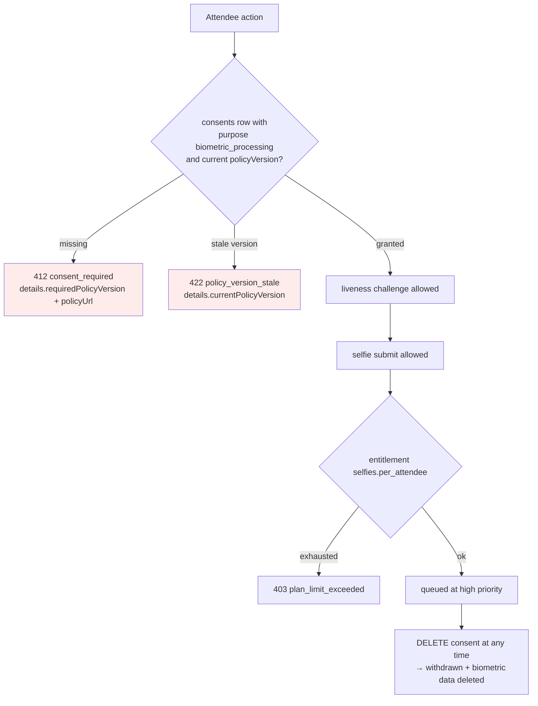

</details>

---

## 9. Billing and entitlements

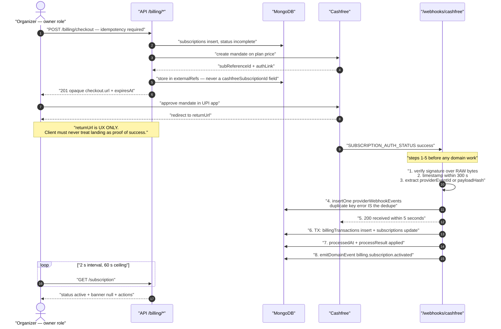

<details open>
<summary><strong>Subscription state machine — and the invariant that content is never deleted</strong></summary>

```mermaid
stateDiagram-v2
    [*] --> none: "tenant created — NO subscriptions document"
    none --> incomplete: "checkout, mandate created"
    incomplete --> active: "auth + first charge succeed"
    incomplete --> none: "abandoned, auth failed, link expired"
    active --> active: "renewal succeeds"
    active --> past_due: "charge failed or cancelled at bank"
    past_due --> active: "late payment inside 14-day grace"
    past_due --> downgraded: "grace elapsed, still unpaid"
    downgraded --> active: "dues cleared — SAME document, full history"
    active --> cancelled: "user cancels or provider reports cancellation"
    downgraded --> cancelled: "cancelled while downgraded"
    cancelled --> [*]

    note right of downgraded
      activePlanKey = "free"
      subscribedPlanKey unchanged
      pendingDueMinor retained
      NOTHING in events, mediaAssets,
      eventImages, imageFaces, faceMatches
      or selfies is touched. Ever.
    end note
    note right of past_due
      Paid entitlements still apply.
      banner.reassurance is MANDATORY:
      "Nothing has been deleted."
    end note
```

```mermaid
flowchart LR
    subgraph guard["Invariant C6 — enforced three ways"]
        G1["Structural<br/>billing collections hold ZERO<br/>references into media/event collections"]
        G2["Code rule<br/>dunning module may write only<br/>status, activePlanKey, statusHistory"]
        G3["Lint<br/>no-restricted-imports on the dunning module<br/>forbids events, eventImages, mediaAssets,<br/>imageFaces, faceMatches, selfies repos"]
        G4["Test<br/>run dunning against a tenant with content,<br/>assert zero writes outside subscriptions"]
    end
    guard --> R["402 blocks CREATION only.<br/>Read, list, gallery, download and export<br/>are unaffected by subscriptions.status.<br/>Any deviation is a P0 bug."]

    style guard fill:#e9f7ef
    style R fill:#dff0d8
```

</details>

<details open>
<summary><strong>Entitlement check — fully generic, zero plan-name branches</strong></summary>

```mermaid
flowchart TD
    A["checkEntitlement tenantId, key, amount"] --> B["read subscriptions → activePlanKey<br/>absent document = free"]
    B --> C["read plans.entitlements[key]"]
    C --> D{"spec exists?"}
    D -->|"no"| E["allowed — not gated"]
    D -->|"yes"| F{"enforcement"}
    F -->|"feature and limit null"| G{"enabled?"}
    G -->|"false"| G1["403 feature_not_available"]
    G -->|"true"| E
    F -->|"hard / soft / policy"| H["effectiveLimit =<br/>overrideLimit OR plan.limit + sum of active grants"]
    H --> I{"limit null?"}
    I -->|"yes"| E2["allowed — unlimited"]
    I -->|"no"| J["periodKey from resetPeriod<br/>monthly → YYYY-MM · yearly → YYYY · else lifetime"]
    J --> K["read usageCounters<br/>tenantId + entitlementKey + periodKey"]
    K --> L{"used + amount > limit?"}
    L -->|"no"| M["allowed, remaining returned"]
    L -->|"yes, status downgraded"| N["402 payment_required<br/>reason payment_downgrade<br/>pendingDueMinor + payNowUrl"]
    L -->|"yes, otherwise"| O["403 plan_limit_exceeded<br/>reason plan_limit + upgradePath"]
    N --> P["emit usage.action.blocked<br/>in-app only, throttled 1/key/h"]
    O --> P

    style E fill:#e9f7ef
    style E2 fill:#e9f7ef
    style M fill:#e9f7ef
    style N fill:#fdecea
    style O fill:#fdecea
```

Adding a new limit is a **data edit in `plans.entitlements` with zero code change**. Clients render unknown keys generically from `display` — never a hard-coded key list.

</details>

<details>
<summary><strong>Dunning and the grace clock</strong></summary>

```mermaid
sequenceDiagram
    autonumber
    participant CF as "Cashfree"
    participant WH as "Webhook handler"
    participant M as "MongoDB"
    participant CR as "Cron — dunning + reminders"
    participant N as "Notification fan-out"

    CF->>WH: "SUBSCRIPTION_PAYMENT_FAILED"
    WH->>M: "TX: transaction failed with failure.category<br/>status past_due<br/>gracePeriodEndsAt = now + platformSettings.dunning.gracePeriodDays<br/>pendingDueMinor = price, dunning.attemptCount++"
    WH->>N: "billing.payment.failed — in_app + email + MOBILE"
    Note over N: "highest-value mobile message in the product<br/>it starts the 14-day clock"

    loop "grace days 1, 5, 7, 11, 13 — 4x daily cron"
        CR->>M: "reminderDays from platformSettings<br/>remindersSent[] makes it idempotent"
        CR->>N: "billing.grace.reminder — mobile ONLY on day 13"
    end

    alt "user pays inside grace"
        CF->>WH: "SUBSCRIPTION_PAYMENT_SUCCESS"
        WH->>M: "status active, pendingDueMinor 0, gracePeriodEndsAt null, dunning reset"
        WH->>N: "billing.subscription.reactivated + usage.limit.restored"
    else "grace elapses"
        CR->>M: "findOneAndUpdate past_due AND gracePeriodEndsAt < now<br/>→ downgraded, activePlanKey free, append statusHistory<br/>WRITES NOTHING ELSE, EVER"
        CR->>N: "billing.subscription.downgraded<br/>must state: nothing has been deleted"
    end
```

</details>

---

## 10. Notifications — one source of truth, Novu holds nothing

```mermaid
flowchart LR
    subgraph ours["OURS — the only source of truth"]
        BIZ["Business code<br/>calls emitDomainEvent ONCE"]
        DE[("domainEvents<br/>outbox + business log")]
        NT["notificationTypes<br/>81 keys — the routing matrix AS DATA"]
        NP["notificationPreferences<br/>global / byType / byEvent / quietHours / digest"]
        SUP["notificationSuppressions<br/>bounce, complaint, unsubscribe, DND"]
        TPL["notificationTemplates<br/>per typeKey × channel × locale"]
        RES["resolveChannel<br/>PURE function — zero network"]
        FEED[("notifications<br/>in-app feed")]
        DISP[("notificationDispatches<br/>ledger INCLUDING skips")]
        DIG[("notificationDigests<br/>open buckets awaiting flush")]
    end
    subgraph transport["Transport adapter — swappable"]
        MT["MessageTransport.send<br/>fully rendered by us"]
        NOVU["Novu<br/>transport-email · transport-sms · transport-whatsapp<br/>ONE step each, pure pass-through"]
    end

    BIZ --> DE
    DE -->|"dispatch.notifications pending"| RES
    NT --> RES
    NP --> RES
    SUP --> RES
    RES -->|"in_app"| FEED
    RES -->|"email / sms / whatsapp"| TPL
    TPL --> MT
    MT --> NOVU
    RES -->|"every decision, including skips"| DISP
    RES -->|"digest strategy"| DIG
    DIG -->|"flush cron"| MT
    NOVU -->|"delivery + bounce receipts"| DISP
    DE -->|"dispatch.analytics pending"| AN[("analyticsDaily")]
    DE -->|"dispatch.queue pending"| Q["Upstash"]

    style ours fill:#e8f0fe
    style NOVU fill:#fdecea
```

**Zero drift is structural:** Novu knows nothing about the 81 types, the channel routing, the copy, the locales, the digests, the preferences, the quiet hours or the throttles. There is nothing in Novu that _can_ disagree. A CI assertion fails the build unless exactly three workflows exist with one step each.

<details open>
<summary><strong>Channel resolution — the pure function every send passes through</strong></summary>

```mermaid
flowchart TD
    A["fan-out: recipient × typeKey"] --> B{"type enabled?"}
    B -->|"no"| Z1["skip: type_disabled"]
    B -->|"yes"| C["read type.channelGroups"]
    C --> D{"transactional?"}
    D -->|"yes"| G["ignore user preference entirely"]
    D -->|"no"| E{"preference off?<br/>precedence: byEvent > byType > global > default"}
    E -->|"yes"| Z2["skip: user_opt_out"]
    E -->|"no"| G
    G --> H["first eligible candidate in group order<br/>mobile = whatsapp then sms"]
    H --> I{"verified contact exists?"}
    I -->|"no"| J["next candidate"]
    J --> K{"any candidates left?"}
    K -->|"yes"| I
    K -->|"no"| Z3["skip: no_verified_contact"]
    I -->|"yes"| L{"contact suppressed?"}
    L -->|"yes"| J
    L -->|"no"| M{"throttle budget?"}
    M -->|"digest strategy"| Z4["accumulate in notificationDigests"]
    M -->|"over rate limit"| Z5["skip: throttled"]
    M -->|"dedupeKey exists"| Z6["skip: deduped<br/>enforced by UNIQUE INDEX, not code"]
    M -->|"ok"| N{"quiet hours AND severity not critical?"}
    N -->|"yes"| O["defer — skipReason quiet_hours_deferred"]
    N -->|"no"| P["insert notificationDispatches: queued"]
    O --> P

    Z1 --> W[("EVERY skip is persisted.<br/>'Why didn't my co-organizer get the invite?'<br/>is answerable from MongoDB alone,<br/>without opening a provider dashboard.")]
    Z2 --> W
    Z3 --> W
    Z5 --> W
    Z6 --> W

    style W fill:#dff0d8
```

</details>

<details open>
<summary><strong>Cross-channel action idempotency — the hardest requirement, solved without locks</strong></summary>

```mermaid
stateDiagram-v2
    [*] --> pending: "organizer invites"
    pending --> accepted: "accept via in_app OR email OR sms OR api"
    pending --> rejected: "reject via any channel"
    pending --> revoked: "organizer revokes or removes member"
    pending --> expired: "TTL reached"
    accepted --> revoked: "organizer removes member later"
    accepted --> [*]
    rejected --> [*]
    revoked --> [*]
    expired --> [*]

    note right of pending
      Terminal transition = ONE conditional
      findOneAndUpdate with status "pending"
      AND expiresAt greater than now in the filter.
      Second attempt matches 0 docs →
      read current state, return HTTP 200.
      NEVER 409.
    end note
    note right of revoked
      Acceptance is structurally impossible:
      the filter can never match.
      No permission check to forget.
    end note
```

```mermaid
sequenceDiagram
    autonumber
    actor I as "Invitee"
    participant A as "API"
    participant M as "MongoDB"

    Note over I: "clicks the email link"
    I->>A: "POST /invitations/token/accept"
    A->>M: "findOneAndUpdate on tokenHash<br/>filter status pending + not expired"
    M-->>A: "matched → accepted, resolvedVia email"
    A->>M: "TX: eventMembers insert"
    A->>M: "notifications.updateMany on actionTarget<br/>actions.$[].state = unavailable<br/>actionTarget.state = resolved"
    A-->>I: "200 alreadyResolved false + redirectUrl"

    Note over I: "later, clicks Accept in the in-app feed"
    I->>A: "POST /me/notifications/id/actions/accept"
    A->>M: "same conditional update"
    M-->>A: "matched 0 documents"
    A->>M: "read current state"
    A-->>I: "200 outcome already_resolved,<br/>alreadyResolved true, resolvedVia email<br/>UI renders 'Already accepted' — not an error toast"

    Note over A: "The notification OWNS NO STATE.<br/>It is a pointer; invitations is the source of truth.<br/>410 only for revoked/expired, where the<br/>affordance should disappear, not report success."
```

</details>

<details>
<summary><strong>In-app feed mechanics — aggregation, rendering, polling</strong></summary>

```mermaid
flowchart TD
    A["attendee.matches.new arrives"] --> B["findOneAndUpdate upsert<br/>filter: userId, typeKey, groupKey, readAt NULL"]
    B --> C["$inc groupCount<br/>$set updatedAt → feed re-sorts"]
    C --> D{"user reads the row?"}
    D -->|"yes"| E["readAt set — next arrival starts a FRESH row<br/>so the unread badge never under-counts"]
    D -->|"no"| B

    F["title and body are PRE-RENDERED at write time"] --> G["client displays VERBATIM<br/>must NOT re-render from typeKey + data"]
    G --> H["a notification says what it said when sent,<br/>even if the template changed since"]

    I["Unknown typeKey / category / severity"] --> J["render generically from title/body/severity<br/>new types ship with NO client deploy"]

    K["OTP types"] --> L["in_app false at catalogue level<br/>retainBody false on dispatch<br/>codes never enter a durable, session-readable feed"]

    style L fill:#fdecea
```

```mermaid
flowchart LR
    A["Bell badge"] -->|"GET /me/notifications/unread-count<br/>every 30 s, honour pollIntervalSeconds"| B["countDocuments against<br/>idx_user_unread PARTIAL index<br/>where readAt: null"]
    B --> C["ETag: unreadCount-severity-epoch"]
    C --> D{"If-None-Match matched?"}
    D -->|"yes"| E["304 — no change, no re-render"]
    D -->|"no"| F["200 unreadCount, byCategory, highestSeverity"]
    G["tab hidden"] -->|"MUST pause"| A
    H["Panel opened"] -->|"GET /me/notifications every 15 s"| I["cursor feed, 20 per page"]

    style B fill:#dff0d8
```

</details>

<details>
<summary><strong>The 81-key catalogue, by category</strong></summary>

```mermaid
pie showData
    title "81 notification typeKeys across 10 categories"
    "billing" : 16
    "event" : 11
    "authentication" : 9
    "matching" : 9
    "collaboration" : 8
    "pipeline" : 8
    "platform_ops" : 7
    "account" : 5
    "usage" : 4
    "compliance" : 4
```

Channel budget: **in_app 92 percent · email 80 percent · mobile 23 percent**. Mobile is rationed to money, access and secrets — a deliverability decision as much as a cost one, because users who get frequent transactional SMS start blocking them, which breaks OTP.

</details>

---

## 11. Media delivery — signed capability, cached bytes

```mermaid
sequenceDiagram
    autonumber
    participant B as "Browser"
    participant N as "Next.js — control plane"
    participant G as "Worker Gateway — cache OFF"
    participant CM as "CachedMedia entrypoint — cache ON"
    participant WC as "Workers Cache — tiered"
    participant R as "Private R2"

    B->>N: "GET gallery or POST /media/signed-urls"
    N->>N: "authorize PER ITEM<br/>thumbnail: event member OR attendee with a faceMatch<br/>original: member with originals.download OR matched attendee"
    N->>N: "sign: base64url HMAC-SHA256 of METHOD + PATH + EXPIRY"
    N-->>B: "urls[] + denied[] — whole request still 200<br/>403 only if EVERY item is denied"
    Note over N: "thumbnails 24 h · originals 15 min. Never invert."

    B->>G: "GET /t/sha256.webp?exp=...&sig=...<br/>plain img src, NO Authorization header"
    G->>G: "validate method, path shape, expiry, HMAC over exact path"
    alt "invalid or expired"
        G-->>B: "403 → client calls /media/signed-urls once, retries ONCE<br/>never retry-loop on 403"
    else "valid"
        G->>G: "strip exp and sig → canonical cache key = pathname"
        G->>CM: "ctx.exports.CachedMedia.fetch"
        CM->>WC: "cache lookup"
        alt "HIT"
            WC-->>B: "cached WebP — CachedMedia never executes"
        else "MISS"
            CM->>R: "R2 binding get"
            R-->>CM: "bytes"
            CM->>WC: "store with Cloudflare-CDN-Cache-Control<br/>thumbnails 31 d · originals 7 d + Cache-Tag"
            WC-->>B: "200 image/webp"
        end
    end
```

```mermaid
flowchart LR
    subgraph key["Why the token is stripped from the cache key"]
        A["User A: /t/abc.webp?exp=1000&sig=AAA"]
        B["User B: /t/abc.webp?exp=2000&sig=BBB"]
        C["User C: /t/abc.webp?exp=3000&sig=CCC"]
        A --> D["canonical /t/abc.webp"]
        B --> D
        C --> D
        D --> E["ONE cache object<br/>Clients must not treat the URL as identity —<br/>imageId + contentHash are the identity"]
    end
    subgraph sig["Why the signature is per path"]
        S["one shared secret"] --> S1["sig for /t/A.webp"]
        S --> S2["sig for /t/B.webp"]
        S --> S3["sig for /o/C.jpg"]
        S1 --> S4["swapping A for B while keeping A's sig<br/>→ recomputed HMAC mismatches → 403.<br/>This is the defence against key guessing."]
    end

    style E fill:#dff0d8
    style S4 fill:#dff0d8
```

---

## 12. Machine-to-machine

<details open>
<summary><strong>Webhook inbox — the 8 steps, no reordering permitted</strong></summary>

```mermaid
flowchart TD
    A["POST /webhooks/provider"] --> B["1. verify signature over the RAW body<br/>never the parsed body — JSON re-serialisation breaks HMAC"]
    B -->|"invalid"| B1["401 invalid_signature — NO write"]
    B --> C["2. timestamp within 300 s"]
    C -->|"stale"| C1["401 stale_signature"]
    C --> D["3. extract providerEventId,<br/>else payloadHash = sha256 rawBody"]
    D --> E["4. insertOne providerWebhookEvents<br/>with provider, env, eventType, rawPayload"]
    E -->|"duplicate key error"| E1["200 duplicate_ignored — do nothing else.<br/>THE UNIQUE INDEX IS THE DEDUPE.<br/>No application-level 'have I seen this?' check."]
    E --> F["5. respond 200 within 5 SECONDS,<br/>before any projection work"]
    F --> G["6. project AFTER responding —<br/>TRANSACTION: billingTransactions + subscriptions<br/>money and access move together"]
    G --> H["7. set processedAt + processResult<br/>applied / ignored / error"]
    H -->|"failure leaves processedAt null"| H1["webhook-projection-sweep retries every 5 min<br/>never a non-200 to the provider"]
    H --> I["8. emitDomainEvent for every state change.<br/>The handler NEVER calls the notification service."]
    G -->|"env mismatch"| J["422 env_mismatch, processResult ignored<br/>a sandbox event must never touch production"]

    style E1 fill:#dff0d8
    style F fill:#fff4e5
```

</details>

<details open>
<summary><strong>Cron — 24 idempotent, bounded, concurrency-safe jobs</strong></summary>

```mermaid
flowchart LR
    subgraph fast["Every 2–5 minutes"]
        A1["pipeline-sweep — 4 steps"]
        A2["webhook-projection-sweep"]
        A3["pipeline-indexed-check"]
        A4["notification-digest-flush"]
        A5["notification-dispatch-retry"]
    end
    subgraph qh["Every 15 min / hourly"]
        B1["quiet-hours-release"]
        B2["dunning"]
        B3["scheduled-plan-changes"]
        B4["upload-session-sweep"]
        B5["event-window-sweep"]
        B6["usage-threshold-check — LATCHED per threshold per period"]
        B7["invitation-expiry + reminder"]
        B8["verification-nudge — max 2 EVER"]
        B9["attendee-no-match-check"]
    end
    subgraph day["4x daily / every 4 h / daily"]
        C1["dunning-reminders — days 1,5,7,11,13"]
        C2["billing-reconcile — the webhook-miss safety net"]
        C3["renewal-reminders — T-3d"]
        C4["retention-warnings — T-14/7/3/1d"]
        C5["retention-purge — ordered, counted, NEVER a TTL"]
        C6["account-deletion-purge"]
        C7["dsr-sla-check"]
        C8["analytics-rollup 02:00 IST"]
        C9["counter-reconcile 02:30 IST"]
        C10["tenant-isolation-audit"]
    end

    R["Mandatory rules for every job"] --> R1["1. conditional single-document updates only —<br/>expected prior state in the filter, never read-then-write"]
    R --> R2["2. bounded work — ?limit= and returns hasMore,<br/>completes inside the Vercel timeout"]
    R --> R3["3. NEVER emit notifications inline —<br/>write domainEvents, the fan-out consumer delivers"]
    R --> R4["4. structured result body: scanned, affected,<br/>skipped, errors, hasMore, details"]

    style C5 fill:#fdecea
    style R fill:#e8f0fe
```

</details>

<details>
<summary><strong>Queue envelope — the broker is transport only</strong></summary>

```mermaid
flowchart LR
    A["Upstash Redis"] --> B["q:selfie — HIGH<br/>drained strictly first"]
    A --> C["q:image — NORMAL"]
    B --> D["an attendee is staring at a spinner"]
    C --> E["an organizer's batch can wait"]

    F["Envelope = a POINTER, never state"] --> G["v, kind, id, tenantId, eventId,<br/>priority, spaceKey, enqueuedAt, attempt, traceId"]
    G --> H["All state is re-read from MongoDB at claim time,<br/>so a message sitting for an hour is never stale"]
    G --> I["spaceKey differs from worker config<br/>→ re-read config before processing<br/>mid-flight model promotion"]
    J["Broker message id lives ONLY in<br/>processing.queueRef.messageId"] --> K["Upstash → SQS = queueRef.provider<br/>plus one adapter. ZERO schema change."]
    L["A lost broker message is a non-event"] --> M["MongoDB holds durable job state;<br/>the sweep re-enqueues anything queued<br/>past its ack window"]

    style H fill:#dff0d8
    style M fill:#dff0d8
```

</details>

---

## 13. Compliance, admin and operations

<details open>
<summary><strong>Data subject requests — deletion becomes evidence</strong></summary>

```mermaid
sequenceDiagram
    autonumber
    actor S as "Data subject — user or attendee"
    participant A as "API"
    participant M as "MongoDB"
    participant AD as "Admin"

    S->>A: "POST /me/data-requests — idempotency required, 5/day"
    A->>M: "dataSubjectRequests: requestType, regulation gdpr/dpdpa,<br/>scope, slaDueAt"
    A-->>S: "202 acknowledgement with the statutory SLA date"
    A->>M: "emit privacy.dsr.received"

    Note over M: "within 48 h of slaDueAt → admin.dsr.sla_risk"
    AD->>A: "POST /admin/data-requests/id/execute"

    rect rgb(232, 240, 254)
        Note over A,M: "Bounded, COUNTED purge — vectors live only on<br/>imageFaces and selfies, both carrying<br/>tenantId + eventId + subject refs"
        A->>M: "deleteMany faceEmbeddings → count 412"
        A->>M: "deleteMany faceMatches → count 1904"
        A->>M: "deleteMany selfies → count 3"
        A->>M: "delete storageObjects → count 3"
    end

    A->>M: "append each step to executionLog with count + timestamp"
    A-->>S: "GET /me/data-requests/id → executionLog is THE EVIDENCE"
    A->>M: "emit privacy.erasure.completed — EMAIL ONLY,<br/>in-app may no longer exist"

    Note over A: "access / portability instead produce export:<br/>short-lived signed URL, capped downloadsRemaining"
```

</details>

<details>
<summary><strong>Admin surface and the deliverability forensics screen</strong></summary>

```mermaid
flowchart TD
    A["Admin — platformRole admin AND 2FA"] --> B["every POST/PATCH/DELETE writes auditLogs<br/>actor ipHash/uaHash, action, target, before, after, reason"]
    B --> C{"destructive or financially material?"}
    C -->|"yes, no reason"| C1["422 reason_required"]

    A --> D["Tenants and users<br/>NOTE: tenants.status is NOT subscriptions.status.<br/>Suspension = abuse. Downgrade = billing.<br/>Separate controls."]
    A --> E["Plans — If-Match, version bump,<br/>amounts IMMUTABLE, plans NEVER deleted"]
    A --> F["Notification catalogue —<br/>/impact is a MANDATORY read before a routing change"]
    A --> G["Dispatch forensics<br/>filter by userId, typeKey, channel, status, skipReason"]
    A --> H["Queue and pipeline health — poll 30 s"]
    A --> I["Billing ops — PATCH restricted;<br/>touching an event/media field → 422 forbidden_field.<br/>C6 as a request validator."]
    A --> J["Face model promotion —<br/>flips platformSettings.face.activeSpaceKey,<br/>requires backfill coverage >= 99.9 percent"]
    A --> K["Audit logs — READ ONLY.<br/>No write, update or delete endpoint exists, by design."]

    G --> L["'Why didn't my co-organizer get the invite?'<br/>answered from MongoDB alone.<br/>This endpoint is the entire justification<br/>for persisting skips."]

    style L fill:#dff0d8
    style I fill:#fff4e5
```

</details>

<details>
<summary><strong>Model swap — zero downtime, zero schema change</strong></summary>

```mermaid
flowchart LR
    A["1. insert faceModels row<br/>status shadow, NEW spaceKey + vectorPath"] --> B["2. create the second Atlas vector index<br/>on the new path"]
    B --> C["3. backfill — worker writes<br/>vectors.newSpace ALONGSIDE vectors.oldSpace"]
    C --> D["4. evaluate both spaces on a labelled set,<br/>compare precision and recall"]
    D --> E["5. flip platformSettings.face.activeSpaceKey<br/>THE ONLY PRODUCTION SWITCH"]
    E --> F["worker learns via heartbeat response —<br/>no redeploy"]
    F --> G["6. after a hold period: $unset the old path,<br/>drop the old index, mark retired"]

    H["Thresholds live in faceModels.thresholds<br/>and are applied in the AGGREGATION PIPELINE"] --> I["changing a threshold must NEVER<br/>require an index rebuild"]

    style E fill:#dff0d8
    style I fill:#dff0d8
```

</details>

---

## 14. Polling is the transport, and the server owns its cadence

There is no realtime transport — Vercel means no long-lived connections.

```mermaid
flowchart LR
    subgraph surfaces["Poll cadence — server-driven where a field exists"]
        A["Notification badge<br/>30 s · pollIntervalSeconds"]
        B["Notification panel open<br/>15 s"]
        C["Attendee status processing<br/>2 s · pollIntervalMs"]
        D["Attendee status ready+indexing<br/>15 s · pollIntervalMs"]
        E["Attendee status settled<br/>60 s · pollIntervalMs"]
        F["Upload batch<br/>3 s until phase complete"]
        G["Event pipeline<br/>10 s until indexed"]
        H["Checkout return<br/>2 s, 60 s ceiling"]
        I["Download job<br/>3 s · pollIntervalMs"]
        J["Admin pipeline health<br/>30 s"]
    end

    subgraph rules["Mandatory client behaviour"]
        R1["pause when visibilityState is not visible"]
        R2["honour the server interval —<br/>hard-coded intervals are a contract violation"]
        R3["exponential backoff on 5xx, x2 to 5 min, reset on success"]
        R4["on 429 obey Retry-After EXACTLY"]
        R5["If-None-Match on unread-count, 304 = no re-render"]
        R6["ONE shared poller per surface per tab"]
    end

    surfaces --> rules
    rules --> F1["A future SSE/Pusher transport changes only<br/>HOW the client learns to refetch.<br/>Endpoints, indexes, DTOs and components<br/>stay identical. Do not design around WebSockets."]

    style F1 fill:#dff0d8
```

```mermaid
flowchart TD
    A["Cache-Control by endpoint"] --> B["GET /plans → public, max-age=300 + ETag"]
    A --> C["GET /legal/policies/current → public, max-age=3600"]
    A --> D["GET /notification-types → private, max-age=600"]
    A --> E["GET /uploads/config → private, max-age=300"]
    A --> F["GET /p/events/slug → private, max-age=30"]
    A --> G["EVERYTHING ELSE → no-store"]
    A --> H["pic.openpic.in/t/* → CDN 31 d, browser 1 h"]
    A --> I["pic.openpic.in/o/* → CDN 7 d, browser 5 min"]

    style G fill:#fff4e5
```

---

## 15. The seams that make every vendor swappable

```mermaid
flowchart TB
    subgraph rule["One rule: no vendor name in any field name"]
        A["externalRefs: provider, env, kind, id, meta, linkedAt"]
        B["storage.locationKey → resolved by config to bucket/region"]
        C["processing.queueRef.provider + messageId"]
        D["notificationDispatches.providerRef"]
        E["plans.prices[].externalRefs — the ONLY place a payment vendor appears"]
    end

    subgraph swaps["Adapter-only swaps"]
        S1["Cashfree → any PSP<br/>createMandate, chargeOnce, cancelMandate,<br/>fetchStatus, verifyWebhook,<br/>normalizeStatus, normalizeFailureCategory"]
        S2["Novu → SendGrid + Twilio + Meta<br/>MessageTransport.send — ONE method.<br/>Suppressions already first-party."]
        S3["Upstash → SQS<br/>enqueue, claim, ack, nack"]
        S4["R2 → S3<br/>flip the locationKey map, copy objects.<br/>Not one of millions of mediaAssets docs changes."]
        S5["InsightFace variant → anything<br/>new spaceKey, dual-write, flip activeSpaceKey"]
    end

    rule --> swaps
    swaps --> Z["Schema changes required: ZERO, in all five cases.<br/>Both providers can legitimately coexist during a migration<br/>because nothing ever selects externalRefs[0]."]

    style Z fill:#dff0d8
```

---

## 16. What the whole system guarantees

```mermaid
mindmap
  root(("OpenPic<br/>invariants"))
    Never destroy
      ::icon(fa fa-shield)
      Billing state never deletes, hides or degrades content
      402 blocks creation only
      Reads, gallery, download, export unaffected by subscription status
      Dunning writes only status, activePlanKey, statusHistory
      Retention purge is user-visible, warned, ordered and counted
      Only one content-destroying endpoint exists, and it is user-initiated
    Never leak
      Face vectors returned by no endpoint, to no caller, ever
      Raw tokens issued exactly once, sha256 at rest
      Cross-tenant reads: exactly ONE whitelisted path
      Nested resource in another tenant returns 404, never 403
      Another user's full contact is always masked
      Raw similarity scores never reach attendees
    Never drift
      Routing lives only in notificationTypes
      Novu holds no templates, routing, preferences or digests
      CI asserts exactly 3 transport workflows, 1 step each
      Every number read from platformSettings, none hard-coded
      Plan limits are data, so a new limit is a data edit
    Never double-apply
      Unique indexes ARE the dedupe, not application checks
      Terminal transitions are one conditional findOneAndUpdate
      Repeated action returns 200, never 409
      Match upserts idempotent on profileId+imageId+faceIndex
      Webhook replay fails to insert and returns 200
    Never lose work
      MongoDB is job truth, the broker is transport
      Leases plus a 2-minute sweep recover any crash
      Abandon on lease_lost, write nothing
      Watermark set to runStartedAt, captured before the query
      Outbox means a notification failure cannot block analytics
```

---

### How to read this set

1. **Diagrams 1–4** are the system. If you only read those, you know what OpenPic is and how a request moves through it.
2. **Sections 5–9** are the four domains that carry real complexity: tenancy, uploads, faces, billing.
3. **Sections 10–12** are the machinery most likely to surprise you: notifications hold no state, webhooks respond before projecting, cron is idempotent and bounded.
4. **Sections 13–16** are the operational and non-functional guarantees — what you must not break.
