# OpenPic — Notification Design & MongoDB Schema Design

**Version:** 2.0 (final)
**Date:** 2026-09-24
**Product:** Event photo-recognition platform. Organizers upload event photos; attendees upload a selfie and receive their own photos.
**Stack:** Next.js (App Router, Vercel) · Better Auth · MongoDB Atlas (+ Atlas Vector Search) · Python worker (InsightFace) · Cloudflare R2 + Worker · Upstash (queue transport) · Novu (message transport) · Cashfree (payment provider)

---

## Hard constraints this design is built around

| #   | Constraint                                                                                                                                                                                 | How it is satisfied                                                                                                                                                                                                                            |
| --- | ------------------------------------------------------------------------------------------------------------------------------------------------------------------------------------------ | ---------------------------------------------------------------------------------------------------------------------------------------------------------------------------------------------------------------------------------------------- |
| C1  | **The schema must not hinge on a specific vendor.** Field names must survive swapping Cashfree → Razorpay, Novu → SendGrid+Twilio, R2 → S3, Upstash → SQS, with adapter-only code changes. | No vendor name appears in any field name. All external identity is confined to a uniform `externalRefs: [{provider, env, kind, id}]` array (§11.1). All physical storage/queue coordinates are behind logical keys resolved by config (§11.2). |
| C2  | **Zero drift between "which channel applies to which notification" and Novu.**                                                                                                             | Novu is given **no** routing knowledge and **no** templates. Three single-step transport workflows only. There is nothing in Novu that _can_ drift (§8).                                                                                       |
| C3  | **Vector search runs inside MongoDB, not in the worker**, on BinData subtype-9 vectors.                                                                                                    | Single `$vectorSearch` query per selfie against a `vectorSearch` index on `imageFaces`, pre-filtered by `eventId` (§17). The worker never loads a candidate set into Python.                                                                   |
| C4  | **Queue is a managed service (Upstash).**                                                                                                                                                  | Upstash Redis is the transport; MongoDB holds durable job state on the work item itself (§18).                                                                                                                                                 |
| C5  | **Keep it simple.**                                                                                                                                                                        | 31 collections, no generic job framework, no event-sourcing, no separate ledger collections where the domain data already _is_ the ledger. Every dropped abstraction is listed with its reason in §30.                                         |
| C6  | **Never delete user content for non-payment.**                                                                                                                                             | Billing collections hold no references into media/event collections; downgrade writes only `subscriptions.status` and `subscriptions.activePlanKey` (§14.3).                                                                                   |

---

## Table of contents

**Part I — Notifications**
[1. Channels](#1-channels) · [2. Audiences](#2-audiences) · [3. Routing principles](#3-routing-principles) · [4. The notification matrix](#4-the-notification-matrix) · [5. Channel resolution](#5-channel-resolution) · [6. Throttling, digests, aggregation](#6-throttling-digests-and-aggregation) · [7. Cross-channel action idempotency](#7-cross-channel-action-idempotency) · [8. Eliminating Novu drift](#8-eliminating-novu-drift)

**Part II — Database**
[9. Design principles](#9-design-principles) · [10. Tenancy](#10-tenancy) · [11. Provider-neutrality mechanics](#11-provider-neutrality-mechanics) · [12. Collection map](#12-collection-map) · [13. Identity & tenancy](#13-domain-a--identity--tenancy) · [14. Plans & billing](#14-domain-b--plans-billing--entitlements) · [15. Events & participation](#15-domain-c--events--participation) · [16. Media & uploads](#16-domain-d--media--uploads) · [17. Faces & vector search](#17-domain-e--faces--vector-search) · [18. Queue & eventing](#18-domain-f--queue--eventing) · [19. Notification collections](#19-domain-g--notification-collections) · [20. Analytics, audit, compliance](#20-domain-h--analytics-audit--compliance)

**Part III — Cross-cutting**
[21. Index summary](#21-index-summary) · [22. Retention & TTL](#22-retention--ttl) · [23. Consistency & transactions](#23-consistency--transactions) · [24. Sizing](#24-sizing) · [25. Query recipes](#25-query-recipes) · [26. Schema versioning](#26-schema-versioning) · [27. Security & privacy](#27-security--privacy) · [28. Provider-swap playbooks](#28-provider-swap-playbooks) · [29. Conventions](#29-conventions) · [30. Deliberately omitted](#30-deliberately-omitted) · [31. Open questions](#31-open-questions)

---

# Part I — Notifications

## 1. Channels

| Channel key | Phase      | Owned by                                           | Requires                                         | Cost     | Use for                                                    |
| ----------- | ---------- | -------------------------------------------------- | ------------------------------------------------ | -------- | ---------------------------------------------------------- |
| `in_app`    | 1          | **First-party** (our collection, our API, polling) | logged-in user                                   | ~0       | Everything. The baseline and the only actionable surface.  |
| `email`     | 1          | Transport adapter                                  | `emailVerified`                                  | very low | The medium of record: receipts, invites, links, summaries. |
| `sms`       | 1          | Transport adapter                                  | `phoneNumberVerified`                            | **high** | Auth codes + a small set of money/access-critical events.  |
| `whatsapp`  | 2          | Transport adapter                                  | verified phone **and** `whatsappCapable == true` | low      | Preferred substitute for `sms`.                            |
| `push`      | 3 (mobile) | Transport adapter                                  | registered device token                          | ~0       | Waking a backgrounded mobile app.                          |

### 1.1 The `mobile` channel group

The PRD says: _prefer WhatsApp, send SMS only if no WhatsApp account exists._ Modelling `whatsapp` and `sms` as two independent channels means every notification type must be edited twice when WhatsApp ships, and every user preference row must be migrated.

So routing targets a **group**, not a channel:

```
group "mobile"  →  ordered candidates [whatsapp, sms]  →  strategy "first_eligible"
```

Phase 1 it resolves to `sms` for everyone (nobody has `whatsappCapable == true` yet). Phase 2 it silently starts resolving to `whatsapp` for capable numbers. **Zero routing rows change, zero preferences migrate.** The user's preference is also expressed against the group ("don't text me"), which is what users actually mean.

`email` and `in_app` are single-member groups, so the resolver has exactly one code path.

---

## 2. Audiences

A "role" here is contextual, not an identity — the same user is organizer of one event, co-organizer of a second, attendee at a third. The audience tag on a notification type is a validation guard (an attendee-only type can never be routed to a platform admin) and a preference-scoping hint.

| Audience              | Who                                            | Reachable channels    | Notes                                                                                                                                                                           |
| --------------------- | ---------------------------------------------- | --------------------- | ------------------------------------------------------------------------------------------------------------------------------------------------------------------------------- |
| `organizer`           | sole owner of an event                         | in_app, email, mobile | Bears all cost/quota consequences → receives all billing and quota notifications.                                                                                               |
| `co_organizer`        | accepted invitee on an event                   | in_app, email, mobile | Operational event notifications only. **Never billing** — not their plan, not their money.                                                                                      |
| `attendee_identified` | logged-in user linked to an event via a selfie | in_app, email, mobile | Full match/gallery notifications.                                                                                                                                               |
| `attendee_anonymous`  | pre-login selfie uploader (cookie-bound)       | **none**              | No verified contact, no account → deliberately unreachable. Their UI state is polled from the same API using the anonymous session token. This is a privacy feature, not a gap. |
| `platform_admin`      | `userProfiles.platformRole == "admin"`         | in_app, email, mobile | Platform health, abuse, DSR SLA, manual billing.                                                                                                                                |
| `billing_contact`     | `tenants.billingContactUserId`                 | in_app, email, mobile | Equals the owner today; exists so invoices don't misroute when seats arrive.                                                                                                    |

> **Audience is derived at send time, never stored on the notification type.** Roles change (a co-organizer is removed; a workspace is transferred). Deciding _who to send to_ always re-reads `eventMembers` / `tenantMembers` at fan-out time. What was actually sent is a historical fact and lives on the dispatch record.

---

## 3. Routing principles

These seven rules generate §4, and are the rules to apply when someone adds a new type next quarter.

1. **In-app is the default for anything with a logged-in recipient.** Free, first-party, reversible, and the only channel that can carry an action button.
2. **Email is the medium of record.** Receipts, legal notices, links needed later, anything longer than a sentence. Matches the PRD's "email is primary".
3. **Mobile is rationed.** Used only when _all three_ hold: time-critical, the user loses money or access if missed (or it is an auth secret), and it cannot wait until they next open the app. Result: **15 of 65 types**. This is a deliverability decision as much as a cost one — users who get frequent transactional SMS start blocking them, which then breaks OTP, the one message that must always land.
4. **Never SMS repetition.** Explicit PRD constraint on matches: SMS on _first_ matches found, never per image. Generalised: any high-frequency type is digest-throttled and mobile-excluded.
5. **Reminders escalate channels, they don't repeat them.** Grace days 1/5/7/11 → in_app + email; day 13 (last chance) adds mobile. Same for upload-window and retention deadlines.
6. **Secrets never enter the in-app feed.** OTP codes are `in_app: false` at the catalogue level, because the feed is durable, queryable, and readable by anyone holding a hijacked session — the exact thing OTP defends against. Dispatch records for these types set `retainBody: false`.
7. **Transactional types cannot be opted out of.** Security, billing, legal and erasure notices set `transactional: true`, which makes the resolver ignore opt-outs. `in_app` is never opt-outable for any type — it is the app's own UI, and suppressing it just hides state the user needs.

---

## 4. The notification matrix

`Mobile` = the `mobile` group (WhatsApp → SMS). ✅ sent · ➖ not sent · ⚙️ conditional (rule in Notes).

### 4.1 Authentication & security — `authentication`

All `transactional: true`, `severity: critical`.

| Type key                         | Trigger                                | Recipient                       | In-app | Email | Mobile | Opt-out | Throttle     | Notes                                                                                                                                   |
| -------------------------------- | -------------------------------------- | ------------------------------- | :----: | :---: | :----: | :-----: | ------------ | --------------------------------------------------------------------------------------------------------------------------------------- |
| `auth.otp.email.requested`       | email OTP requested                    | requester                       |   ➖   |  ✅   |   ➖   |   No    | 5/h/contact  | Rule 6. `retainBody: false`.                                                                                                            |
| `auth.otp.mobile.requested`      | SMS OTP requested                      | requester                       |   ➖   |  ➖   |   ✅   |   No    | 5/h/contact  | **Pinned to `sms`**, not the group — WhatsApp OTP needs pre-approved templates and opt-in, so phase 2 must never silently reroute auth. |
| `auth.signin.new_device`         | session from unrecognised device/IP    | user                            |   ✅   |  ✅   |   ➖   |   No    | 1/device/24h | Carries "not you? revoke sessions".                                                                                                     |
| `auth.2fa.enabled` / `.disabled` | 2FA toggled                            | user                            |   ✅   |  ✅   |   ✅   |   No    | —            | Mobile included: disabling 2FA is the classic takeover step.                                                                            |
| `auth.contact.changed`           | email/phone changed                    | user at **old and new** contact |   ✅   |  ✅   |   ✅   |   No    | —            | Fan-out to the previous contact so a hijacker cannot silently lock the owner out.                                                       |
| `auth.account.completed`         | email + phone both verified            | user                            |   ✅   |  ✅   |   ➖   |   No    | —            | Unlocks full functionality.                                                                                                             |
| `auth.suspicious.blocked`        | rate-limit / stuffing / liveness abuse | user                            |   ✅   |  ✅   |   ⚙️   |   No    | 1/6h         | Mobile only if the account was locked.                                                                                                  |
| `auth.admin.signin`              | admin console login                    | that admin                      |   ✅   |  ✅   |   ✅   |   No    | —            | Admins have blast radius; every login is announced everywhere.                                                                          |

### 4.2 Account lifecycle — `account`

| Type key                          | Trigger                    | Recipient        | In-app | Email | Mobile | Opt-out | Throttle      | Notes                                                     |
| --------------------------------- | -------------------------- | ---------------- | :----: | :---: | :----: | :-----: | ------------- | --------------------------------------------------------- |
| `account.welcome`                 | first sign-up              | user             |   ✅   |  ✅   |   ➖   |   No    | once/lifetime |                                                           |
| `account.verification.incomplete` | incomplete at T+24h, T+72h | user             |   ✅   |  ✅   |   ➖   |   Yes   | max 2 ever    | Stops permanently once complete.                          |
| `account.deletion.requested`      | self-serve deletion        | user             |   ✅   |  ✅   |   ✅   |   No    | —             | Includes cancel-window link. Mobile because irreversible. |
| `account.deletion.completed`      | purge finished             | last known email |   ➖   |  ✅   |   ➖   |   No    | —             | In-app impossible; email is the DPDPA erasure receipt.    |
| `account.sessions.revoked`        | all sessions revoked       | user             |   ✅   |  ✅   |   ➖   |   No    | —             |                                                           |

### 4.3 Billing & subscription — `billing`

Recipient always the **billing contact**. Never co-organizers.

| Type key                           | Trigger                            | In-app | Email | Mobile | Opt-out | Throttle        | Notes                                                                                      |
| ---------------------------------- | ---------------------------------- | :----: | :---: | :----: | :-----: | --------------- | ------------------------------------------------------------------------------------------ |
| `billing.mandate.pending`          | mandate awaiting bank/UPI approval |   ✅   |  ✅   |   ➖   |   No    | —               | Deep link to complete authorisation.                                                       |
| `billing.mandate.failed`           | authorisation failed/abandoned     |   ✅   |  ✅   |   ✅   |   No    | 1/h             | User believes they subscribed but didn't — must be corrected fast.                         |
| `billing.subscription.activated`   | first charge succeeded             |   ✅   |  ✅   |   ✅   |   No    | —               | Money left their account.                                                                  |
| `billing.renewal.upcoming`         | T-3d or provider pre-debit notice  |   ✅   |  ✅   |   ➖   |   No    | 1/cycle         | Our own words, mirroring the mandatory pre-debit notification.                             |
| `billing.payment.succeeded`        | recurring charge succeeded         |   ✅   |  ✅   |   ➖   |   No    | —               | Receipt + invoice link.                                                                    |
| `billing.payment.failed`           | charge failed / cancelled at bank  |   ✅   |  ✅   |   ✅   |   No    | 1/24h           | **Highest-value mobile message in the product** — starts the 14-day clock.                 |
| `billing.grace.reminder`           | grace days 1, 5, 7, 11, 13         |   ✅   |  ✅   |   ⚙️   |   No    | 1/scheduled day | Rule 5: mobile **only day 13**. Countdown + exact downgrade date + pay-now action.         |
| `billing.subscription.downgraded`  | grace elapsed unpaid               |   ✅   |  ✅   |   ✅   |   No    | —               | Must state **"nothing has been deleted"** — the single most important copy in the product. |
| `billing.subscription.reactivated` | dues cleared                       |   ✅   |  ✅   |   ✅   |   No    | —               | Limits restored.                                                                           |
| `billing.plan.upgraded`            | upgrade completed                  |   ✅   |  ✅   |   ➖   |   No    | —               | New limits summary.                                                                        |
| `billing.plan.downgrade_scheduled` | self-serve downgrade confirmed     |   ✅   |  ✅   |   ➖   |   No    | —               | Lists what will be constrained next period.                                                |
| `billing.plan.downgrade_applied`   | effective date reached             |   ✅   |  ✅   |   ➖   |   No    | —               |                                                                                            |
| `billing.addon.purchased`          | storage/event top-up               |   ✅   |  ✅   |   ➖   |   No    | —               |                                                                                            |
| `billing.invoice.issued`           | invoice generated                  |   ✅   |  ✅   |   ➖   |   Yes   | —               | The only opt-outable billing type (duplicates the receipt).                                |
| `billing.subscription.cancelled`   | mandate cancelled                  |   ✅   |  ✅   |   ✅   |   No    | —               | Mobile because provider-initiated cancellations happen without user intent.                |
| `billing.refund.processed`         | refund settled                     |   ✅   |  ✅   |   ➖   |   No    | —               |                                                                                            |

### 4.4 Usage & entitlements — `usage`

| Type key                  | Trigger                             | Recipient | In-app | Email | Mobile |     Opt-out     | Throttle           | Notes                                                                                         |
| ------------------------- | ----------------------------------- | --------- | :----: | :---: | :----: | :-------------: | ------------------ | --------------------------------------------------------------------------------------------- |
| `usage.storage.threshold` | crosses 80/95/100 %                 | organizer |   ✅   |  ✅   |   ➖   | Yes (80 % only) | 1/threshold/period | Latched: re-crossing after a delete doesn't re-notify in the same period.                     |
| `usage.events.threshold`  | event quota 80/100 %                | organizer |   ✅   |  ✅   |   ➖   | Yes (80 % only) | 1/threshold/period |                                                                                               |
| `usage.action.blocked`    | action refused by entitlement check | actor     |   ✅   |  ➖   |   ➖   |       No        | 1/key/h            | In-app only — it's UI feedback with an upgrade CTA. Pairs with the PRD's tooltip requirement. |
| `usage.limit.restored`    | upgrade/top-up cleared a block      | organizer |   ✅   |  ➖   |   ➖   |       No        | —                  | Closes the loop.                                                                              |

### 4.5 Event lifecycle — `event`

Recipients: organizer + accepted co-organizers, minus the actor.

| Type key                      | Trigger                         | In-app | Email | Mobile | Opt-out | Throttle        | Notes                                                                                   |
| ----------------------------- | ------------------------------- | :----: | :---: | :----: | :-----: | --------------- | --------------------------------------------------------------------------------------- |
| `event.created`               | event created                   |   ✅   |  ✅   |   ➖   |   No    | —               | Carries share link + QR download — the organizer's most-needed artefact.                |
| `event.details.updated`       | name/date/timezone/logo changed |   ✅   |  ✅   |   ➖   |   Yes   | coalesce 15 min | So a 6-field edit isn't 6 notifications. Shows old → new for dates.                     |
| `event.starting_soon`         | T-24h from start                |   ✅   |  ✅   |   ➖   |   Yes   | —               |                                                                                         |
| `event.ended`                 | end datetime passed             |   ✅   |  ✅   |   ➖   |   Yes   | —               | States the post-event upload window.                                                    |
| `event.upload_window.closing` | T-72h and T-24h                 |   ✅   |  ✅   |   ⚙️   |   No    | 1/point         | Mobile **only at T-24h**. Not opt-outable — missing it means photos can never be added. |
| `event.upload_window.closed`  | window closed                   |   ✅   |  ✅   |   ➖   |   No    | —               | Upgrade path offered if the plan allows extension.                                      |
| `event.link.rotated`          | share link/QR regenerated       |   ✅   |  ✅   |   ➖   |   No    | —               | Already-printed QR codes are now dead — must be loud.                                   |
| `event.archived`              | archived                        |   ✅   |  ✅   |   ➖   |   No    | —               |                                                                                         |
| `event.deleted`               | deletion scheduled              |   ✅   |  ✅   |   ✅   |   No    | —               | Irreversible + destroys attendee access.                                                |
| `event.retention.expiring`    | T-14d, T-3d before media purge  |   ✅   |  ✅   |   ⚙️   |   No    | 1/point         | Mobile at T-3d only. Last chance to download originals.                                 |
| `event.attendee.milestone`    | 1st attendee, then every 50     |   ✅   |  ➖   |   ➖   |   Yes   | daily digest    | Delight only. In-app by design.                                                         |

### 4.6 Collaboration — `collaboration`

| Type key                    | Trigger                              | Recipient           | In-app | Email | Mobile | Opt-out | Throttle | Notes                                                                                                                                                                                      |
| --------------------------- | ------------------------------------ | ------------------- | :----: | :---: | :----: | :-----: | -------- | ------------------------------------------------------------------------------------------------------------------------------------------------------------------------------------------ |
| `collab.invite.sent`        | organizer invites co-organizer       | invitee             |   ✅   |  ✅   |   ✅   |   No    | 1/invite | **PRD requires all three channels.** Carries `accept`/`reject`; §7 handles cross-channel finality. If the invitee has no account, the in-app row is created lazily on first login (§19.4). |
| `collab.invite.reminder`    | T+3d still pending                   | invitee             |   ✅   |  ✅   |   ➖   |   Yes   | max 1    |                                                                                                                                                                                            |
| `collab.invite.accepted`    | accepted                             | organizer           |   ✅   |  ✅   |   ➖   |   Yes   | —        |                                                                                                                                                                                            |
| `collab.invite.rejected`    | rejected                             | organizer           |   ✅   |  ✅   |   ➖   |   Yes   | —        |                                                                                                                                                                                            |
| `collab.invite.revoked`     | organizer revokes pending invite     | invitee             |   ✅   |  ✅   |   ➖   |   No    | —        | Also marks the in-app actions `unavailable` (PRD).                                                                                                                                         |
| `collab.invite.expired`     | TTL reached                          | invitee + organizer |   ✅   |  ➖   |   ➖   |   Yes   | —        | Low value; in-app only.                                                                                                                                                                    |
| `collab.member.removed`     | co-organizer removed after accepting | removed user        |   ✅   |  ✅   |   ➖   |   No    | —        | They lose access to content they uploaded — deserves email.                                                                                                                                |
| `collab.member.removed.ack` | same trigger                         | organizer           |   ✅   |  ➖   |   ➖   |   Yes   | —        | Confirmation of own action.                                                                                                                                                                |

### 4.7 Uploads & processing — `pipeline`

Not in the PRD; added because "did my 4,000 photos actually land?" is the organizer's biggest anxiety and the resumable-upload design makes partial failure a normal outcome.

| Type key                             | Trigger                                       | Recipient                  | In-app | Email | Mobile | Opt-out | Throttle                  | Notes                                                                                                                            |
| ------------------------------------ | --------------------------------------------- | -------------------------- | :----: | :---: | :----: | :-----: | ------------------------- | -------------------------------------------------------------------------------------------------------------------------------- |
| `upload.batch.completed`             | batch finished clean                          | uploader                   |   ✅   |  ⚙️   |   ➖   |   Yes   | 1/batch                   | Email **only if** ≥100 files or >10 min runtime (user likely walked away). Body: `n uploaded · m duplicates skipped · 0 failed`. |
| `upload.batch.completed_with_errors` | ≥1 failure                                    | uploader                   |   ✅   |  ✅   |   ➖   |   No    | 1/batch                   | Always email; retry action for the failed subset.                                                                                |
| `upload.batch.files_rejected`        | unsupported/corrupt filtered                  | uploader                   |   ✅   |  ➖   |   ➖   |   Yes   | folded into batch summary | Per-file notifications would be a flood.                                                                                         |
| `upload.session.stalled`             | resumable session idle >24h with parts stored | uploader                   |   ✅   |  ✅   |   ➖   |   Yes   | 1/session                 | "312 of 500 uploaded — resume" + the abort deadline.                                                                             |
| `upload.blocked.quota`               | upload refused mid-batch                      | uploader **and** organizer |   ✅   |  ✅   |   ➖   |   No    | 1/event/6h                | Organizer looped in because only they can buy storage — a co-organizer would otherwise be stuck silently.                        |
| `pipeline.event.indexed`             | all queued images for the event processed     | organizer + co-organizers  |   ✅   |  ⚙️   |   ➖   |   Yes   | 1/event/6h                | Email on first completion per event only. "Event is fully searchable."                                                           |
| `pipeline.image.failed`              | image permanently failed                      | organizer                  |   ✅   |  ✅   |   ➖   |   No    | **daily digest**          | One email listing all failures, never one per image.                                                                             |
| `pipeline.delayed`                   | queue lag breaches SLA for this event         | organizer                  |   ✅   |  ➖   |   ➖   |   No    | 1/event/6h                | Honest expectation-setting beats silence. Admins get their own alert.                                                            |

### 4.8 Attendee experience — `matching`

| Type key                      | Trigger                                               | Recipient | In-app | Email | Mobile | Opt-out | Throttle                                                           | Notes                                                                                                                                |
| ----------------------------- | ----------------------------------------------------- | --------- | :----: | :---: | :----: | :-----: | ------------------------------------------------------------------ | ------------------------------------------------------------------------------------------------------------------------------------ |
| `attendee.selfie.accepted`    | passed liveness + detection                           | attendee  |   ✅   |  ➖   |   ➖   |   No    | —                                                                  | The user is looking at the screen.                                                                                                   |
| `attendee.selfie.rejected`    | no face / liveness fail / low quality                 | attendee  |   ✅   |  ⚙️   |   ➖   |   No    | 1/attempt                                                          | Email only if identified **and** 2+ consecutive failures. Carries reason + retry.                                                    |
| `attendee.matches.ready`      | **first** non-empty match set for this attendee+event | attendee  |   ✅   |  ✅   |   ✅   |   No    | **once per attendee+event** (dedupe)                               | **This is the PRD's SMS moment** — "matching images have been found", exactly once.                                                  |
| `attendee.matches.new`        | additional matches later                              | attendee  |   ✅   |  ✅   |   ➖   |   Yes   | **digest**: flush 15 min after quiet, hard flush 6h, ≤3 emails/day | Rule 4. In-app is a single rolling grouped row whose count increments (§6).                                                          |
| `attendee.matches.none_found` | event/window closed with 0 matches                    | attendee  |   ✅   |  ✅   |   ➖   |   Yes   | once                                                               | Closes the loop; offers a better selfie.                                                                                             |
| `attendee.event.linked`       | anonymous selfie claimed after login                  | attendee  |   ✅   |  ➖   |   ➖   |   No    | —                                                                  | Confirms the PRD's "event is saved to my account".                                                                                   |
| `attendee.gallery.expiring`   | T-7d, T-1d before purge                               | attendee  |   ✅   |  ✅   |   ⚙️   |   No    | 1/point                                                            | Mobile at T-1d only. Not opt-outable — after purge the photos are gone.                                                              |
| `attendee.download.ready`     | bulk/zip prepared                                     | attendee  |   ✅   |  ✅   |   ➖   |   No    | —                                                                  | Short-lived signed link.                                                                                                             |
| `attendee.consent.receipt`    | biometric-processing consent recorded                 | attendee  |   ➖   |  ✅   |   ➖   |   No    | 1/event                                                            | DPDPA/GDPR consent receipt — a record, not app state. Skipped for anonymous attendees (no contact); the `consents` row still exists. |

### 4.9 Legal & privacy — `compliance`

| Type key                    | Trigger                  | Recipient           | In-app | Email | Mobile | Opt-out | Notes                                                               |
| --------------------------- | ------------------------ | ------------------- | :----: | :---: | :----: | :-----: | ------------------------------------------------------------------- |
| `legal.terms.updated`       | new T&C / policy version | all account holders |   ✅   |  ✅   |   ➖   |   No    | In-app carries an acknowledge action which writes a `consents` row. |
| `privacy.dsr.received`      | DSR logged               | requester           |   ✅   |  ✅   |   ➖   |   No    | Statutory acknowledgement with SLA date.                            |
| `privacy.export.ready`      | export generated         | requester           |   ✅   |  ✅   |   ➖   |   No    | Short-lived signed link, capped download count.                     |
| `privacy.erasure.completed` | erasure executed         | requester           |   ➖   |  ✅   |   ➖   |   No    | In-app may no longer exist; email is the receipt.                   |

### 4.10 Platform operations — `platform_ops`, audience `platform_admin`

| Type key                      | Trigger                                                                  | In-app | Email | Mobile | Opt-out | Throttle              | Notes                                                                             |
| ----------------------------- | ------------------------------------------------------------------------ | :----: | :---: | :----: | :-----: | --------------------- | --------------------------------------------------------------------------------- |
| `admin.invite.sent`           | admin invites a new admin                                                |   ✅   |  ✅   |   ✅   |   No    | —                     | To the invitee; also in-app to all other admins (privileged-access transparency). |
| `admin.abuse.flagged`         | liveness spoofing, selfie-of-others heuristics, upload abuse             |   ✅   |  ✅   |   ➖   |   Yes   | hourly digest         |                                                                                   |
| `admin.queue.backlog`         | depth/age over threshold                                                 |   ✅   |  ✅   |   ⚙️   |   No    | 1/30 min while firing | Mobile at sev-1. Serves the PRD's "worker must never idle / must keep up".        |
| `admin.provider.failing`      | payment/notification provider error spike, or webhook processing failing |   ✅   |  ✅   |   ✅   |   No    | 1/30 min              | Silent payment-webhook failure = wrongful downgrades. Always mobile.              |
| `admin.billing.manual_review` | Enterprise/manual subscription needs action; reconciliation mismatch     |   ✅   |  ✅   |   ➖   |   No    | —                     |                                                                                   |
| `admin.dsr.sla_risk`          | DSR within 48h of statutory deadline                                     |   ✅   |  ✅   |   ➖   |   No    | daily                 |                                                                                   |
| `admin.plan.modified`         | plan/price edited by an admin                                            |   ✅   |  ✅   |   ➖   |   No    | —                     | To **other** admins — pricing changes must never be invisible.                    |

### 4.11 Channel budget

| Channel  | Types                    | Share |
| -------- | ------------------------ | ----- |
| `in_app` | 60 / 65                  | 92 %  |
| `email`  | 52 / 65                  | 80 %  |
| `mobile` | 15 / 65 (+5 conditional) | 23 %  |

That ratio is the intended shape: in-app carries everything, email carries the record, mobile is reserved for money, access and secrets.

---

## 5. Channel resolution

One resolver, run per (recipient × type). A pure function of DB state — unit-testable with zero network.

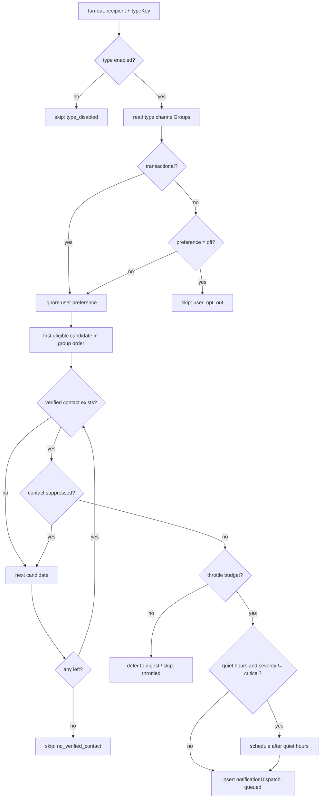

**Preference precedence** (most specific wins):

```
type.transactional == true        →  forced ON (preferences ignored)
event-scoped preference           →  overrides
type-scoped preference            →  overrides
global channel-group preference   →  overrides
notificationTypes.channelGroups   →  default
```

**Every skip is persisted** as a `notificationDispatch` with `status: "skipped"` and a `skipReason`. "Why didn't my co-organizer get the invite?" must be answerable from MongoDB alone, without opening a provider dashboard. That is a deliberate write-amplification trade: a few extra small documents for a fully self-contained audit trail.

---

## 6. Throttling, digests and aggregation

Three distinct mechanisms that are routinely confused:

| Mechanism      | Config                             | Behaviour                                                                                                                            | Used by                                                                     |
| -------------- | ---------------------------------- | ------------------------------------------------------------------------------------------------------------------------------------ | --------------------------------------------------------------------------- |
| **Dedupe**     | `dedupe.keyTemplate` + window      | Second occurrence of the same logical event is **dropped**. Enforced by a **unique index** on `dedupeKey`, not by application logic. | `attendee.matches.ready`, `auth.signin.new_device`                          |
| **Rate limit** | `throttle.strategy = "rate_limit"` | Over budget → `skipped: throttled`. Nothing kept.                                                                                    | `auth.otp.*`, `usage.action.blocked`, admin alerts                          |
| **Digest**     | `throttle.strategy = "digest"`     | Occurrences accumulate in a `notificationDigests` bucket; one message per window with a rendered summary.                            | `attendee.matches.new`, `pipeline.image.failed`, `event.attendee.milestone` |

**In-app aggregation is separate from digesting.** For `attendee.matches.new` the feed must show one live row ("38 new photos in Rahul & Priya's Wedding") that updates as matches arrive, while email waits for the digest window. Implemented as an upsert into the _same_ document, not new inserts:

```js
db.notifications.findOneAndUpdate(
  { userId, typeKey: "attendee.matches.new", groupKey: String(eventId), readAt: null },
  {
    $inc: { groupCount: newMatchCount },
    $set: { updatedAt: now, "data.latestImageId": imageId },
    $setOnInsert: {
      tenantId,
      eventId,
      createdAt: now,
      severity: "informational",
      expireAt: addDays(now, 90),
      titleKey: "attendee.matches.new",
    },
  },
  { upsert: true }
);
```

`readAt: null` is in the filter on purpose: once the attendee has read "38 new photos", the next arrival must start a **fresh** counter rather than resurrecting a read row — otherwise the unread badge silently under-counts. This is the one place an upsert filter carries read state, and it is intentional.

**Digest window for matches:** flush 15 minutes after the last arrival, hard-flush at 6 hours, cap 3 emails/day/event. Rationale: photo uploads arrive in bursts (a photographer dumps 800 images at once), so a quiet-period flush naturally produces one email per burst rather than one per image or one per fixed hour.

---

## 7. Cross-channel action idempotency

The PRD's hardest notification requirement: _acceptance/rejection must be idempotent and final across channels._

**The notification never owns the decision.** A notification in any channel is a _pointer_ to an `invitations` document that owns the terminal state. The in-app row stores a denormalised `actions[].state` purely so the UI can grey out buttons without a round-trip, and it is allowed to be briefly stale because the write path re-validates.

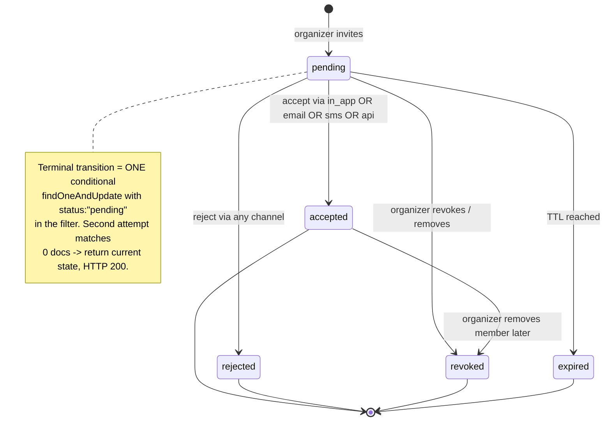

```js
const res = await db.collection("invitations").findOneAndUpdate(
  { _id: inviteId, status: "pending", expiresAt: { $gt: new Date() } },
  {
    $set: {
      status: "accepted",
      resolvedAt: new Date(),
      resolvedVia: "email",
      resolvedByUserId: userId,
    },
  },
  { returnDocument: "after" }
);

if (!res) {
  // already accepted / rejected / revoked / expired
  const current = await db.collection("invitations").findOne({ _id: inviteId });
  return renderTerminalState(current); // never a 409 to the user
}
await emitDomainEvent("collab.invite.accepted", { inviteId, eventId: res.eventId });
```

Then one follow-up write closes the affordance everywhere:

```js
db.notifications.updateMany(
  { "actionTarget.kind": "invitation", "actionTarget.id": inviteId },
  {
    $set: {
      "actions.$[].state": "unavailable",
      "actionTarget.state": "resolved",
      actionResolvedVia: "email",
      actionResolvedAt: new Date(),
    },
  }
);
```

Three properties this buys, with no transaction and no lock:

1. **Email link clicked twice** → second click matches 0 docs → "Already accepted", not an error.
2. **Accepted by email, then in-app button clicked** → same path → buttons disabled, no double membership.
3. **Removed while pending** → `status` is `revoked`, so the accept filter can never match. The PRD's "must not be able to accept after removal" is satisfied **structurally**, not by a permission check someone can forget to write.

---

## 8. Eliminating Novu drift

### 8.1 The problem with every "source of truth" answer

| Where routing lives                                | Drift risk                                                                                                                                                                                              |
| -------------------------------------------------- | ------------------------------------------------------------------------------------------------------------------------------------------------------------------------------------------------------- |
| Novu workflows (fetch active steps at runtime)     | Cannot be merged with our preferences/suppressions/quiet hours/digests, cannot be unit-tested offline, and is lost on provider swap. Also a dashboard edit changes production behaviour with no review. |
| Our DB **and** Novu workflows, reconciled by a job | Two sources of truth. The reconciler detects drift _after_ it has already mis-delivered.                                                                                                                |
| **Our DB only, with Novu holding nothing**         | **No drift is possible — there is nothing in Novu to disagree with.**                                                                                                                                   |

### 8.2 The decision

**Novu is configured with exactly three workflows, each containing exactly one step, and each step's template is a pure pass-through of our payload.**

| Workflow ID                    | Step         | Payload we send                     |
| ------------------------------ | ------------ | ----------------------------------- |
| `transport-email`              | 1 × email    | `{ subject, html, text, replyTo? }` |
| `transport-sms`                | 1 × sms      | `{ text }`                          |
| `transport-whatsapp` (phase 2) | 1 × whatsapp | `{ templateName, variables }`       |

The step body is literally `{{payload.html}}` / `{{payload.text}}`. Novu therefore knows:

- **nothing** about our 65 notification types
- **nothing** about which channels apply to which type
- **nothing** about our copy, locales, digests, preferences, quiet hours, or throttles

All of that lives in `notificationTypes`, `notificationTemplates` and `notificationPreferences`, and is applied _before_ the adapter is called. Novu's remaining job is the only genuinely hard part: multi-provider credential management, per-provider retry, and delivery/bounce receipts.

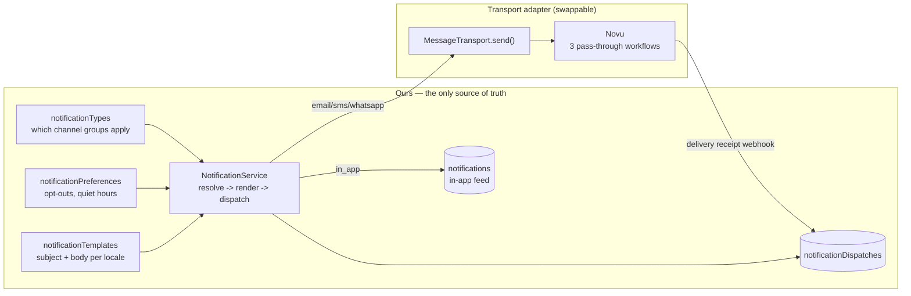

### 8.3 The guard that keeps it true

Drift is structurally impossible, but _someone adding a second step in the Novu dashboard_ would reintroduce it. Two cheap guards:

1. **Workflows are code.** They are upserted from a checked-in definition on every deploy. Dashboard write access is restricted.
2. **CI assertion** (~20 lines): fetch all workflows; fail the build unless the set is exactly the three expected IDs, each has exactly one step, and each step's active channel matches its name. A dashboard edit turns the build red instead of silently changing production. Runtime failures raise `admin.provider.failing`.

### 8.4 What we give up, and why that's correct

| Novu feature unused    | Why it's fine                                                                                                |
| ---------------------- | ------------------------------------------------------------------------------------------------------------ |
| Template editor        | Our templates need locale + tenant branding + our own variable set, and must round-trip through code review. |
| Digest / delay steps   | We digest across _notification types and entities_ (§6), which Novu cannot see.                              |
| Preference centre      | We own preferences at three scopes including per-event.                                                      |
| In-app widget / socket | In-app is first-party by requirement (Vercel → polling).                                                     |
| Per-type workflows     | The entire source of drift.                                                                                  |

**Result:** the transport interface is four methods. Replacing Novu with SendGrid + Twilio + Meta Cloud API directly is one adapter file; nothing in the schema, the catalogue, the templates, the feed, or any call site changes.

```ts
export interface MessageTransport {
  send(msg: OutboundMessage): Promise<{ providerMessageId: string }>;
  // OutboundMessage = { channel, to, subject?, html?, text?, templateName?, variables? }
  // fully rendered by us before this call
}
```

---

# Part II — Database

## 9. Design principles

| #   | Principle                                                       | Consequence                                                                                             | Why                                                                                                                                                                                                     |
| --- | --------------------------------------------------------------- | ------------------------------------------------------------------------------------------------------- | ------------------------------------------------------------------------------------------------------------------------------------------------------------------------------------------------------- |
| P1  | **No vendor name in any field name**                            | `externalRefs: [{provider, env, kind, id}]` — never `cashfreeSubscriptionId`, `novuWorkflowId`, `r2Key` | A vendor-named field becomes load-bearing in code, indexes, queries and dashboards. The array form also lets two providers coexist during a migration — the only safe way to actually switch.           |
| P2  | **Policy is data, not code**                                    | `plans.entitlements`, `notificationTypes.channelGroups`, `faceModels.thresholds`, `platformSettings`    | The PRD demands swappable face models, config-driven plan limits and per-type routing. All three become editable rows instead of deploys.                                                               |
| P3  | **`tenantId` leads every compound index on tenant data**        | see §10.2                                                                                               | One forgotten `tenantId` in a filter is a cross-tenant leak. Leading-field indexes make the correct query the only fast query, so mistakes surface as slow queries in dev rather than breaches in prod. |
| P4  | **Provider truth is mirrored, never primary**                   | `providerWebhookEvents` (raw, deduped) → projected into domain state                                    | Webhooks are replayed, delayed, dropped, and spoofable. Raw storage + unique event id makes every state change replayable and auditable.                                                                |
| P5  | **Append-only where disputes happen**                           | `billingTransactions`, `notificationDispatches`, `auditLogs`                                            | "I was charged twice" / "I never got the invite" is unanswerable against mutable state.                                                                                                                 |
| P6  | **Timestamps, not booleans**                                    | `readAt`, `deletedAt`, `resolvedAt`, `accountCompletedAt`                                               | Same cost, strictly more information, and partial indexes on `{field: null}` stay tiny.                                                                                                                 |
| P7  | **Denormalise only hot-path reads, and name them as caches**    | `tenants.counters`, `events.counters`, `attendeeEventProfiles.matchCount`                               | Aggregating on every dashboard/gallery load won't scale; but every cached value needs reconciliation, so each must be justified.                                                                        |
| P8  | **Biometric data is isolated and purgeable in one delete**      | vectors live only on `imageFaces` / `selfies`, every row carries `tenantId` + `eventId`                 | Face vectors are sensitive personal data. Erasure must be a bounded `deleteMany`, not a scavenger hunt through embedded arrays.                                                                         |
| P9  | **MongoDB is the job source of truth; the broker is transport** | `processing` sub-document on the work item; broker ids only in `externalRefs`                           | Satisfies "fault-tolerant worker" without betting durability on Upstash, and makes the broker swappable.                                                                                                |
| P10 | **Never delete for non-payment**                                | billing collections hold no refs into media/event collections                                           | Structural separation means no dunning bug _can_ destroy content.                                                                                                                                       |

---

## 10. Tenancy

### 10.1 What the tenant is

The tenant is **not the user**. It is the _billable workspace owned by one organizer_: collection `tenants`, referenced everywhere as `tenantId`.

The deciding requirement is this PRD line: _"Activities a co-organizer does should come under the plan of the organizer of the event… the organizer should be the only one that should bear the cost."_

If plans, quotas and storage attach to `userId`, every write path must ask "whose quota is this?" and resolve organizer-of-event on every upload. That resolution _will_ be forgotten somewhere, and a co-organizer will be billed for someone else's wedding. With `tenantId` on the event, the answer is already in the document being written: **cost attribution becomes a field, not a rule.**

Secondary payoff: multi-seat workspaces, ownership transfer and agency accounts all become additive instead of a migration.

> **Naming:** the collection is `tenants`, not `accounts` — Better Auth already owns a collection named `account`. `accounts` and `account` side by side is a production incident waiting to happen.

### 10.2 Isolation strategy

**Chosen: single database, shared collections, row-level isolation via a mandatory `tenantId` discriminator.**

| Option                    | Verdict     | Reasoning                                                                                                                                                                                                                                |
| ------------------------- | ----------- | ---------------------------------------------------------------------------------------------------------------------------------------------------------------------------------------------------------------------------------------- |
| Database-per-tenant       | ✗           | Up to 1,000 databases at target scale. Atlas namespace limits, index memory multiplied per tenant, and the admin dashboard (HIGH priority) would need 1,000-way fan-out. Serverless connection pooling makes per-tenant routing hostile. |
| Collection-per-tenant     | ✗           | Same namespace explosion; schema changes become a 1,000-way loop.                                                                                                                                                                        |
| **Row-level `tenantId`**  | ✅          | One index set, trivial cross-tenant analytics, cheap, and `tenantId` doubles as a future shard-key prefix.                                                                                                                               |
| Atlas per-tenant DB users | ✗ (for now) | Real defence-in-depth but incompatible with one serverless pool. Revisit only if an audit demands it.                                                                                                                                    |

The cost is that isolation becomes an application invariant. Three cheap mitigations:

1. **Only a repository layer builds filters.** `repo(tenantId).collection(x)` injects `tenantId` into every filter and document. Direct `db.collection(...)` on tenant-scoped collections is blocked by a lint rule. The single whitelisted exception is "my events across tenants" for attendees (§10.3).
2. **Index shape enforces it** (P3).
3. **A nightly audit** counts documents whose `tenantId` doesn't resolve to a live tenant, or disagrees with the parent event's `tenantId`; alerts via `admin.abuse.flagged`.

### 10.3 Where attendees sit

An attendee is **not** a tenant member. They are a _data subject whose data lives inside the tenant's boundary_. So their records carry **two keys**:

| Key                                                                    | Answers                                                                         | Used for                                                |
| ---------------------------------------------------------------------- | ------------------------------------------------------------------------------- | ------------------------------------------------------- |
| `tenantId`                                                             | whose storage/quota/retention does this consume, and who is the data fiduciary? | Cost attribution, purge cascade, tenant-scoped indexes  |
| `subject` = `{kind: "user"\|"anonymous", userId?, attendeeSessionId?}` | who may see this, and who can demand erasure?                                   | Access control, DSR execution, cross-tenant "my events" |

Two otherwise-awkward PRD requirements then fall out for free:

- _"See all my events in my account"_ → query `attendeeEventProfiles` by `subject.userId` **across** tenants. The one legitimate cross-tenant read path; whitelisted in the repository layer and only ever returning the caller's own rows.
- _Anonymous-then-login claim_ → the profile is created with `subject.kind: "anonymous"`, then atomically re-pointed to `subject.kind: "user"`. No data moves, no re-upload, no re-processing — exactly the PRD's "she doesn't have to re-visit and re-upload".

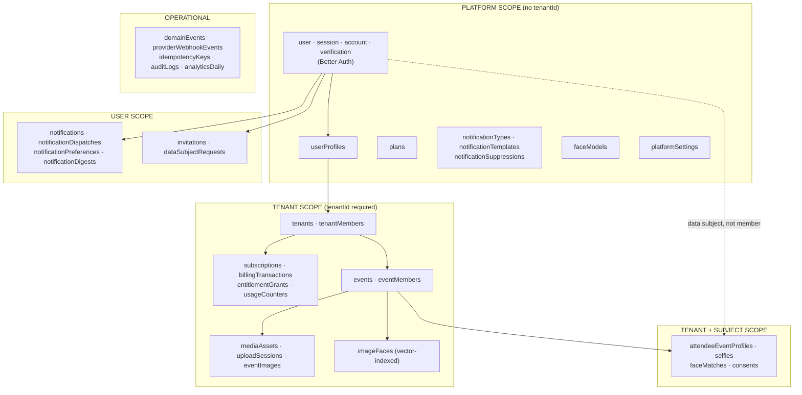

---

## 11. Provider-neutrality mechanics

Four patterns, applied everywhere. Together they are the whole answer to C1.

### 11.1 `externalRefs` — tagged external identity

```js
externalRefs: [
  {
    provider: "cashfree",
    env: "production",
    kind: "subscription",
    id: "sub_9f2c...",
    meta: { subReferenceId: "1029384" },
    linkedAt: ISODate(),
  },
];
```

| Field      | Purpose                                                                                                                |
| ---------- | ---------------------------------------------------------------------------------------------------------------------- |
| `provider` | Vendor key (`"cashfree"`, `"novu"`, `"r2"`, `"upstash"`). Matches the registered adapter.                              |
| `env`      | `"sandbox"` / `"production"` — stops a sandbox id from ever being used against prod.                                   |
| `kind`     | What the id _is_ (`"plan"`, `"subscription"`, `"payment"`, `"message"`, `"object"`).                                   |
| `id`       | The vendor's identifier, opaque to us.                                                                                 |
| `meta`     | Vendor extras that don't deserve first-class fields. **Never read by business logic** — only by that vendor's adapter. |
| `linkedAt` | When we learned this id; orders history during a migration.                                                            |

Indexed with a partial multikey index so `provider + id → our document` (the webhook lookup) is O(1). During a migration a document legitimately holds refs from both vendors; nothing breaks because nothing ever selects `externalRefs[0]`.

### 11.2 Logical resources, not physical coordinates

Never `r2Bucket: "images-originals"` or `queueUrl: "https://..."`. Instead:

```js
storage: {
  locationKey: "originals",                 // resolved by config -> provider/bucket/region
  objectKey:   "a3f9e1.../v1.jpg",
  bytes: 8421310, contentType: "image/jpeg",
  checksum: { algo: "sha256", value: "a3f9e1..." },
  storedAt: ISODate()
}
```

`locationKey` is resolved at runtime to `{provider, bucket, region, endpoint, credentials}`. Changing bucket, region or cloud is a config change plus a copy job; the millions of `mediaAssets` documents never change. Same pattern for `processing.queueKey` (§18).

### 11.3 One generic webhook inbox

`providerWebhookEvents` receives **all** inbound provider callbacks — payments, message-delivery receipts, storage events. The requirements are identical regardless of vendor: verify signature, dedupe, store raw, project into domain state, be replayable.

### 11.4 Policy tables we own

| Policy                                 | Our collection                    | The vendor's role                                                              |
| -------------------------------------- | --------------------------------- | ------------------------------------------------------------------------------ |
| Which channels per notification type   | `notificationTypes.channelGroups` | none (§8)                                                                      |
| Notification copy                      | `notificationTemplates`           | none, except WhatsApp's Meta-mandated approved template name in `providerRefs` |
| Plan limits                            | `plans.entitlements`              | none                                                                           |
| Plan price/schedule                    | `plans.prices[].externalRefs`     | mirrors it as a vendor plan                                                    |
| Grace period, retry policy, thresholds | `platformSettings`                | none                                                                           |
| Face model + thresholds                | `faceModels`                      | none (weights are on HuggingFace)                                              |

---

## 12. Collection map

31 collections. Phase column: 1 = launch, 2 = later.

| #                              | Collection                                   | Scope            | Ph  | Purpose                                                        |
| ------------------------------ | -------------------------------------------- | ---------------- | --- | -------------------------------------------------------------- |
| **A · Identity & tenancy**     |                                              |                  |     |                                                                |
| 1                              | `user`, `session`, `account`, `verification` | platform         | 1   | Better Auth-owned. Not designed here.                          |
| 2                              | `userProfiles`                               | platform         | 1   | App-owned profile, contact capabilities, locale, platform role |
| 3                              | `tenants`                                    | tenant root      | 1   | The billable workspace                                         |
| 4                              | `tenantMembers`                              | tenant           | 1   | user ↔ tenant with role                                        |
| 5                              | `attendeeSessions`                           | —                | 1   | Anonymous cookie-bound attendee identity                       |
| 6                              | `invitations`                                | mixed            | 1   | Unified invite + owner of the terminal decision                |
| **B · Plans & billing**        |                                              |                  |     |                                                                |
| 7                              | `plans`                                      | platform         | 1   | Tier definition, entitlements, **embedded prices**             |
| 8                              | `subscriptions`                              | tenant           | 1   | One live subscription per tenant; lifecycle                    |
| 9                              | `billingTransactions`                        | tenant           | 1   | Append-only auth/charge/refund ledger                          |
| 10                             | `entitlementGrants`                          | tenant           | 1   | Additive top-ups / promos / manual overrides                   |
| 11                             | `usageCounters`                              | tenant           | 1   | Hot counter per entitlement per period                         |
| **C · Events & participation** |                                              |                  |     |                                                                |
| 12                             | `events`                                     | tenant           | 1   | The core object; **embedded access links**                     |
| 13                             | `eventMembers`                               | tenant           | 1   | organizer / co_organizer                                       |
| 14                             | `attendeeEventProfiles`                      | tenant + subject | 1   | An attendee's participation in one event                       |
| 15                             | `consents`                                   | tenant + subject | 1   | Verifiable consent records (DPDPA/GDPR)                        |
| **D · Media & uploads**        |                                              |                  |     |                                                                |
| 16                             | `mediaAssets`                                | tenant           | 1   | Content-addressed binary + derivatives                         |
| 17                             | `uploadSessions`                             | tenant           | 1   | Resumable multipart state                                      |
| 18                             | `eventImages`                                | tenant           | 1   | event ↔ asset join; gallery + processing state                 |
| 19                             | `selfies`                                    | tenant + subject | 1   | Attendee probe image, liveness, embedding                      |
| **E · Faces**                  |                                              |                  |     |                                                                |
| 20                             | `faceModels`                                 | platform         | 1   | Model registry, embedding spaces, thresholds                   |
| 21                             | `imageFaces`                                 | tenant           | 1   | One detected face + **its vector (vector-indexed)**            |
| 22                             | `faceMatches`                                | tenant + subject | 1   | Confirmed selfie ↔ image match; drives the gallery             |
| **F · Queue & eventing**       |                                              |                  |     |                                                                |
| 23                             | `domainEvents`                               | mixed            | 1   | Transactional outbox + business event log                      |
| 24                             | `providerWebhookEvents`                      | —                | 1   | Raw inbound callbacks, deduped                                 |
| 25                             | `idempotencyKeys`                            | —                | 1   | API-level idempotency                                          |
| **G · Notifications**          |                                              |                  |     |                                                                |
| 26                             | `notificationTypes`                          | platform         | 1   | **The §4 matrix, as data**                                     |
| 27                             | `notificationTemplates`                      | platform         | 1   | First-party copy per channel per locale                        |
| 28                             | `notificationPreferences`                    | user             | 1   | Opt-outs, quiet hours, digest cadence                          |
| 29                             | `notifications`                              | user             | 1   | The in-app feed                                                |
| 30                             | `notificationDispatches`                     | user             | 1   | Per-channel attempt ledger incl. skips                         |
| 31                             | `notificationDigests`                        | user             | 1   | Open aggregation buckets awaiting flush                        |
| 32                             | `notificationSuppressions`                   | platform         | 1   | Bounces, complaints, unsubscribes, DND                         |
| **H · Analytics & compliance** |                                              |                  |     |                                                                |
| 33                             | `analyticsDaily`                             | mixed            | 1   | Pre-aggregated dashboard rollups                               |
| 34                             | `auditLogs`                                  | mixed            | 1   | Who did what to whom                                           |
| 35                             | `dataSubjectRequests`                        | —                | 1   | GDPR/DPDPA workflow                                            |
| 36                             | `platformSettings`                           | platform         | 1   | Singleton tunables                                             |

---

## 13. Domain A — Identity & tenancy

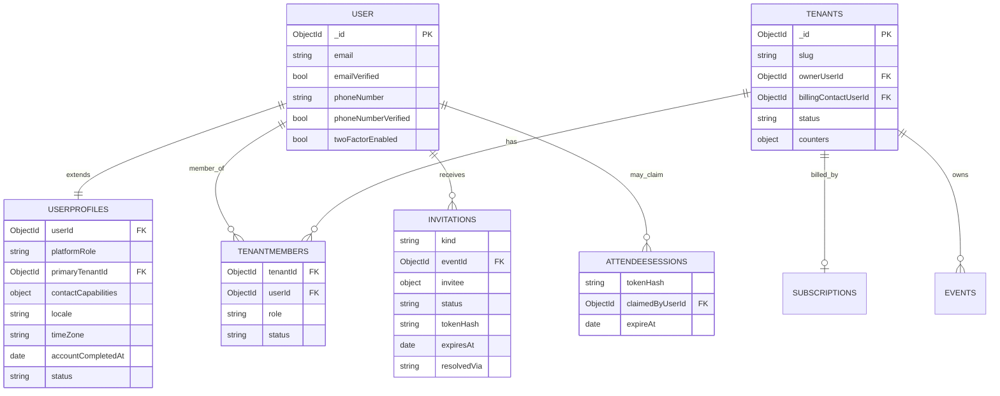

### 13.1 `user` / `session` / `account` / `verification` — Better Auth

Owned entirely by Better Auth's MongoDB adapter. **Do not hand-roll and do not write outside Better Auth APIs.** The PRD mandates a well-maintained auth tool; respecting its schema is the cost.

Add only auth-critical fields via `additionalFields`/plugins:

| Field                                | Source              | Purpose                                              |
| ------------------------------------ | ------------------- | ---------------------------------------------------- |
| `email`, `emailVerified`             | core                | Email OTP identity                                   |
| `phoneNumber`, `phoneNumberVerified` | phone-number plugin | SMS OTP identity; **the gate for the `sms` channel** |
| `twoFactorEnabled`                   | two-factor plugin   | Optional 2FA for clients, mandatory for admins       |
| `banned`, `banReason`, `banExpires`  | admin plugin        | Abuse response                                       |

Everything else lives in `userProfiles`.

> **Why split profile from auth user.** Tempting to dump `platformRole`, `locale` etc. into `user`. Rejected: every Better Auth upgrade would then touch a collection full of product data; auth reads `user` on every request, so keeping it small keeps it cache-friendly; and product fields need indexes and TTLs that would fight the adapter. Cost: one extra lookup, cached per request.

### 13.2 `userProfiles`

| Field                                   | Type                                                         | Purpose                                                                                                                                                                                   |
| --------------------------------------- | ------------------------------------------------------------ | ----------------------------------------------------------------------------------------------------------------------------------------------------------------------------------------- |
| `userId`                                | ObjectId **unique**                                          | 1:1 with Better Auth `user`                                                                                                                                                               |
| `platformRole`                          | `"client" \| "admin"`                                        | The PRD's two user types. Admins are elevated users, not a separate collection, so one person can be both without duplicate identity.                                                     |
| `primaryTenantId`                       | ObjectId \| null                                             | Default workspace. **Null is normal** — a pure attendee has no workspace and no plan.                                                                                                     |
| `displayName`, `avatarAssetId`          |                                                              | Display                                                                                                                                                                                   |
| `locale`                                | `"en-IN"`                                                    | Template selection                                                                                                                                                                        |
| `timeZone`                              | IANA                                                         | Quiet-hours computation, human-readable timestamps                                                                                                                                        |
| `contactCapabilities.whatsappCapable`   | bool \| **null**                                             | `null` = never probed. Phase 2 flips `mobile` resolution per user. Nullable-not-false so "unknown" ≠ "unavailable".                                                                       |
| `contactCapabilities.whatsappCheckedAt` | date                                                         | Re-probe staleness                                                                                                                                                                        |
| `contactCapabilities.pushTokens`        | array                                                        | `[{tokenHash, platform, deviceId, lastSeenAt}]`. Hashed — a leaked token lets an attacker spam the device.                                                                                |
| `accountCompletedAt`                    | date \| null                                                 | PRD: complete only when email **and** phone verified. Materialised because it gates functionality on every request.                                                                       |
| `status`                                | `"active" \| "suspended" \| "deletion_pending" \| "deleted"` | `deletion_pending` holds the DSR cancel window                                                                                                                                            |
| `deletionScheduledAt`                   | date \| null                                                 | Drives the purge job                                                                                                                                                                      |
| `lastSeenAt`                            | date                                                         | Analytics + "is this user reachable in-app at all?"                                                                                                                                       |
| `marketingOptIn`                        | bool                                                         | Kept apart from transactional preferences — mixing them is how marketing reaches an opted-out user                                                                                        |
| `autoProvisioned`                       | bool                                                         | Set by the `user.created` hook when it lazily creates the default profile. `false`/absent marks an explicitly managed profile that must win the read tie-break (ADR-0041 §4, ADR-0043 §4) |
| `schemaVersion`                         | int                                                          |                                                                                                                                                                                           |

**Indexes:** `{userId:1}` unique · `{platformRole:1, status:1}` (admin fan-out) · `{status:1, deletionScheduledAt:1}` partial on `deletion_pending` · `{primaryTenantId:1}`

### 13.3 `tenants`

| Field                                     | Type                                  | Purpose                                                                                                                                                                                             |
| ----------------------------------------- | ------------------------------------- | --------------------------------------------------------------------------------------------------------------------------------------------------------------------------------------------------- |
| `_id`                                     | ObjectId                              | **The `tenantId` everything else carries**                                                                                                                                                          |
| `slug`                                    | string unique                         | Stable handle for support/admin URLs; non-sequential                                                                                                                                                |
| `name`                                    | string                                | Workspace/brand name                                                                                                                                                                                |
| `ownerUserId`                             | ObjectId                              | The sole organizer today; transferable without touching a single event                                                                                                                              |
| `billingContactUserId`                    | ObjectId                              | Receives §4.3 notifications                                                                                                                                                                         |
| `status`                                  | `"active" \| "suspended" \| "closed"` | Platform suspension (abuse), **distinct from subscription status**. A suspended tenant is blocked; a downgraded tenant is merely limited. Conflating them is how non-payers get treated as abusers. |
| `counters`                                | object                                | Cache: `{eventCount, activeEventCount, imageCount, storageBytes, attendeeCount}`. Powers the client dashboard in one read instead of five aggregations. Reconciled nightly (P7).                    |
| `settings`                                | object                                | `{defaultTimeZone, brandLogoAssetId, defaultWatermarkAssetId}` — inherited by new events                                                                                                            |
| `dataRegion`                              | `"in" \| "eu"`                        | Recorded now even with one region; retrofitting residency is painful                                                                                                                                |
| `createdAt`, `updatedAt`, `schemaVersion` |                                       |                                                                                                                                                                                                     |

**Indexes:** `{slug:1}` unique · `{ownerUserId:1}` · `{status:1, createdAt:-1}`

### 13.4 `tenantMembers`

| Field                                      | Type                             | Purpose                                                                                                                                                          |
| ------------------------------------------ | -------------------------------- | ---------------------------------------------------------------------------------------------------------------------------------------------------------------- |
| `tenantId`, `userId`                       | ObjectId                         | Composite identity                                                                                                                                               |
| `role`                                     | `"owner" \| "admin" \| "member"` | Workspace-level role, **distinct from event-level roles**. A workspace member isn't automatically on every event — which matters as soon as an agency has staff. |
| `status`                                   | `"active" \| "removed"`          | Soft removal preserves history                                                                                                                                   |
| `joinedAt`, `removedAt`, `invitedByUserId` |                                  | Provenance                                                                                                                                                       |

**Indexes:** `{tenantId:1, userId:1}` unique · `{userId:1, status:1}` (workspace switcher)

> **Why this exists with one member per tenant today.** Without it, "the owner" is a field on `tenants` and every future seat feature is a migration plus an authorization rewrite. With it, authorization is already `resolveTenantRole(userId, tenantId)` and multi-seat is a new row. Cost: one collection, ~1,000 documents.

### 13.5 `attendeeSessions`

Enables _"attendees must be able to upload a selfie without logging in"_.

| Field                     | Type             | Purpose                                                                                                                                   |
| ------------------------- | ---------------- | ----------------------------------------------------------------------------------------------------------------------------------------- |
| `tokenHash`               | string unique    | SHA-256 of the opaque cookie token. **Hashed at rest** — the raw token is a bearer credential to someone's face photo and matched images. |
| `claimedByUserId`         | ObjectId \| null | Set on login; drives the anonymous→identified merge                                                                                       |
| `claimedAt`               | date \| null     |                                                                                                                                           |
| `deviceFingerprint`       | object           | `{uaHash, ipHash, acceptLangHash}` for abuse detection. Hashed: the purpose is correlation, not surveillance (data minimisation).         |
| `eventIds`                | ObjectId[]       | Events touched anonymously — bounded, so an array beats a join                                                                            |
| `createdAt`, `lastSeenAt` |                  |                                                                                                                                           |
| `expireAt`                | date             | **TTL 30 days.** An unclaimed session is the only key to that selfie; expiring it bounds both exposure and orphan data.                   |

**Indexes:** `{tokenHash:1}` unique · `{claimedByUserId:1}` sparse · `{expireAt:1}` TTL 0

### 13.6 `invitations`

| Field                                           | Type                                                              | Purpose                                                                                                                                     |
| ----------------------------------------------- | ----------------------------------------------------------------- | ------------------------------------------------------------------------------------------------------------------------------------------- |
| `_id`                                           | ObjectId                                                          | The `actionTarget.id` referenced by notifications (§7)                                                                                      |
| `kind`                                          | `"event_co_organizer" \| "platform_admin" \| "tenant_member"`     | Discriminator                                                                                                                               |
| `tenantId`                                      | ObjectId \| null                                                  | Null for `platform_admin`                                                                                                                   |
| `eventId`                                       | ObjectId \| null                                                  | Set for co-organizer invites                                                                                                                |
| `invitedByUserId`                               | ObjectId                                                          | For "invited by Buck" copy and audit                                                                                                        |
| `invitee`                                       | object                                                            | `{kind: "user"\|"email"\|"phone", userId?, email?, phoneE164?}` — **an invite may precede the account**; resolved to `userId` on acceptance |
| `status`                                        | `"pending" \| "accepted" \| "rejected" \| "revoked" \| "expired"` | **Single source of truth for the cross-channel decision**                                                                                   |
| `role`                                          | string                                                            | Role granted on acceptance                                                                                                                  |
| `tokenHash`                                     | string unique                                                     | Hash of the emailed/SMS'd one-time token                                                                                                    |
| `channelsNotified`                              | string[]                                                          | Which channels carried it — answers "did she even get the SMS?" without touching dispatches                                                 |
| `expiresAt`                                     | date                                                              | Default 14 days                                                                                                                             |
| `resolvedAt`, `resolvedVia`, `resolvedByUserId` |                                                                   | Audit of _how_ the idempotent decision was made; genuinely useful in support                                                                |
| `revokedAt`, `revokedByUserId`, `revokeReason`  |                                                                   | PRD: organizer can remove regardless of accept state                                                                                        |
| `createdAt`, `updatedAt`                        |                                                                   |                                                                                                                                             |

**Indexes:**

- `{tokenHash:1}` unique — token redemption
- `{eventId:1, "invitee.email":1}` unique **partial** on `status:"pending"` (+ parallel on `invitee.userId`) — prevents duplicate live invites
- `{"invitee.userId":1, status:1, createdAt:-1}` — "my pending invitations"
- `{status:1, expiresAt:1}` partial on `pending` — expiry sweeper
- `{tenantId:1, eventId:1, status:1}` — event settings screen

> **Why unify invitation kinds.** Co-organizer and admin invites need _identical_ machinery: hashed one-time token, expiry, revocation, terminal atomicity, multi-channel delivery, idempotent acceptance. Two collections means writing that twice and fixing the inevitable idempotency bug twice. `kind` costs one field.
>
> **Deliberately NOT unified with notifications.** An invitation is a durable business fact with a state machine; a notification is a delivery artefact. Merging them is why so many products can't answer "is this invite still valid?" after pruning old notifications.

---

## 14. Domain B — Plans, billing & entitlements

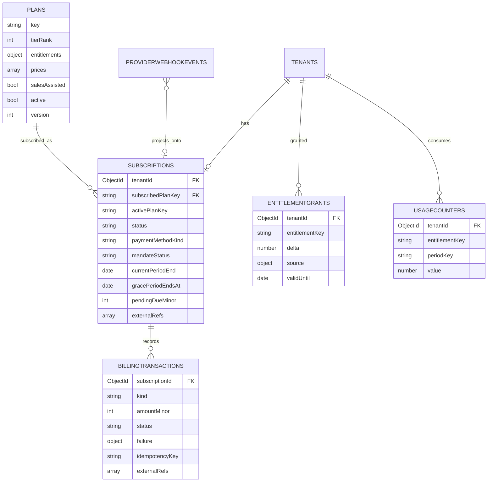

### 14.1 `plans`

| Field                                      | Type          | Purpose                                                                                                                                                     |
| ------------------------------------------ | ------------- | ----------------------------------------------------------------------------------------------------------------------------------------------------------- |
| `key`                                      | string unique | `"free" \| "starter" \| "professional" \| "enterprise"`. Referenced by key everywhere so code, seeds and tests are stable across re-seeding.                |
| `name`, `description`, `marketingFeatures` |               | Pricing-page content, so copy changes aren't deploys                                                                                                        |
| `tierRank`                                 | int           | `0,1,2,3`. Makes "upgrade or downgrade?" a comparison instead of a hard-coded ordering table — needed because the PRD's upgrade and downgrade flows differ. |
| `entitlements`                             | object        | **The limits, as data** (below)                                                                                                                             |
| `prices`                                   | array         | **Embedded** (below)                                                                                                                                        |
| `salesAssisted`                            | bool          | Enterprise → no self-serve checkout                                                                                                                         |
| `selfServe`                                | bool          | Shown on the in-app purchase page                                                                                                                           |
| `active`                                   | bool          | Grandfathering: retired plans stay active-for-existing, hidden-for-new. **Never delete a plan** — live subscriptions and historical invoices point at it.   |
| `version`                                  | int           | Bump when entitlements change; `subscriptions` records the version sold, so existing customers keep what they bought                                        |

**`entitlements` — self-describing:**

```js
entitlements: {
  "events.active":           { limit: 7,            resetPeriod: "monthly",  scope: "tenant",   enforcement: "hard" },
  "events.duration_days":    { limit: 7,            resetPeriod: "none",     scope: "event",    enforcement: "hard" },
  "events.post_upload_days": { limit: 7,            resetPeriod: "none",     scope: "event",    enforcement: "hard" },
  "storage.bytes":           { limit: 107374182400, resetPeriod: "lifetime", scope: "tenant",   enforcement: "hard" },
  "images.per_event":        { limit: 5000,         resetPeriod: "none",     scope: "event",    enforcement: "hard" },
  "coorganizers.per_event":  { limit: 3,            resetPeriod: "none",     scope: "event",    enforcement: "hard" },
  "selfies.per_attendee":    { limit: 3,            resetPeriod: "none",     scope: "attendee", enforcement: "hard" },
  "gallery.retention_days":  { limit: 90,           resetPeriod: "none",     scope: "event",    enforcement: "policy" },
  "originals.download":      { limit: null,         resetPeriod: "none",     scope: "event",    enforcement: "feature" }
}
```

| Sub-field     | Purpose                                                                                                                                                 |
| ------------- | ------------------------------------------------------------------------------------------------------------------------------------------------------- |
| `limit`       | Number, or `null` = **unlimited** (PRD: top plan may choose unlimited post-event upload). Boolean features use `null` + `enforcement:"feature"`.        |
| `resetPeriod` | `"monthly" \| "yearly" \| "lifetime" \| "none"` — tells the entitlement service which `periodKey` to read. Monthly quotas reset; storage is cumulative. |
| `scope`       | `"tenant" \| "event" \| "attendee"` — tells it _what_ to count against. Without this, "5,000 images" is ambiguous between per-event and per-account.    |
| `enforcement` | `"hard"` block · `"soft"` allow+notify · `"policy"` background job enforces · `"feature"` boolean gate                                                  |

> **Why self-describing instead of sibling fields.** A `maxEventsPerPeriod` + `eventPeriod` convention (deriving the period by string concatenation) is invisible to any validator, breaks silently when someone adds a limit without its twin, and cannot express scope. One self-describing object per key makes the entitlement service fully generic: **adding a limit is a data edit with zero code change.**

**`prices` — embedded:**

```js
prices: [
  {
    priceKey: "starter-monthly-inr",
    billingCycle: "monthly",
    amountMinor: 49900,
    currency: "INR",
    taxBehavior: "inclusive",
    active: true,
    validFrom: ISODate(),
    validUntil: null,
    trialDays: 0,
    externalRefs: [
      { provider: "cashfree", env: "production", kind: "plan", id: "STARTER_MONTHLY_V1" },
    ],
  },
];
```

> **Why embedded, and why not a field on the plan itself.** One plan has many prices (monthly, yearly, multi-currency, promotional, grandfathered) — so price can't be a scalar on the plan. But prices are few and always read together with the plan, so a separate collection buys a join for nothing. Embedding keeps **entitlements defined exactly once per tier**, which is the data that must never diverge. Adding yearly billing later = pushing one array element. This array is also the **only** place a payment vendor appears in the billing schema.

**Indexes:** `{key:1}` unique · `{"prices.externalRefs.provider":1, "prices.externalRefs.id":1}` partial

### 14.2 `usageCounters` & `entitlementGrants`

```js
// usageCounters
{ tenantId, entitlementKey: "events.active", periodKey: "2026-09", value: 5, updatedAt }
{ tenantId, entitlementKey: "storage.bytes", periodKey: "lifetime", value: 73400320000, updatedAt }
```

**Index:** `{tenantId:1, entitlementKey:1, periodKey:1}` unique

```js
// entitlementGrants — additive top-ups
{ tenantId, entitlementKey: "storage.bytes", delta: 53687091200,
  overrideLimit: null,
  source: { kind: "purchase", billingTransactionId, note: null },
  validFrom, validUntil: null, createdAt, createdByUserId }
```

**Index:** `{tenantId:1, entitlementKey:1, validFrom:1}`

Effective limit:

$$\text{limit}_{\text{eff}} = \text{override} \;\;\text{or}\;\; \text{plan.limit} + \sum_{\text{active grants}} \text{delta}$$

Grants are **additive rows, never mutations of the plan**, so a refunded top-up is a negative delta and the audit trail stays intact. `overrideLimit` is the escape hatch for negotiated Enterprise terms.

The entitlement check, fully generic:

```ts
async function checkEntitlement(tenantId, key, amount = 1, ctx = {}) {
  const sub = await subscriptions.findOne({ tenantId, status: { $ne: "cancelled" } });
  const plan = await plans.findOne({ key: sub?.activePlanKey ?? "free" });
  const spec = plan.entitlements[key];
  if (!spec) return { allowed: true }; // not gated
  if (spec.limit === null && spec.enforcement === "feature") return { allowed: true };

  const limit = await effectiveLimit(tenantId, key, spec); // plan + grants
  if (limit === null) return { allowed: true }; // unlimited

  const periodKey =
    spec.resetPeriod === "monthly"
      ? monthKey()
      : spec.resetPeriod === "yearly"
        ? yearKey()
        : "lifetime";
  const used =
    (await usageCounters.findOne({ tenantId, entitlementKey: key, periodKey }))?.value ?? 0;

  if (used + amount > limit) {
    return {
      allowed: false,
      limit,
      used,
      reason: sub?.status === "downgraded" ? "payment_downgrade" : "plan_limit",
    };
  }
  return { allowed: true, remaining: limit - used - amount };
}
```

The `reason` distinction is what makes `usage.action.blocked` copy correct: "upgrade to do this" vs "pay your outstanding dues to restore your limits".

### 14.3 `subscriptions`

| Field                                     | Type                                                                                 | Purpose                                                                                                                                                                                                                                                          |
| ----------------------------------------- | ------------------------------------------------------------------------------------ | ---------------------------------------------------------------------------------------------------------------------------------------------------------------------------------------------------------------------------------------------------------------- |
| `tenantId`                                | ObjectId                                                                             | Owner (**not** `userId` — §10.1)                                                                                                                                                                                                                                 |
| `subscribedPlanKey`                       | string                                                                               | What they pay for                                                                                                                                                                                                                                                |
| `subscribedPlanVersion`                   | int                                                                                  | The entitlement snapshot they bought — protects grandfathered customers                                                                                                                                                                                          |
| `activePlanKey`                           | string                                                                               | **What applies right now.** Equals `subscribedPlanKey` except when `status == "downgraded"`, where it is `"free"` while `subscribedPlanKey` still records the paid plan. This is what makes reactivation a status flip on the _same_ record with history intact. |
| `status`                                  | `"incomplete" \| "active" \| "past_due" \| "downgraded" \| "cancelled" \| "expired"` | Lifecycle below                                                                                                                                                                                                                                                  |
| `priceKey`                                | string                                                                               | Exact price in force                                                                                                                                                                                                                                             |
| `paymentMethodKind`                       | `"mandate_upi" \| "mandate_bank_debit" \| "card" \| "invoice" \| "manual"`           | **Generic, not vendor terms.** "UPI Autopay" and "e-NACH" are one vendor's names for _recurring mandates_. Adding e-NACH later = one enum value. Enterprise contracts = `"invoice"`/`"manual"` with no external refs, already supported.                         |
| `mandateStatus`                           | `"pending" \| "active" \| "paused" \| "revoked" \| "expired"` \| null                | **Independent of subscription status.** A revoked mandate on a paid-up period is `active` + `revoked`: the user has access, but the next renewal will fail. Collapsing these loses the ability to warn them in advance.                                          |
| `billingCycle`                            | string                                                                               | Denormalised from price for query convenience                                                                                                                                                                                                                    |
| `currentPeriodStart` / `currentPeriodEnd` | date                                                                                 | Entitlement period window                                                                                                                                                                                                                                        |
| `nextChargeAt`                            | date                                                                                 | Renewal reminders + reconciliation                                                                                                                                                                                                                               |
| `gracePeriodEndsAt`                       | date \| null                                                                         | `failedAt + platformSettings.dunning.gracePeriodDays` (14). **Read from settings, never hard-coded.**                                                                                                                                                            |
| `pendingDueMinor`                         | int                                                                                  | Drives the pay-now banner                                                                                                                                                                                                                                        |
| `dunning`                                 | object                                                                               | `{attemptCount, lastAttemptAt, remindersSent:["d1","d5"], nextReminderAt}` — makes the reminder schedule idempotent under cron retries and visible in support                                                                                                    |
| `cancelAt`, `cancelledAt`, `cancelReason` |                                                                                      | End-of-period vs immediate                                                                                                                                                                                                                                       |
| `scheduledChange`                         | object \| null                                                                       | `{toPlanKey, effectiveAt, reason:"self_downgrade"}` — self-serve downgrades take effect next period, unlike upgrades which are immediate                                                                                                                         |
| `previousSubscriptionId`                  | ObjectId \| null                                                                     | Upgrade chain: mandates can't be mutated in place, so upgrade = cancel + create; the chain preserves history                                                                                                                                                     |
| `statusHistory`                           | array, capped ~50                                                                    | `[{from, to, at, reason, actor}]` — answers "why is this tenant on free?" without log diving. Bounded so it can't grow unbounded.                                                                                                                                |
| `externalRefs`                            | array                                                                                | Provider subscription/mandate ids                                                                                                                                                                                                                                |

**Indexes:**

- `{tenantId:1}` unique **partial** on `status: {$nin:["cancelled","expired"]}` — one live subscription per tenant enforced **by the database**, not a code comment
- `{"externalRefs.provider":1, "externalRefs.id":1}` partial — webhook → subscription
- `{status:1, gracePeriodEndsAt:1}` partial on `past_due` — dunning sweep
- `{status:1, nextChargeAt:1}` — renewal reminders
- `{status:1, updatedAt:1}` partial on `incomplete` — abandoned-checkout reconciliation
- `{"scheduledChange.effectiveAt":1}` sparse — scheduled downgrade sweep

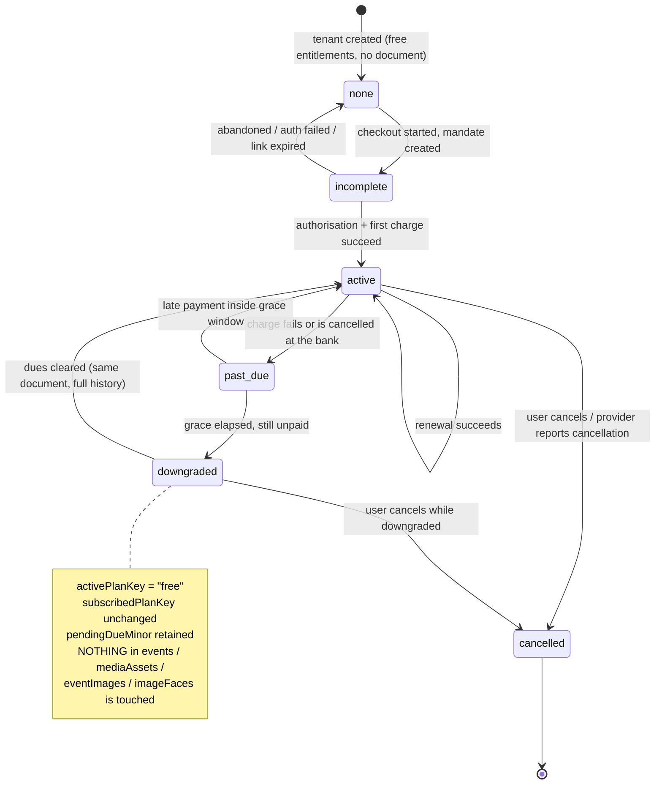

> **`none` is the absence of a document.** A free tenant has no `subscriptions` row; the entitlement service defaults `activePlanKey` to `"free"`. Placeholder free subscriptions would be 1,000 documents that exist only to say "nothing here", plus an extra state in every dunning and reconciliation filter.

**The C6 invariant, restated as a code rule:** the dunning worker may write only `subscriptions.status`, `subscriptions.activePlanKey` and `subscriptions.statusHistory`. Nothing in billing holds a reference into `events`, `eventImages`, `mediaAssets` or `imageFaces`, so no dunning bug _can_ reach user content. Enforce by review and, ideally, a lint rule on the worker module's imports.

### 14.4 `billingTransactions`

Append-only.

| Field                        | Type                                                                                  | Purpose                                                                                                                                                                                                                                               |
| ---------------------------- | ------------------------------------------------------------------------------------- | ----------------------------------------------------------------------------------------------------------------------------------------------------------------------------------------------------------------------------------------------------- |
| `tenantId`, `subscriptionId` | ObjectId                                                                              | Scope                                                                                                                                                                                                                                                 |
| `kind`                       | `"authorization" \| "charge" \| "refund" \| "chargeback" \| "credit" \| "adjustment"` | Vendor-neutral taxonomy                                                                                                                                                                                                                               |
| `amountMinor`, `currency`    | int, string                                                                           | ₹499 → `49900, "INR"`                                                                                                                                                                                                                                 |
| `status`                     | `"initiated" \| "pending" \| "succeeded" \| "failed" \| "cancelled" \| "refunded"`    | **Normalised by the adapter** — business logic never sees vendor status strings                                                                                                                                                                       |
| `failure`                    | object                                                                                | `{code, message, providerCode, category, retryable}` where `category ∈ {insufficient_funds, mandate_revoked, auth_required, technical}`. **Dunning copy and retry policy branch on `category` only**, so vendor codes never leak into business rules. |
| `idempotencyKey`             | string unique                                                                         | Ours, stable across retries of the same intent                                                                                                                                                                                                        |
| `externalRefs`               | array                                                                                 | Vendor payment/order/txn ids                                                                                                                                                                                                                          |
| `occurredAt`, `settledAt`    | date                                                                                  | Provider timeline vs our receipt time                                                                                                                                                                                                                 |
| `periodCovered`              | `{start, end}`                                                                        | Which period the money bought; makes invoice reconstruction trivial                                                                                                                                                                                   |
| `invoiceNumber`              | string \| null                                                                        | Sequential, tenant-scoped, gapless                                                                                                                                                                                                                    |
| `rawPayloadRef`              | ObjectId                                                                              | → `providerWebhookEvents._id`. **A reference, not a copy** — one raw payload, not duplicated per projection.                                                                                                                                          |

**Indexes:** `{idempotencyKey:1}` unique · `{tenantId:1, occurredAt:-1}` · `{subscriptionId:1, kind:1, occurredAt:-1}` · `{"externalRefs.provider":1,"externalRefs.id":1}` partial · `{status:1, occurredAt:1}` partial on pending

---

## 15. Domain C — Events & participation

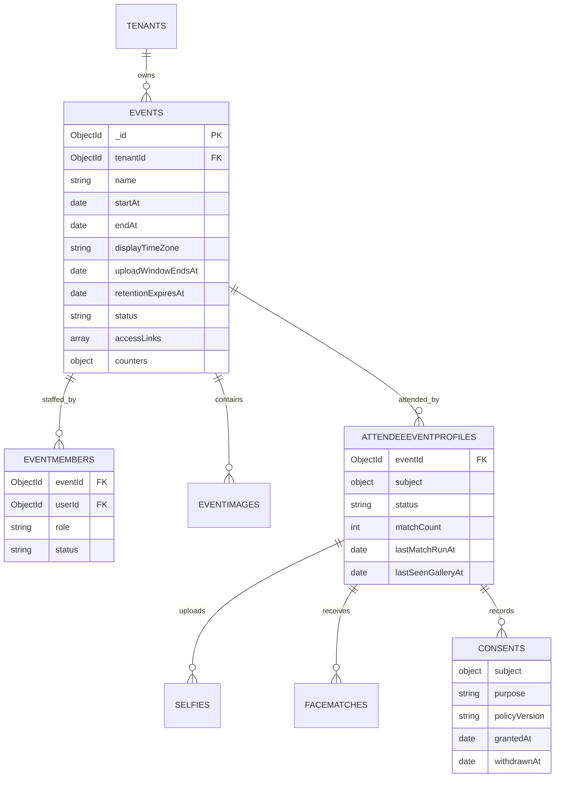

### 15.1 `events`

| Field                                                    | Type                                                                      | Purpose                                                                                                                                                                                                                                        |
| -------------------------------------------------------- | ------------------------------------------------------------------------- | ---------------------------------------------------------------------------------------------------------------------------------------------------------------------------------------------------------------------------------------------- |
| `tenantId`                                               | ObjectId                                                                  | **Cost attribution, in one field** (§10.1)                                                                                                                                                                                                     |
| `name`, `description`, `logoAssetId`                     |                                                                           | PRD: organizer branding on the attendee upload page                                                                                                                                                                                            |
| `startAt`, `endAt`                                       | date, UTC                                                                 | Canonical times                                                                                                                                                                                                                                |
| `displayTimeZone`                                        | IANA                                                                      | PRD: organizer picks the timezone shown to attendees. Stored **separately** from the UTC instants — a timezone is a display preference, not a time.                                                                                            |
| `uploadWindowEndsAt`                                     | date                                                                      | `endAt + entitlement("events.post_upload_days")`, **materialised at creation/edit**. Materialised because it's read on every upload; recomputing it from the plan on each upload would let a mid-event plan change silently move the deadline. |
| `retentionExpiresAt`                                     | date                                                                      | `endAt + entitlement("gallery.retention_days")`. Drives purge + the expiry notifications.                                                                                                                                                      |
| `status`                                                 | `"draft" \| "published" \| "live" \| "ended" \| "archived" \| "deleting"` | Derived-but-stored, because "published" gates the public link and must be explicit                                                                                                                                                             |
| `accessLinks`                                            | array                                                                     | **Embedded** (below)                                                                                                                                                                                                                           |
| `counters`                                               | object                                                                    | Cache: `{imageCount, processedImageCount, failedImageCount, attendeeCount, matchCount, storageBytes}`. Powers the organizer dashboard and the `pipeline.event.indexed` trigger in one read.                                                    |
| `watermarkAssetId`, `thumbnailPreset`                    |                                                                           | Per-event processing overrides                                                                                                                                                                                                                 |
| `createdByUserId`, `createdAt`, `updatedAt`, `deletedAt` |                                                                           |                                                                                                                                                                                                                                                |
| `schemaVersion`                                          | int                                                                       |                                                                                                                                                                                                                                                |

**`accessLinks` — embedded, rotatable:**

```js
accessLinks: [
  {
    slug: "k7m2xq9p",
    active: true,
    createdAt: ISODate(),
    revokedAt: null,
    qrAssetId: ObjectId(),
    scanCount: 148,
  },
];
```

Rotation pushes a new element and sets `active: false` + `revokedAt` on the old one, which is what makes `event.link.rotated` meaningful (already-printed QR codes stop working, and we can prove when). A separate collection would buy a join for an array that will hold 1–3 elements.

**Indexes:**

- `{tenantId:1, status:1, startAt:-1}` — organizer event list
- `{"accessLinks.slug":1}` unique **partial** on `"accessLinks.active": true` — public link resolution; sparse-unique so revoked slugs can't be reused but don't block
- `{status:1, uploadWindowEndsAt:1}` — window-closing sweeps
- `{status:1, retentionExpiresAt:1}` — retention sweeps
- `{tenantId:1, endAt:-1}` — dashboard/analytics

### 15.2 `eventMembers`

```js
{ tenantId, eventId, userId, role: "organizer" | "co_organizer",
  status: "active" | "removed", invitationId, addedAt, removedAt, removedByUserId }
```

**Indexes:** `{eventId:1, userId:1}` unique · `{eventId:1, role:1, status:1}` (notification fan-out) · `{userId:1, status:1}` ("events I work on") · `{eventId:1, role:1}` unique **partial** on `{role:"organizer", status:"active"}` — **enforces the PRD's "exactly one organizer per event" in the database**

### 15.3 `attendeeEventProfiles`

The attendee's participation record — the hub of the whole attendee experience.

| Field                    | Type                                                                                   | Purpose                                                                                              |
| ------------------------ | -------------------------------------------------------------------------------------- | ---------------------------------------------------------------------------------------------------- |
| `tenantId`, `eventId`    | ObjectId                                                                               | Tenant boundary + event scope                                                                        |
| `subject`                | object                                                                                 | `{kind:"user"\|"anonymous", userId?, attendeeSessionId?}` (§10.3)                                    |
| `status`                 | `"selfie_pending" \| "processing" \| "ready" \| "no_match" \| "failed" \| "withdrawn"` | Drives the attendee UI without querying selfies/matches                                              |
| `activeSelfieId`         | ObjectId                                                                               | The selfie currently used for matching (PRD: attendee may reuse a previous selfie)                   |
| `matchCount`             | int                                                                                    | Cache: PRD requires a live total count. `$inc`'d on match insert.                                    |
| `lastMatchRunAt`         | date                                                                                   | **Watermark for incremental matching** (§17.4) — only faces created after this are scored on re-runs |
| `lastSeenGalleryAt`      | date                                                                                   | Powers the PRD's "New" badge: an image is new if `faceMatches.createdAt > lastSeenGalleryAt`         |
| `firstMatchNotifiedAt`   | date \| null                                                                           | Guarantees `attendee.matches.ready` (and its SMS) fires exactly once                                 |
| `consentId`              | ObjectId                                                                               | The biometric-processing consent in force                                                            |
| `claimedAt`              | date \| null                                                                           | When anonymous → identified                                                                          |
| `createdAt`, `updatedAt` |                                                                                        |                                                                                                      |

**Indexes:**

- `{eventId:1, "subject.userId":1}` unique **partial** on `subject.kind:"user"` — one profile per user per event
- `{eventId:1, "subject.attendeeSessionId":1}` unique partial on `subject.kind:"anonymous"`
- `{"subject.userId":1, updatedAt:-1}` — **the whitelisted cross-tenant read**: "my events"
- `{eventId:1, status:1, lastMatchRunAt:1}` — the incremental match sweep
- `{tenantId:1, eventId:1, createdAt:-1}` — organizer's attendee analytics

**The claim operation** (anonymous → identified) is a single atomic update, which is why no data moves and no reprocessing happens:

```js
db.attendeeEventProfiles.updateOne(
  { _id: profileId, "subject.kind": "anonymous", "subject.attendeeSessionId": sessionId },
  {
    $set: { "subject.kind": "user", "subject.userId": userId, claimedAt: new Date() },
    $unset: { "subject.attendeeSessionId": "" },
  }
);
```

### 15.4 `consents`

```js
{ tenantId, eventId,
  subject: { kind, userId?, attendeeSessionId? },
  purpose: "biometric_processing" | "terms_of_service" | "marketing",
  policyVersion: "tos-2026-03", policyDocumentHash: "sha256:...",
  grantedAt, withdrawnAt: null,
  evidence: { ipHash, uaHash, method: "checkbox" | "in_app_action", locale },
  createdAt }
```

GDPR/DPDPA require _demonstrable_ consent: who, what for, which policy version, when, and how. `policyVersion` + `policyDocumentHash` are what make it demonstrable years later — a version string alone is worthless if the document behind it was edited.

**Indexes:** `{eventId:1, "subject.userId":1, purpose:1}` · `{"subject.userId":1, purpose:1, grantedAt:-1}` · `{purpose:1, policyVersion:1}` (re-consent campaigns for `legal.terms.updated`)

---

## 16. Domain D — Media & uploads

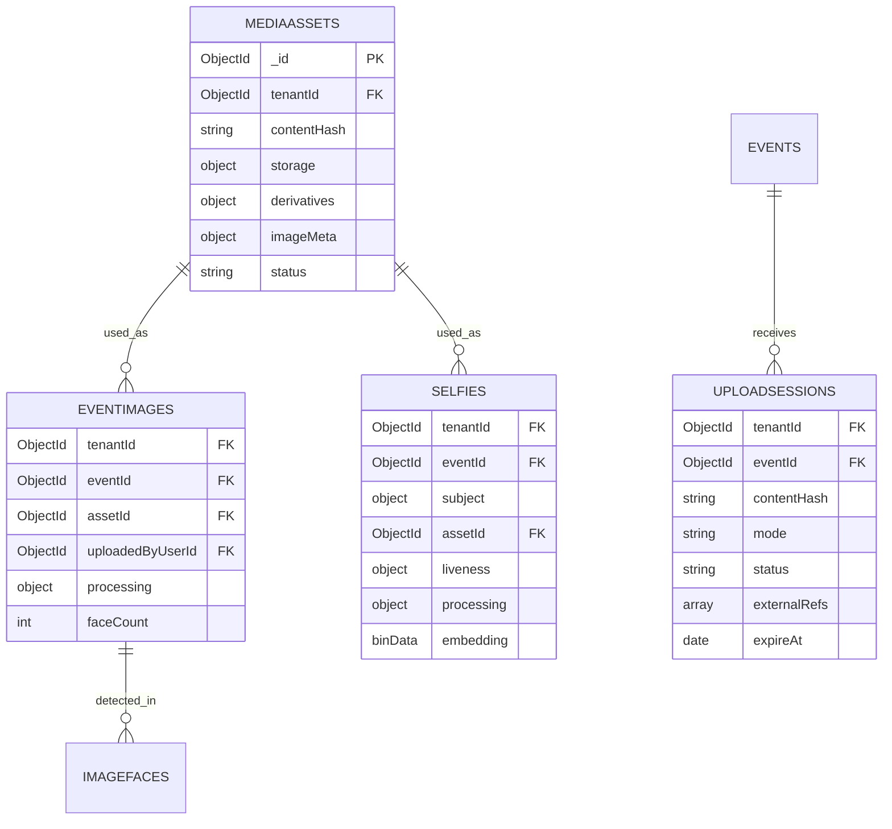

### 16.1 `mediaAssets` — content-addressed binary

| Field                   | Type                                                                          | Purpose                                                                                                                                                                                                                                             |
| ----------------------- | ----------------------------------------------------------------------------- | --------------------------------------------------------------------------------------------------------------------------------------------------------------------------------------------------------------------------------------------------- |
| `tenantId`              | ObjectId                                                                      | **Dedupe and storage cost are tenant-scoped** (below)                                                                                                                                                                                               |
| `contentHash`           | string                                                                        | SHA-256 of the original bytes. **Doubles as the object key** per your media design.                                                                                                                                                                 |
| `kind`                  | `"event_image" \| "selfie" \| "event_logo" \| "watermark" \| "export"`        | Lifecycle and retention differ per kind                                                                                                                                                                                                             |
| `storage`               | object                                                                        | `{locationKey, objectKey, bytes, contentType, checksum, storedAt}` (§11.2)                                                                                                                                                                          |
| `derivatives`           | object                                                                        | `{thumbnail: {locationKey, objectKey, bytes, width, height, format, processorVersion, watermarkVersion, generatedAt}}`. A map, not an array, because lookups are by name (`thumbnail`, later `preview`).                                            |
| `imageMeta`             | object                                                                        | `{width, height, orientation, exifCaptureAt, cameraMake, cameraModel}`. `orientation` + dimensions are what let the gallery render the PRD's correct aspect-ratio layout without re-reading the file, and what drive orientation-preserving resize. |
| `status`                | `"uploading" \| "stored" \| "derivatives_ready" \| "quarantined" \| "purged"` | `quarantined` for failed integrity/MIME validation                                                                                                                                                                                                  |
| `refCount`              | int                                                                           | Number of live `eventImages`/`selfies` pointing here. Purge only when it reaches 0.                                                                                                                                                                 |
| `createdAt`, `purgedAt` |                                                                               |                                                                                                                                                                                                                                                     |

**Indexes:**

- `{tenantId:1, contentHash:1}` **unique** — the dedupe key
- `{status:1, createdAt:1}` partial on `uploading` — orphan sweep
- `{refCount:1}` partial on `refCount: 0` — purge candidates

> **Why dedupe is tenant-scoped, not global.** A global unique index on `contentHash` with a `file_references` join collection is tempting (one copy of a byte-identical image platform-wide). Rejected on three grounds: (1) storage billing — two tenants would have to split or double-count the same bytes, and neither is defensible on an invoice; (2) information leak — a tenant could detect that another tenant already holds a given image by observing an instant "duplicate skipped"; (3) DPDPA erasure — deleting for one tenant must not affect another, so global dedupe forces refcount-gated deletion, and a refcount bug becomes a failure to erase. Tenant-scoped dedupe still satisfies the _actual_ requirement (organizer and co-organizers uploading the same photo), which is entirely within one tenant. It also lets `refCount` stay a simple integer instead of a join collection.

### 16.2 `uploadSessions` — resumable state

| Field                                          | Type                                                     | Purpose                                                                                                                                                                                                                                                                           |
| ---------------------------------------------- | -------------------------------------------------------- | --------------------------------------------------------------------------------------------------------------------------------------------------------------------------------------------------------------------------------------------------------------------------------- |
| `tenantId`, `eventId`                          | ObjectId                                                 | Scope                                                                                                                                                                                                                                                                             |
| `createdByUserId`                              | ObjectId                                                 | **In-progress sessions are per-user.** If two users upload identical content concurrently, user B must not attach to user A's in-flight multipart upload — that's an ownership problem, not a dedupe one. Cross-user dedupe happens at the `mediaAssets` layer, after completion. |
| `contentHash`                                  | string                                                   | Client-computed SHA-256; the resume key                                                                                                                                                                                                                                           |
| `batchId`                                      | ObjectId                                                 | Groups a drag-and-drop batch → drives `upload.batch.*` notifications and the progress bar                                                                                                                                                                                         |
| `mode`                                         | `"single" \| "multipart"`                                | < 8 MB vs ≥ 8 MB                                                                                                                                                                                                                                                                  |
| `status`                                       | `"pending" \| "in_progress" \| "completed" \| "aborted"` | Answers the client's batch-resolve pre-check                                                                                                                                                                                                                                      |
| `fileName`, `declaredSize`, `declaredMimeType` |                                                          | Display/audit only — **never identity**                                                                                                                                                                                                                                           |
| `externalRefs`                                 | array                                                    | `[{provider:"r2", kind:"multipart_upload", id:"<uploadId>"}]` — the provider's multipart id lives here, not in a `r2UploadId` field                                                                                                                                               |
| `assetId`                                      | ObjectId \| null                                         | Set on completion                                                                                                                                                                                                                                                                 |
| `createdAt`, `updatedAt`, `completedAt`        |                                                          |                                                                                                                                                                                                                                                                                   |
| `expireAt`                                     | date                                                     | **TTL 5 days**, staggered before the storage lifecycle rule that aborts incomplete multipart uploads at 7 days                                                                                                                                                                    |

**Indexes:** `{tenantId:1, createdByUserId:1, contentHash:1}` · `{eventId:1, batchId:1, status:1}` (batch progress) · `{status:1, updatedAt:1}` partial on `in_progress` (`upload.session.stalled` detection) · `{expireAt:1}` TTL 0

**Part tracking is deliberately absent.** The object store already knows exactly which parts it holds; `ListParts` answers resume authoritatively. A per-part Mongo write on every chunk adds cost at volume _and_ creates an ambiguous state (part landed in storage, our part-write didn't). One extra API call on the exceptional resume path beats a write on every chunk of the normal path.

### 16.3 `eventImages` — the join + pipeline state

| Field                            | Type                    | Purpose                                                                                 |
| -------------------------------- | ----------------------- | --------------------------------------------------------------------------------------- |
| `tenantId`, `eventId`, `assetId` | ObjectId                | The join                                                                                |
| `uploadedByUserId`               | ObjectId                | PRD: attribution, while cost stays with `tenantId`                                      |
| `uploadBatchId`                  | ObjectId                | Batch summaries                                                                         |
| `sequence`                       | int                     | Monotonic per event; stable "newest first" ordering that can't tie like `createdAt` can |
| `processing`                     | object                  | **Durable job state** (§18.2)                                                           |
| `faceCount`                      | int                     | Cache; also the `pipeline.image.failed` diagnostic ("0 faces found")                    |
| `visibility`                     | `"visible" \| "hidden"` | Organizer can hide an image without deleting it                                         |
| `createdAt`, `deletedAt`         |                         |                                                                                         |

**Indexes:**

- `{eventId:1, assetId:1}` **unique** — the multi-session dedupe guarantee: a concurrent duplicate upload by a co-organizer fails on insert rather than needing a read-check
- `{eventId:1, sequence:-1}` — gallery pagination, newest first
- `{"processing.status":1, "processing.leaseExpiresAt":1}` — the reclaim sweep
- `{eventId:1, "processing.status":1}` — per-event progress and `pipeline.event.indexed`

### 16.4 `selfies`

| Field                   | Type           | Purpose                                                                                                              |
| ----------------------- | -------------- | -------------------------------------------------------------------------------------------------------------------- |
| `tenantId`, `eventId`   | ObjectId       | Scope                                                                                                                |
| `subject`               | object         | `{kind, userId?, attendeeSessionId?}`                                                                                |
| `profileId`             | ObjectId       | → `attendeeEventProfiles`                                                                                            |
| `assetId`               | ObjectId       | The image                                                                                                            |
| `liveness`              | object         | **Embedded**: `{required, challengeKind:"gesture", challengeSpec, passed, score, attemptCount, checkedAt, modelKey}` |
| `quality`               | object         | `{faceCount, largestFaceBox, blurScore, brightnessScore, accepted, rejectionReason}`                                 |
| `processing`            | object         | Durable job state (§18.2), `priority: "high"`                                                                        |
| `spaceKey`              | string         | Which embedding space produced `embedding`                                                                           |
| `embedding`             | **BinData(9)** | The largest face's vector, float32, L2-normalised. Used as the **query vector** — see §17.                           |
| `isActive`              | bool           | PRD: attendee may reuse a previous selfie; only one is active per profile                                            |
| `createdAt`, `expireAt` |                |                                                                                                                      |

**Indexes:** `{profileId:1, isActive:1}` · `{eventId:1, "subject.userId":1, createdAt:-1}` · `{"processing.status":1, "processing.leaseExpiresAt":1}` · `{"subject.userId":1, createdAt:-1}` (reusable selfies across events) · `{expireAt:1}` TTL 0

> **Liveness embedded, not its own collection.** A liveness check has a 1:1 lifetime with the selfie attempt, is always read with it, and is never queried independently. A separate collection with a 24-hour TTL would create a dangling reference on a document we keep for 90 days.
>
> **`selfies.embedding` is deliberately NOT vector-indexed.** It is only ever a query vector, never a search target (§17.1). One vector index instead of two.

---

## 17. Domain E — Faces & vector search

### 17.1 The matching direction decision

Two possible directions:

| Direction                       | Cost per 5,000-image batch (~15,000 faces, ~100 attendees)         | Index lag exposure                                                     |
| ------------------------------- | ------------------------------------------------------------------ | ---------------------------------------------------------------------- |
| Image face → search selfies     | **15,000** vector queries                                          | A selfie uploaded seconds ago may not be indexed yet → silently missed |
| **Selfie → search image faces** | **~100** vector queries (one per attendee, incrementally filtered) | None: image faces were indexed minutes/hours earlier during upload     |

**Decision: selfie → `imageFaces`, one direction only.** It is ~150× cheaper on the dominant workload, removes one vector index, removes half the matching code, and eliminates index-lag correctness risk. The "new images matched for an existing attendee" requirement is met by _re-running_ each attendee's query incrementally (§17.4), which is cheap precisely because there are two orders of magnitude fewer selfies than faces.

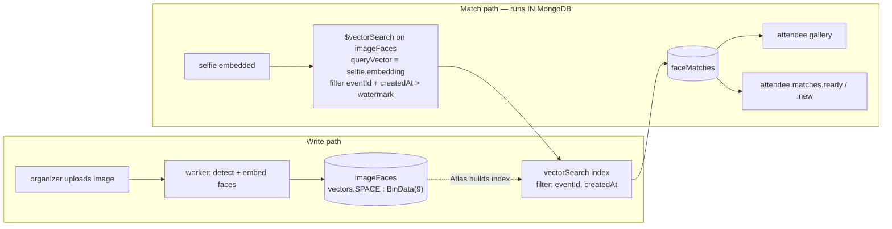

### 17.2 `faceModels` — swappable models as data

The PRD requires independently swappable detection, landmark, attribute and recognition models via env vars. The problem: **Atlas vector indexes have a fixed `numDimensions` and `similarity` per index**, so a swappable recognition model cannot share one index path with its replacement.

Solution: the _recognition_ model defines an **embedding space**, and the vector is stored at a **space-specific path**.

```js
{
  _id, modelKey: "insightface-antelopev2-2026-03",
  role: "recognition",                       // detection | landmark2d | landmark3d | attribute | recognition
  spaceKey: "arcface_r100_512",              // ONLY for role = "recognition"
  vectorPath: "vectors.arcface_r100_512",    // where the BinData lives
  dimensions: 512,
  similarity: "dotProduct",                  // vectors are L2-normalised on write
  vectorIndexName: "imageFaces_vec_arcface_r100_512",
  source: { repo: "hf://openpic/antelopev2", revision: "a91f2c" },
  thresholds: { match: 0.38, strongMatch: 0.55, reviewFloor: 0.30 },
  status: "active",                          // active | shadow | retired
  activatedAt, retiredAt
}
```

| Field                                                   | Purpose                                                                                                                                                                |
| ------------------------------------------------------- | ---------------------------------------------------------------------------------------------------------------------------------------------------------------------- |
| `role`                                                  | Lets the four InsightFace sub-models be swapped independently, as the PRD requires. Only `recognition` has a space.                                                    |
| `spaceKey` / `vectorPath` / `dimensions` / `similarity` | Everything needed to build and query the index. **Read from config, never hard-coded** — this is what makes the swap a data change.                                    |
| `thresholds.match`                                      | The cosine cut-off. Per-model, because thresholds are not transferable across models — hard-coding `0.38` and then swapping the model is a silent accuracy regression. |
| `status: "shadow"`                                      | A new model can embed alongside the active one and be evaluated on real data before promotion.                                                                         |

**Model swap procedure, zero schema change and zero downtime:**

```
1. insert faceModels row, status "shadow", new spaceKey + new vectorPath
2. create the second Atlas vector index on the new path
3. backfill: worker writes vectors.<newSpace> alongside vectors.<oldSpace>
4. evaluate: run both spaces on a labelled set, compare precision/recall
5. flip platformSettings.face.activeSpaceKey  ← the only production switch
6. after a hold period: $unset the old path, drop the old index, mark retired
```

### 17.3 `imageFaces` — the vector-indexed collection

| Field                                          | Type                           | Purpose                                                                                                        |
| ---------------------------------------------- | ------------------------------ | -------------------------------------------------------------------------------------------------------------- |
| `tenantId`                                     | ObjectId                       | Boundary                                                                                                       |
| `eventId`                                      | ObjectId                       | **Indexed as a `filter` field** — the pre-filter that scopes every search to one event                         |
| `imageId`, `assetId`                           | ObjectId                       | Provenance                                                                                                     |
| `faceIndex`                                    | int                            | 0..n-1 within the image; with `imageId` forms a natural unique key                                             |
| `bbox`                                         | `{x,y,w,h}`                    | Crop for review UI and "which face is you" disambiguation                                                      |
| `detScore`                                     | double                         | Detector confidence; lets us drop junk detections without re-running                                           |
| `landmarkQuality`, `blurScore`, `yawPitchRoll` | double                         | Quality gating: a heavily profile face matching weakly is noise, not a match                                   |
| `attributes`                                   | object                         | `{ageEstimate, genderEstimate}` — PRD mentions these models; **never used for matching or shown to attendees** |
| `vectors.<spaceKey>`                           | **BinData subtype 9, FLOAT32** | The embedding. L2-normalised on write.                                                                         |
| `spaceKeys`                                    | string[]                       | Which spaces this face has been embedded in — drives backfill queries during a model migration                 |
| `createdAt`                                    | date                           | **Indexed as a `filter` field** — the incremental-match watermark                                              |
| `modelKeys`                                    | object                         | `{detection, recognition}` — exact provenance for reproducibility                                              |

**Why BinData subtype 9 rather than `Array<double>`:** a 512-dim vector is 2,048 bytes as `binData(float32)` versus ~6 KB as an array of BSON doubles — roughly a 3× reduction in both storage and network, before index quantization. It is also the form MongoDB documents for pre-quantized ingestion, and it is accepted as a `queryVector` (float32 BinData query vectors can search a float32 BinData index at full fidelity).

**Regular indexes:** `{imageId:1, faceIndex:1}` unique · `{eventId:1, createdAt:1}` · `{tenantId:1, eventId:1}` (purge) · `{eventId:1, spaceKeys:1}` (backfill)

**Atlas Vector Search index** — one per embedding space:

```json
{
  "name": "imageFaces_vec_arcface_r100_512",
  "type": "vectorSearch",
  "fields": [
    {
      "type": "vector",
      "path": "vectors.arcface_r100_512",
      "numDimensions": 512,
      "similarity": "dotProduct",
      "quantization": "scalar"
    },
    { "type": "filter", "path": "eventId" },
    { "type": "filter", "path": "createdAt" }
  ]
}
```

| Choice                     | Reason                                                                                                                                                                                                                                                                                                                                                                                          |
| -------------------------- | ----------------------------------------------------------------------------------------------------------------------------------------------------------------------------------------------------------------------------------------------------------------------------------------------------------------------------------------------------------------------------------------------- |
| `similarity: "dotProduct"` | Vectors are L2-normalised on write, so dot product **equals** cosine while being cheaper. The score is returned normalised as $s = (1 + \cos\theta)/2$, so a configured cosine threshold $\tau$ converts to a score cut-off $s_\tau = (1+\tau)/2$, and recovering cosine from a score is $\cos\theta = 2s - 1$. Store the recovered cosine on the match so thresholds stay human-interpretable. |
| `quantization: "scalar"`   | Cuts index memory roughly 4× (float32 → int8) while retaining full-fidelity float32 on disk for rescoring. At 15M faces this is the difference between fitting in RAM and not.                                                                                                                                                                                                                  |
| `filter: eventId`          | **The single most important line in this index.** Without it every search would scan every event's faces — both wrong (cross-event matches) and slow. Filters must be declared in the index to be usable.                                                                                                                                                                                       |
| `filter: createdAt`        | Enables the incremental watermark (`$gt`) so re-runs score only new faces. Range operators are supported on date filter fields.                                                                                                                                                                                                                                                                 |

### 17.4 The match query — executed by MongoDB

```js
// Runs on: (a) selfie embedded, (b) incremental sweep when the event has new faces.
const model = await faceModels.findOne({ spaceKey: activeSpaceKey, status: "active" });
const selfie = await selfies.findOne({ _id: selfieId });
const profile = await attendeeEventProfiles.findOne({ _id: selfie.profileId });

const results = await imageFaces
  .aggregate([
    {
      $vectorSearch: {
        index: model.vectorIndexName,
        path: model.vectorPath,
        queryVector: selfie.embedding, // BinData(9) float32, normalised
        exact: true, // ENN: deterministic recall
        limit: 500,
        filter: {
          eventId: selfie.eventId, // hard tenancy + event scope
          createdAt: { $gt: profile.lastMatchRunAt ?? new Date(0) }, // incremental
        },
      },
    },
    { $set: { score: { $meta: "vectorSearchScore" } } },
    { $set: { cosine: { $subtract: [{ $multiply: ["$score", 2] }, 1] } } },
    { $match: { cosine: { $gte: model.thresholds.match }, detScore: { $gte: 0.55 } } }, // cheap post-filters on quality
    { $project: { imageId: 1, faceIndex: 1, cosine: 1, bbox: 1 } },
  ])
  .toArray();
```

| Decision                                  | Reason                                                                                                                                                                                                                                                                                                                                                                                                                                       |
| ----------------------------------------- | -------------------------------------------------------------------------------------------------------------------------------------------------------------------------------------------------------------------------------------------------------------------------------------------------------------------------------------------------------------------------------------------------------------------------------------------- |
| `exact: true` (ENN)                       | With the `eventId` pre-filter, the candidate set is one event's faces (~15,000 at the 5,000-image plan ceiling). Exact search over that is fast, needs **no `numCandidates` tuning**, and guarantees 100 % recall — which matters because a missed photo is a visible product failure, not a ranking nuisance. Revisit ANN (`exact:false`, `numCandidates ≈ 20 × limit`) only if per-event face counts reach the high hundreds of thousands. |
| `limit: 500`                              | A hard cap on matches per query. An attendee legitimately appearing in more than 500 _new_ photos in one window is handled by the next incremental run.                                                                                                                                                                                                                                                                                      |
| Threshold applied **after** the search    | The index returns ranked neighbours; the business threshold is model config (`faceModels.thresholds`), so it must be applied in the pipeline, not baked into the index. Changing a threshold must never require an index rebuild.                                                                                                                                                                                                            |
| Quality post-filters in the same pipeline | Keeps the whole decision inside MongoDB, satisfying C3. The worker receives decisions, not candidates.                                                                                                                                                                                                                                                                                                                                       |

Then write matches and advance the watermark:

```js
await faceMatches.bulkWrite(
  results.map((r) => ({
    updateOne: {
      filter: { profileId: profile._id, imageId: r.imageId, faceIndex: r.faceIndex },
      update: {
        $setOnInsert: {
          tenantId: selfie.tenantId,
          eventId: selfie.eventId,
          profileId: profile._id,
          subject: selfie.subject,
          imageId: r.imageId,
          faceIndex: r.faceIndex,
          selfieId: selfie._id,
          similarity: r.cosine,
          spaceKey: model.spaceKey,
          modelKey: model.modelKey,
          confidence: r.cosine >= model.thresholds.strongMatch ? "strong" : "normal",
          createdAt: new Date(),
        },
      },
      upsert: true,
    },
  })),
  { ordered: false }
);

await attendeeEventProfiles.updateOne(
  { _id: profile._id },
  { $set: { lastMatchRunAt: runStartedAt, status: "ready" }, $inc: { matchCount: insertedCount } }
);
```

`lastMatchRunAt` is set to `runStartedAt` (captured **before** the query), never `Date.now()` after it — otherwise faces created during the query would fall into the gap and never be scored.

> **On Atlas Search index lag.** Vector indexes are eventually consistent (typically sub-second). This design is structurally immune: the _query vector_ comes straight from a document read (never from an index), and the _search targets_ are image faces written earlier during upload. If an incremental sweep runs while a face is still being indexed, the next sweep picks it up, because the watermark only advances past faces the query could see. The sweep is idempotent (upsert on a unique key), so re-scoring is harmless.

### 17.5 `faceMatches`

```js
{ tenantId, eventId, profileId, subject, imageId, faceIndex, selfieId,
  similarity: 0.512, confidence: "strong" | "normal",
  spaceKey, modelKey,
  seenAt: null,            // powers the PRD's "New" badge dismissal
  hiddenAt: null,          // attendee can hide a wrong match — feedback signal, never a delete
  createdAt }
```

**Indexes:**

- `{profileId:1, imageId:1, faceIndex:1}` **unique** — makes every re-run idempotent, which is the entire basis of the incremental design
- `{profileId:1, createdAt:-1}` — gallery pagination, newest first (PRD)
- `{profileId:1, seenAt:1, createdAt:-1}` partial on `seenAt: null` — the "New" badge set
- `{eventId:1, createdAt:-1}` — organizer analytics
- `{tenantId:1, eventId:1}` — purge

`hiddenAt` rather than deletion: a false positive is a model-quality signal worth keeping, and deleting it would make the next incremental run re-insert it.

---

## 18. Domain F — Queue & eventing

### 18.1 Division of responsibility

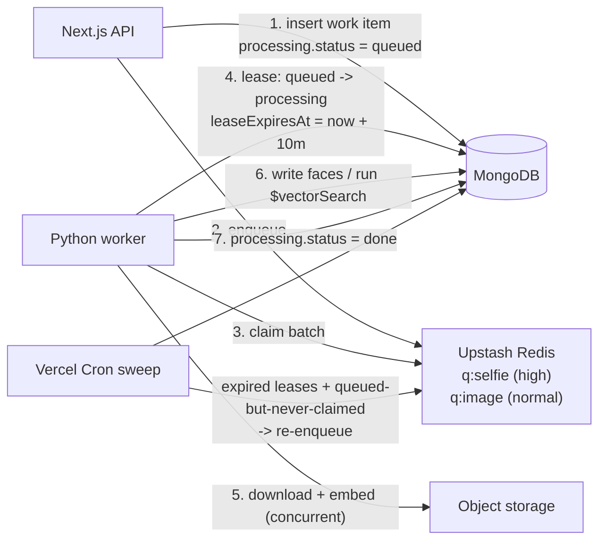

| Concern                                        | Owner                                   | Why                                                                                                                                                                                                                   |
| ---------------------------------------------- | --------------------------------------- | --------------------------------------------------------------------------------------------------------------------------------------------------------------------------------------------------------------------- |
| Durability, retry accounting, dead-lettering   | **MongoDB** (`processing` sub-document) | Satisfies "all uploads must be processed no matter the worker fails mid-way" without depending on broker semantics, and makes the broker swappable (C1, C4).                                                          |
| Wake-up, ordering, priority, backpressure      | **Upstash Redis**                       | The thing a managed queue is actually good at. Two lists/sorted sets — `q:selfie` drained before `q:image`, satisfying the PRD's "attendee selfie must be high priority".                                             |
| Concurrency, pipelining download vs. inference | **The worker**                          | PRD: never idle, download and processing concurrent, adapt to whichever is slower. This requires the worker to _pull_ on its own schedule — which is why a pull-based Redis queue was chosen over HTTP-push delivery. |

> **Why no generic `jobs` collection.** A job collection would duplicate identity that already exists: the work item _is_ the `eventImages` or `selfies` document. Embedding `processing` there removes a collection, removes a join on every status read, makes "how far along is this event?" a single indexed count on `eventImages`, and makes the unique index on `{eventId, assetId}` double as duplicate-job protection. The two work types are the only two we have; a generic framework for two types is speculative.

### 18.2 The `processing` sub-document

Identical shape on `eventImages` and `selfies`:

```js
processing: {
  status: "queued" | "processing" | "done" | "failed" | "skipped",
  priority: "high" | "normal",         // selfies high (PRD)
  attempts: 0,
  maxAttempts: 5,
  leaseExpiresAt: null,                // set on claim; the crash-recovery mechanism
  workerId: null,                      // which instance holds the lease (debugging)
  queuedAt, startedAt, finishedAt,
  durationMs: null,
  lastError: null,                      // { code, message, at, retryable }
  queueRef: { queueKey: "image", provider: "upstash", messageId: "..." },
  modelKeys: { detection: "...", recognition: "..." }   // reproducibility
}
```

| Field                      | Purpose                                                                                                                                                                                  |
| -------------------------- | ---------------------------------------------------------------------------------------------------------------------------------------------------------------------------------------- |
| `leaseExpiresAt`           | **The fault tolerance.** A worker crash leaves `processing` with an expired lease; the sweep flips it back to `queued` and re-enqueues. No broker visibility-timeout semantics required. |
| `attempts` / `maxAttempts` | Bounded retry, then `failed` → `pipeline.image.failed` (digested).                                                                                                                       |
| `queueRef`                 | The **only** place a broker identifier appears. Swapping Upstash for SQS changes `provider` and the adapter; no schema change (C1).                                                      |
| `modelKeys`                | Which models produced this result — so a model swap can identify stale results without guessing.                                                                                         |

**Claim** (atomic, safe with many concurrent workers):

```js
const doc = await eventImages.findOneAndUpdate(
  {
    _id: itemId,
    "processing.status": { $in: ["queued", "processing"] },
    $or: [
      { "processing.leaseExpiresAt": null },
      { "processing.leaseExpiresAt": { $lt: new Date() } },
    ],
  },
  {
    $set: {
      "processing.status": "processing",
      "processing.leaseExpiresAt": new Date(Date.now() + 600_000),
      "processing.workerId": workerId,
      "processing.startedAt": new Date(),
    },
    $inc: { "processing.attempts": 1 },
  },
  { returnDocument: "after" }
);
if (!doc) return; // someone else holds a live lease — skip, no error
```

**Sweep** (Vercel Cron, every 2 minutes) — the safety net that makes lost broker messages a non-event:

```js
// 1. expired leases -> requeue
// 2. queued for > 5 minutes with no messageId acknowledgement -> requeue
// 3. attempts >= maxAttempts -> failed  (emits pipeline.image.failed)
// 4. events with faces newer than a profile's lastMatchRunAt -> enqueue incremental match
```

Step 4 is the mechanism behind `attendee.matches.new`: no separate scheduling collection, just an indexed query on `{eventId, status, lastMatchRunAt}`.

### 18.3 `domainEvents` — transactional outbox + business log

One append-only collection that is the **single fan-out point** for notifications, analytics and queue publishing.

```js
{ _id, eventKey: "collab.invite.accepted",
  tenantId, actorRef: { kind: "user", id }, subjectRef: { kind: "invitation", id },
  payload: { ... },                       // minimal, resolvable identifiers
  occurredAt, recordedAt,
  dispatch: { notifications: "pending" | "done" | "skipped",
              analytics:     "pending" | "done",
              queue:         "pending" | "done" | "not_applicable" },
  expireAt }                              // TTL 180 days
```

| Why                                    | Detail                                                                                                                                                                                                         |
| -------------------------------------- | -------------------------------------------------------------------------------------------------------------------------------------------------------------------------------------------------------------- |
| **One emit point**                     | Business code calls `emitDomainEvent(...)` once. Notification fan-out, analytics rollup and queue publishing are consumers. Nobody has to remember to notify.                                                  |
| **At-least-once without transactions** | Write the domain event in the same operation as the state change where possible; a consumer picks it up and flips its own `dispatch` flag. A crash between the two leaves `pending`, and the consumer retries. |
| **Per-consumer status**                | Notification delivery failing must not block the analytics rollup, and vice versa.                                                                                                                             |
| **Replayable**                         | Re-running notification fan-out for a window is `{"dispatch.notifications":"pending"}` — useful after an outage.                                                                                               |

**Indexes:** `{"dispatch.notifications":1, occurredAt:1}` partial on `pending` · `{"dispatch.analytics":1, occurredAt:1}` partial on `pending` · `{tenantId:1, occurredAt:-1}` · `{eventKey:1, occurredAt:-1}` · `{expireAt:1}` TTL 0

### 18.4 `providerWebhookEvents` & `idempotencyKeys`

```js
// providerWebhookEvents — one inbox for ALL providers (§11.3)
{ _id, provider: "cashfree", env: "production", eventType: "PAYMENT_FAILED",
  providerEventId: "cf_evt_...",        // unique
  payloadHash: "sha256:...",            // fallback identity when no event id exists
  signatureValid: true,
  rawPayload: { ... },
  receivedAt, processedAt: null,
  processResult: null,                  // "applied" | "ignored" | "error"
  processError: null,
  expireAt }                            // TTL 90 days
```

**Indexes:** `{provider:1, providerEventId:1}` unique · `{provider:1, payloadHash:1}` unique partial on `providerEventId: null` · `{processedAt:1, receivedAt:1}` partial on `processedAt: null` · `{expireAt:1}` TTL 0

The unique index _is_ the deduplication: a replayed webhook fails to insert, the handler returns 200, and nothing is reprocessed. No application-level "have I seen this?" check.

```js
// idempotencyKeys — API-level replay protection
{ key, scope: "POST /api/billing/checkout", userId, requestHash,
  status: "in_progress" | "completed", responseSnapshot, createdAt, expireAt }  // TTL 24h
```

**Indexes:** `{key:1, scope:1}` unique · `{expireAt:1}` TTL 0

---

## 19. Domain G — Notification collections

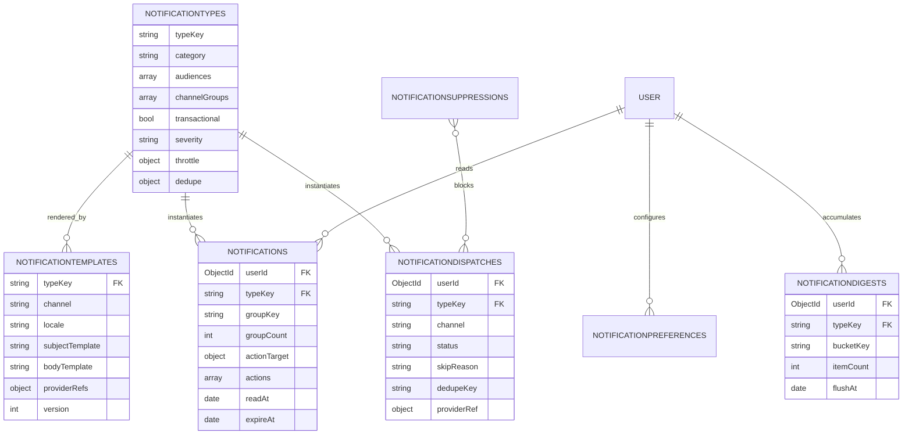

### 19.1 `notificationTypes` — the §4 matrix as data

```js
{
  typeKey: "attendee.matches.ready",
  category: "matching",
  audiences: ["attendee_identified"],
  channelGroups: [
    { group: "in_app",  enabled: true,  optOutAllowed: false },
    { group: "email",   enabled: true,  optOutAllowed: false },
    { group: "mobile",  enabled: true,  optOutAllowed: false,
      candidates: ["whatsapp", "sms"], strategy: "first_eligible" }
  ],
  transactional: true,
  severity: "important",                    // critical | important | informational
  respectQuietHours: true,                  // ignored when severity = critical
  throttle: { strategy: "none" },
  dedupe: { keyTemplate: "{typeKey}:{profileId}", windowHours: null },   // null = forever
  retainBody: true,
  actionable: false,
  enabled: true,
  version: 3, updatedAt, updatedByUserId
}
```

| Field                         | Purpose                                                                                                                                   |
| ----------------------------- | ----------------------------------------------------------------------------------------------------------------------------------------- |
| `channelGroups[]`             | **The routing decision, and the only copy of it.** `group` + `candidates` + `strategy` implement §1.1. Novu holds none of this (§8).      |
| `optOutAllowed`               | Per-group, because a user may be allowed to mute email for a type but not in-app.                                                         |
| `transactional`               | Rule 7: forces delivery regardless of preference.                                                                                         |
| `severity`                    | Drives quiet-hours bypass and admin escalation.                                                                                           |
| `throttle` / `dedupe`         | §6. `dedupe.keyTemplate` is interpolated and stored on the dispatch; a unique index enforces it.                                          |
| `retainBody`                  | `false` for OTP types — the dispatch record stores metadata only, never the code (rule 6).                                                |
| `actionable`                  | Whether the in-app row renders buttons (`collab.invite.sent` = true).                                                                     |
| `version` + `updatedByUserId` | Routing changes are audited. An admin UI edits these rows; `admin.plan.modified`-style notification to other admins can be extended here. |

**Indexes:** `{typeKey:1}` unique · `{category:1, enabled:1}` · `{"channelGroups.group":1}` (impact analysis: "what would muting SMS affect?")

Seeding this collection _is_ implementing §4. There is no routing code to write — only a resolver that reads it.

### 19.2 `notificationTemplates`

```js
{ typeKey: "attendee.matches.ready", channel: "email", locale: "en-IN",
  subjectTemplate: "{{count}} photos of you from {{eventName}}",
  bodyTemplate: "...{{galleryUrl}}...",       // MJML/Handlebars source
  variables: ["count", "eventName", "galleryUrl"],   // validated at render time
  providerRefs: { whatsappTemplateName: null },      // Meta-approved name, phase 2 only
  version: 4, active: true, updatedAt, updatedByUserId }
```

**Indexes:** `{typeKey:1, channel:1, locale:1, active:1}` unique partial on `active:true`

`variables[]` exists so a missing variable is a render-time error caught in CI against fixtures, rather than an email that says "Hi {{firstName}}".

`providerRefs.whatsappTemplateName` is the one unavoidable provider coupling: Meta requires pre-approved WhatsApp templates. It is confined to a single field on a single collection, tagged as a provider ref, and read only by the WhatsApp adapter.

### 19.3 `notificationPreferences`

One document per user, with three scopes:

```js
{ userId,
  global:    { email: "on", mobile: "off", in_app: "on" },
  byType:    { "event.details.updated": { email: "off" } },
  byEvent:   { "6702...": { mobile: "off" } },
  quietHours:{ enabled: true, start: "22:00", end: "07:00", timeZone: "Asia/Kolkata" },
  digest:    { "attendee.matches.new": "daily" },      // instant | quiet_period | daily | off
  locale: "en-IN", updatedAt }
```

**Index:** `{userId:1}` unique

> **Why one document with nested maps rather than a row per (user, type, channel).** At <1K users with 65 types × 3 groups, the row-per-preference model is up to ~200,000 rows to express what is almost always "defaults, plus two exceptions". The resolver needs _all_ of a user's preferences on every send, so one document is one read instead of a query. Maps keyed by `typeKey`/`eventId` are sparse — only overrides are stored, so the document stays small (typically well under 2 KB). The 16 MB limit is not reachable in this shape. If per-tenant admin-managed preference policies ever arrive, that is a new collection, not a change to this one.

### 19.4 `notifications` — the in-app feed

| Field                                   | Type             | Purpose                                                                      |
| --------------------------------------- | ---------------- | ---------------------------------------------------------------------------- |
| `userId`                                | ObjectId         | Owner                                                                        |
| `tenantId`, `eventId`                   | ObjectId \| null | Context for filtering and purge cascade; null for account/billing-level rows |
| `typeKey`                               | string           | → `notificationTypes`                                                        |
| `titleKey` / `title`, `body`            | string           | Rendered at write time (below)                                               |
| `data`                                  | object           | `{eventId, imageId, link, count, ...}` — the click-through payload           |
| `severity`                              | string           | Denormalised from the type for cheap UI styling                              |
| `groupKey`                              | string \| null   | Aggregation key, e.g. `String(eventId)` (§6)                                 |
| `groupCount`                            | int              | Incremented for grouped rows                                                 |
| `actionTarget`                          | object \| null   | `{kind: "invitation", id, state: "open" \| "resolved"}` (§7)                 |
| `actions`                               | array            | `[{key:"accept", label, style, state:"available"\|"unavailable"}]`           |
| `actionResolvedVia`, `actionResolvedAt` |                  | Cross-channel audit                                                          |
| `readAt`                                | date \| null     | **Null = unread** (P6)                                                       |
| `createdAt`, `updatedAt`                | date             | `updatedAt` moves on group increments so the feed re-sorts                   |
| `expireAt`                              | date             | `createdAt + 90 days`, set at insert                                         |

**Indexes:**

- `{userId:1, createdAt:-1}` — the feed
- `{userId:1, createdAt:-1}` **partial** on `readAt: null`, named `idx_user_unread` — the badge count; the partial predicate keeps this index proportional to _unread_ rows only, which is the hot, polled path
- `{userId:1, typeKey:1, groupKey:1}` partial on `readAt: null` — the aggregation upsert (§6)
- `{"actionTarget.kind":1, "actionTarget.id":1}` — closing actions across rows (§7)
- `{eventId:1}` sparse — purge cascade
- `{expireAt:1}` TTL 0

**Render at write time, not read time.** `title`/`body` are stored already rendered. Rationale: the feed is read far more than written (polled every 30 s); rendering on read would need a template + preference + locale lookup per row; and a notification should say what it said _when it was sent_, even if the template changed since. The cost is that a template fix doesn't retroactively update old rows — which is correct behaviour for a historical record.

**Lazy creation for pre-account invitees.** `collab.invite.sent` to an email with no account has no `userId`. Rather than a nullable-userId row, the in-app notification is created on first login by a small hook: resolve `invitations` where `invitee.email == user.email` and `status == "pending"`, and insert the feed rows. One function, no schema compromise.

**API surface** (first-party, polling, per your constraints):

| Method | Route                                       | Notes                                                                                                                            |
| ------ | ------------------------------------------- | -------------------------------------------------------------------------------------------------------------------------------- |
| `GET`  | `/api/notifications?cursor=&limit=`         | Cursor = `createdAt` + `_id`; default window 30 days                                                                             |
| `GET`  | `/api/notifications/unread-count`           | The hot path. `countDocuments` against `idx_user_unread`. Polled every 30 s, paused on `document.visibilityState !== "visible"`. |
| `POST` | `/api/notifications/:id/read` · `/read-all` |                                                                                                                                  |
| `POST` | `/api/notifications/:id/actions/:actionKey` | Delegates to the owning entity's idempotent transition (§7)                                                                      |

A future realtime transport (Pusher/SSE elsewhere) changes only _how the client learns to refetch_. The collection, indexes, routes and components are unchanged — so it is a genuine later decision, not a rewrite.

### 19.5 `notificationDispatches`

One row per (notification, channel) attempt — **including skips**.

| Field                                           | Type                                                                                                                               | Purpose                                                                                                                                                                    |
| ----------------------------------------------- | ---------------------------------------------------------------------------------------------------------------------------------- | -------------------------------------------------------------------------------------------------------------------------------------------------------------------------- |
| `userId`, `tenantId`, `eventId`                 | ObjectId                                                                                                                           | Scope                                                                                                                                                                      |
| `typeKey`, `channel`                            | string                                                                                                                             | `channel` is the **resolved** channel (`"sms"`), while `channelGroup` records what was requested (`"mobile"`) — this pair is how you later prove WhatsApp fallback behaved |
| `channelGroup`                                  | string                                                                                                                             |                                                                                                                                                                            |
| `status`                                        | `"queued" \| "sent" \| "delivered" \| "failed" \| "skipped" \| "bounced"`                                                          | Normalised across providers by the adapter                                                                                                                                 |
| `skipReason`                                    | `"user_opt_out" \| "no_verified_contact" \| "suppressed" \| "throttled" \| "deduped" \| "type_disabled" \| "quiet_hours_deferred"` | **The answer to "why didn't they get it?"** (§5)                                                                                                                           |
| `dedupeKey`                                     | string \| null                                                                                                                     | Interpolated from the type; **unique index enforces dedupe**                                                                                                               |
| `contactHash`                                   | string                                                                                                                             | SHA-256 of the destination. Hashed so the delivery log isn't a harvestable contact list, while still supporting "did we ever reach this address?"                          |
| `templateVersion`                               | int                                                                                                                                | Which copy went out                                                                                                                                                        |
| `providerRef`                                   | object \| null                                                                                                                     | `{provider, env, messageId}` — a single object, not an array, because a dispatch has exactly one provider attempt                                                          |
| `attempts`, `lastError`                         |                                                                                                                                    | Retry accounting                                                                                                                                                           |
| `queuedAt`, `sentAt`, `deliveredAt`, `failedAt` | date                                                                                                                               | Receipt timeline from provider webhooks                                                                                                                                    |
| `notificationId`                                | ObjectId \| null                                                                                                                   | Links to the in-app row, when there is one                                                                                                                                 |
| `expireAt`                                      | date                                                                                                                               | TTL 180 days                                                                                                                                                               |

**Indexes:**

- `{dedupeKey:1}` **unique partial** on `dedupeKey != null` — dedupe by database constraint, not by code
- `{userId:1, queuedAt:-1}` — support view
- `{status:1, queuedAt:1}` partial on `queued` — retry sweep
- `{"providerRef.provider":1, "providerRef.messageId":1}` partial — delivery-receipt webhook → dispatch
- `{typeKey:1, channel:1, queuedAt:-1}` — deliverability analytics
- `{expireAt:1}` TTL 0

### 19.6 `notificationDigests` & `notificationSuppressions`

```js
// notificationDigests — open buckets awaiting flush
{ userId, typeKey, bucketKey: "attendee.matches.new:6702abc",
  itemCount: 38, sampleItems: [ /* first 5, for the summary line */ ],
  firstItemAt, lastItemAt, flushAt, status: "open" | "flushed", expireAt }
```

**Indexes:** `{userId:1, bucketKey:1}` unique partial on `status:"open"` · `{status:1, flushAt:1}` partial on `open` (the flush cron) · `{expireAt:1}` TTL 0

`flushAt` is pushed forward on each arrival (quiet-period behaviour) but never beyond `firstItemAt + hardFlushHours`, which is how "flush 15 min after the burst ends, but never later than 6 h" is expressed as one field.

```js
// notificationSuppressions — the permanent do-not-send list
{ channel: "email", contactHash: "sha256:...",
  reason: "hard_bounce" | "complaint" | "unsubscribe" | "dnd_registry" | "invalid",
  source: { provider: "novu", providerEventId: "..." },
  scope: "all" | "marketing",
  createdAt, expiresAt: null }
```

**Indexes:** `{channel:1, contactHash:1}` unique · `{createdAt:-1}`

> **Why suppressions are first-party even though the provider maintains its own list.** Three reasons: a provider swap must not resurrect a hard-bounced address; the resolver must be able to skip _before_ spending a send (and record `skipReason: "suppressed"`); and Indian DND/TRAI obligations for SMS are ours to honour, not a vendor's. `scope` distinguishes "never contact" from "no marketing" so an unsubscribe can't silently block an OTP.

---

## 20. Domain H — Analytics, audit, compliance

### 20.1 `analyticsDaily`

```js
{ scope: { kind: "tenant" | "event" | "platform", id: ObjectId | null },
  dateKey: "2026-09-24",
  metrics: { eventsCreated: 3, imagesUploaded: 4120, imagesProcessed: 4118,
             imagesFailed: 2, selfiesUploaded: 87, matchesCreated: 1904,
             uniqueAttendees: 84, storageBytesAdded: 12884901888,
             downloads: 412, notificationsSent: 260,
             revenueMinor: 49900, p95ProcessingMs: 3400 },
  computedAt }
```

**Indexes:** `{"scope.kind":1, "scope.id":1, dateKey:-1}` unique · `{dateKey:-1}`

> **Why there is no raw `activityEvents` collection.** `domainEvents` is already an append-only business log with a 180-day TTL. A nightly job rolls it (plus counts from `eventImages`, `faceMatches`, `notificationDispatches`) into `analyticsDaily`. A second raw-event collection would duplicate the same facts with a second TTL to tune, and both dashboards (client + admin) read only rollups. If product analytics later needs clickstream granularity, that belongs in a dedicated analytics tool, not in the transactional database.

### 20.2 `auditLogs`

```js
{ actor: { kind: "user" | "admin" | "system", id, ipHash, uaHash },
  action: "plan.price.updated" | "member.removed" | "subscription.downgraded" | "dsr.executed",
  target: { kind: "plan" | "event" | "user" | "subscription", id },
  tenantId, before: {...}, after: {...},
  reason, at, expireAt }   // TTL 400 days
```

**Indexes:** `{tenantId:1, at:-1}` · `{"actor.id":1, at:-1}` · `{"target.kind":1,"target.id":1, at:-1}` · `{action:1, at:-1}` · `{expireAt:1}` TTL 0

Scope is deliberately narrow: **admin actions, billing state changes, membership changes and privacy operations.** Auditing every read would swamp the collection and make the interesting rows unfindable. The 400-day TTL exceeds a full audit year.

### 20.3 `dataSubjectRequests`

```js
{ requestType: "access" | "erasure" | "rectification" | "portability" | "consent_withdrawal",
  subject: { kind, userId?, attendeeSessionId?, verifiedEmail },
  regulation: "gdpr" | "dpdpa",
  status: "received" | "verifying" | "in_progress" | "completed" | "rejected",
  slaDueAt,                                  // drives admin.dsr.sla_risk
  scope: { tenantIds: [...], eventIds: [...] },
  executionLog: [ { step: "faceEmbeddings.deleted", count: 412, at } ],
  exportAssetId, completedAt, rejectionReason,
  receivedAt }
```

**Indexes:** `{"subject.userId":1, receivedAt:-1}` · `{status:1, slaDueAt:1}` partial on open statuses · `{regulation:1, status:1}`

`executionLog` is what turns "we deleted your data" into evidence. Because vectors live only on `imageFaces` and `selfies`, and both carry `tenantId` + `eventId` + subject refs (P8), erasure is a bounded, countable sequence of `deleteMany` calls whose counts are recorded — not a scavenger hunt.

### 20.4 `platformSettings`

Singleton document; the home of every tunable that must not be a hard-coded constant.

```js
{ _id: "singleton",
  dunning:  { gracePeriodDays: 14, reminderDays: [1,5,7,11,13], maxChargeRetries: 3 },
  retention:{ notificationDays: 90, notificationActiveDays: 30,
              dispatchDays: 180, domainEventDays: 180, webhookDays: 90,
              attendeeSessionDays: 30, uploadSessionDays: 5 },
  face:     { activeSpaceKey: "arcface_r100_512", matchLimit: 500,
              minDetScore: 0.55, exactSearch: true },
  pipeline: { leaseMinutes: 10, maxAttempts: 5, sweepIntervalSeconds: 120,
              backlogWarnDepth: 5000, backlogWarnAgeMinutes: 15 },
  upload:   { multipartThresholdBytes: 8388608, maxFileBytes: 104857600,
              supportedMimeTypes: [...] },
  notifications: { pollIntervalSeconds: 30, digestQuietMinutes: 15,
                   digestHardFlushHours: 6, maxDigestEmailsPerDay: 3 },
  updatedAt, updatedByUserId }
```

Every number quoted anywhere in this document is read from here. `face.activeSpaceKey` is the single switch that promotes a new face model (§17.2); `face.exactSearch` is the single switch from ENN to ANN.

---

# Part III — Cross-cutting

## 21. Index summary

Non-obvious indexes only; the full set is listed per collection above.

| Collection               | Index                                                          | Type               | Why it matters                                                                      |
| ------------------------ | -------------------------------------------------------------- | ------------------ | ----------------------------------------------------------------------------------- |
| `notifications`          | `{userId:1, createdAt:-1}` on `readAt: null`                   | **partial**        | The polled badge count. Partial keeps it sized to unread rows, not all rows.        |
| `notificationDispatches` | `{dedupeKey:1}` on `dedupeKey != null`                         | **unique partial** | "SMS exactly once per attendee+event" enforced by the DB, not by code.              |
| `eventMembers`           | `{eventId:1, role:1}` on `{role:"organizer", status:"active"}` | **unique partial** | "Exactly one organizer per event" enforced by the DB.                               |
| `subscriptions`          | `{tenantId:1}` on `status ∉ {cancelled, expired}`              | **unique partial** | "One live subscription per tenant" enforced by the DB.                              |
| `eventImages`            | `{eventId:1, assetId:1}`                                       | **unique**         | Concurrent duplicate upload by a co-organizer fails on insert — no read-check race. |
| `faceMatches`            | `{profileId:1, imageId:1, faceIndex:1}`                        | **unique**         | Makes every incremental re-match idempotent. The whole §17.4 design rests on this.  |
| `imageFaces`             | `vectors.<space>` + filters `eventId`, `createdAt`             | **vectorSearch**   | Event-scoped, incremental semantic search inside MongoDB (C3).                      |
| `events`                 | `{"accessLinks.slug":1}` on `active: true`                     | **unique partial** | Public link resolution; revoked slugs can't be reused and don't collide.            |
| `mediaAssets`            | `{tenantId:1, contentHash:1}`                                  | **unique**         | Tenant-scoped dedupe (§16.1).                                                       |
| `providerWebhookEvents`  | `{provider:1, providerEventId:1}`                              | **unique**         | Webhook replay protection with zero application logic.                              |
| all tenant-scoped        | `tenantId` as leading field                                    | compound           | P3 — makes the tenant-safe query the only fast query.                               |

## 22. Retention & TTL

| Collection                                                | Window                                                 | Mechanism                 | Rationale                                                                                                                                                                                                                                                                                 |
| --------------------------------------------------------- | ------------------------------------------------------ | ------------------------- | ----------------------------------------------------------------------------------------------------------------------------------------------------------------------------------------------------------------------------------------------------------------------------------------- |
| `notifications`                                           | 30 d active / 90 d visible / delete at 90 d            | TTL on `expireAt`         | The 30-day cutoff is a `createdAt` filter in the list query (not a separate collection); deletion is MongoDB's background TTL monitor. No cron.                                                                                                                                           |
| `notificationDispatches`                                  | 180 d                                                  | TTL                       | Outlives any plausible delivery dispute.                                                                                                                                                                                                                                                  |
| `notificationDigests`                                     | 7 d                                                    | TTL                       | Buckets are flushed in hours; TTL only reaps abandoned ones.                                                                                                                                                                                                                              |
| `domainEvents`                                            | 180 d                                                  | TTL                       | Long enough for replay and rollup backfill.                                                                                                                                                                                                                                               |
| `providerWebhookEvents`                                   | 90 d                                                   | TTL                       | Beyond any provider's own replay window.                                                                                                                                                                                                                                                  |
| `idempotencyKeys`                                         | 24 h                                                   | TTL                       | Client retry horizon.                                                                                                                                                                                                                                                                     |
| `attendeeSessions`                                        | 30 d                                                   | TTL                       | Bounds anonymous-selfie exposure.                                                                                                                                                                                                                                                         |
| `uploadSessions`                                          | 5 d                                                    | TTL                       | Deliberately **before** the 7-day storage lifecycle rule that aborts incomplete multipart uploads, so our state is gone before the bytes are.                                                                                                                                             |
| `auditLogs`                                               | 400 d                                                  | TTL                       | Exceeds a full audit year.                                                                                                                                                                                                                                                                |
| `eventImages`, `imageFaces`, `faceMatches`, `mediaAssets` | `events.retentionExpiresAt`                            | **application purge job** | **Never TTL.** These carry storage cost and biometric data; deletion must be ordered (storage objects, then vectors, then metadata), counted for DSR evidence, and preceded by the `event.retention.expiring` / `attendee.gallery.expiring` warnings. TTL gives no hooks and no ordering. |
| `selfies`                                                 | `createdAt + 90 d` or event retention, whichever first | TTL on `expireAt`         | Biometric minimisation: the probe image has no value after the event.                                                                                                                                                                                                                     |
| Everything billing                                        | **never**                                              | —                         | Financial records.                                                                                                                                                                                                                                                                        |

> **Note on TTL semantics:** MongoDB's TTL monitor runs roughly every 60 seconds, so deletion is "shortly after `expireAt`", not exactly at it. That is fine for every use above; it is _not_ fine for anything treated as a security boundary, which is why signed-URL expiry is enforced at the edge and not by a TTL.

## 23. Consistency & transactions

Transactions are used in exactly four places, because everywhere else a better mechanism exists.

| Operation                                                                      | Mechanism                                           | Why                                                                                           |
| ------------------------------------------------------------------------------ | --------------------------------------------------- | --------------------------------------------------------------------------------------------- |
| Entitlement check + domain write + counter `$inc`                              | **Transaction**                                     | A created event that doesn't increment the counter means free events forever. Must be atomic. |
| Upload complete: `mediaAssets` insert + `eventImages` insert + storage counter | **Transaction**                                     | Storage billing correctness.                                                                  |
| Payment webhook: `billingTransactions` insert + `subscriptions` update         | **Transaction**                                     | Money and access must move together.                                                          |
| Invitation accept: `invitations` transition + `eventMembers` insert            | **Transaction**                                     | Prevents a "accepted but not a member" limbo.                                                 |
| Everything else                                                                | `findOneAndUpdate` / unique index / `$inc` / outbox | Cheaper, works across shards, and can't deadlock.                                             |

Four rules that make the rest work without transactions:

1. **Conditional single-document updates over read-then-write.** Every state machine transition puts the expected prior state in the filter (§7, §18.2). A lost race matches zero documents and is handled, not retried into corruption.
2. **Unique indexes over existence checks.** Dedupe, one-organizer, one-live-subscription, webhook replay, match idempotency are all enforced by index. Duplicate-key errors are expected control flow.
3. **`$inc` over read-modify-write.** All counters. Reconciled nightly against source data.
4. **Outbox over dual writes.** No code path writes domain state and calls a provider in the same breath; it writes a `domainEvent`, and a consumer calls the provider (§18.3).

**Reads:** `majority` read concern for anything gating money or access (entitlement checks, payment projections). `local` is fine for the gallery and feed, where a sub-second stale read is invisible. Vector search reads the search index, which is eventually consistent by design — addressed in §17.4.

## 24. Sizing

At the PRD's ceiling — 1,000 clients, ~1,000 events, 5,000 images/event, ~3 faces/image, ~100 attendees/event:

| Collection               | Docs      | Avg size | Total      | Notes                                                                              |
| ------------------------ | --------- | -------- | ---------- | ---------------------------------------------------------------------------------- |
| `imageFaces`             | ~15 M     | ~2.3 KB  | **~35 GB** | Dominated by the 2,048-byte vector. The one collection that needs a capacity plan. |
| `faceMatches`            | ~5 M      | ~250 B   | ~1.3 GB    |                                                                                    |
| `eventImages`            | ~5 M      | ~500 B   | ~2.5 GB    |                                                                                    |
| `mediaAssets`            | ~5 M      | ~800 B   | ~4 GB      |                                                                                    |
| `notifications`          | ~2 M live | ~600 B   | ~1.2 GB    | Bounded by the 90-day TTL.                                                         |
| `notificationDispatches` | ~4 M live | ~500 B   | ~2 GB      | Bounded by the 180-day TTL.                                                        |
| everything else          | < 1 M     | —        | < 1 GB     |                                                                                    |

**Vector index memory:** 15 M × 512 dims. At float32 that would be ~30 GB of index; with `quantization: "scalar"` (int8) it is roughly **~8 GB**, which is the difference between fitting in a reasonable Atlas tier's RAM and not. Three levers if it grows:

1. **Retention is the primary lever.** Purging expired events removes faces and their index entries. At a 90-day gallery retention, the steady state is far below the cumulative total.
2. `quantization: "binary"` with full-fidelity rescoring — a further ~24× index reduction, at some recall cost. Worth benchmarking before it's needed.
3. Per-event face caps and `detScore` gating at write time — don't embed faces the matcher would reject anyway.

**Atlas tier:** vector search indexes are available on Flex/free tiers with index-count limits, but the working set above needs a dedicated tier (M10+, realistically M20/M30 for the vector index RAM). Budget for that explicitly — it is the single largest infrastructure line item in this design.

## 25. Query recipes

<details>
<summary><strong>Attendee gallery page — newest first, with "New" badges</strong></summary>

```js
// PRD: newest at top, paginated, live count, "New" badge for unseen
const matches = await faceMatches.aggregate([
  { $match: { profileId, hiddenAt: null, ...(cursor && { createdAt: { $lt: cursor } }) } },
  { $sort: { createdAt: -1 } },
  { $limit: 40 },
  {
    $lookup: {
      from: "eventImages",
      localField: "imageId",
      foreignField: "_id",
      as: "img",
      pipeline: [
        { $match: { visibility: "visible", deletedAt: null } },
        { $project: { assetId: 1, sequence: 1 } },
      ],
    },
  },
  { $unwind: "$img" },
  {
    $lookup: {
      from: "mediaAssets",
      localField: "img.assetId",
      foreignField: "_id",
      as: "asset",
      pipeline: [{ $project: { "derivatives.thumbnail": 1, imageMeta: 1 } }],
    },
  },
  { $unwind: "$asset" },
  {
    $project: {
      similarity: 1,
      createdAt: 1,
      isNew: { $gt: ["$createdAt", profile.lastSeenGalleryAt ?? new Date(0)] },
      thumbnail: "$asset.derivatives.thumbnail",
      width: "$asset.imageMeta.width",
      height: "$asset.imageMeta.height",
      orientation: "$asset.imageMeta.orientation",
    },
  },
]);
// live total = profile.matchCount (cached, $inc'd) — no count query per page
```

`width`/`height`/`orientation` are returned so the grid can reserve correct aspect-ratio space before the image loads — the PRD's "correct orientation, layout and padding" requirement, with no layout shift.
</details>

<details>
<summary><strong>Batch upload resolve — dedupe + resume in one round trip</strong></summary>

```js
// POST /uploads/batch-resolve  { hashes: [...] }
const [assets, sessions] = await Promise.all([
  mediaAssets
    .find(
      { tenantId, contentHash: { $in: hashes }, status: { $ne: "purged" } },
      { projection: { contentHash: 1, _id: 1 } }
    )
    .toArray(),
  uploadSessions
    .find(
      {
        tenantId,
        createdByUserId: userId,
        contentHash: { $in: hashes },
        status: { $in: ["pending", "in_progress"] },
      },
      { projection: { contentHash: 1, externalRefs: 1, mode: 1 } }
    )
    .toArray(),
]);
// completed -> skip upload entirely
// in_progress -> return the provider multipart id so the client resumes
// neither -> fresh upload
```

Note the session lookup is scoped by `createdByUserId` (§16.2) while the asset lookup is not — in-flight uploads are per-user, completed content is shared within the tenant.
</details>

<details>
<summary><strong>Organizer dashboard — one read, no aggregation</strong></summary>

```js
const [tenant, sub, counters] = await Promise.all([
  tenants.findOne({ _id: tenantId }, { projection: { counters: 1, settings: 1 } }),
  subscriptions.findOne({ tenantId, status: { $ne: "cancelled" } }),
  usageCounters.find({ tenantId, periodKey: { $in: [monthKey(), "lifetime"] } }).toArray(),
]);
// tenant.counters serves the headline numbers (P7);
// usageCounters + plan.entitlements + entitlementGrants serve the quota bars.
```

</details>

<details>
<summary><strong>Notification fan-out from a domain event</strong></summary>

```js
const ev = await domainEvents.findOneAndUpdate(
  { "dispatch.notifications": "pending" },
  { $set: { "dispatch.notifications": "in_progress" } },
  { sort: { occurredAt: 1 } }
);

const type = await notificationTypes.findOne({ typeKey: ev.eventKey, enabled: true });
const recipients = await resolveRecipients(type.audiences, ev); // reads eventMembers / tenants

for (const r of recipients) {
  const prefs = await notificationPreferences.findOne({ userId: r.userId });
  for (const group of type.channelGroups.filter((g) => g.enabled)) {
    const decision = resolveChannel(group, type, prefs, r); // §5, pure function
    if (decision.skip) {
      await recordSkip(r, type, group, decision.reason);
      continue;
    }
    if (decision.channel === "in_app") {
      await writeFeedRow(r, type, ev);
      continue;
    }
    const rendered = await renderTemplate(type.typeKey, decision.channel, prefs.locale, ev.payload);
    await enqueueDispatch(r, type, decision, rendered); // -> MessageTransport
  }
}
await domainEvents.updateOne({ _id: ev._id }, { $set: { "dispatch.notifications": "done" } });
```

`resolveChannel` is a pure function of (type row, preference doc, user profile, suppression list) — fully unit-testable with no provider, which is the practical payoff of §8.
</details>

## 26. Schema versioning

Every collection that may evolve carries `schemaVersion: <int>`.

**Migration strategy: lazy, read-triggered, with a backfill sweep.**

```ts
function migrate(doc) {
  if (doc.schemaVersion === CURRENT) return doc;
  if (doc.schemaVersion === 1) doc = v1_to_v2(doc);
  if (doc.schemaVersion === 2) doc = v2_to_v3(doc);
  return doc;
}
```

1. Deploy code that reads **both** shapes.
2. Migrate on read (write back opportunistically).
3. Run a low-priority backfill sweep to convert the tail.
4. Remove the old branch once `countDocuments({schemaVersion: {$lt: CURRENT}}) == 0`.

No maintenance window, no big-bang migration, and a rollback is possible at every step. The alternative — a one-shot migration script — is untenable on a 15 M-document collection on a serverless platform with request timeouts.

Additive changes (new optional field, new enum value, new entitlement key, new notification type) do **not** bump `schemaVersion`. Only shape changes do.

## 27. Security & privacy

| Area                        | Measure                                                                                                                                                                                                                                                      |
| --------------------------- | ------------------------------------------------------------------------------------------------------------------------------------------------------------------------------------------------------------------------------------------------------------ |
| **Biometric minimisation**  | Vectors live only on `imageFaces` / `selfies`, never duplicated or embedded elsewhere. Every row carries `tenantId` + `eventId` + subject refs, so erasure is a bounded, countable `deleteMany`. Vectors are never returned to any client, by any API, ever. |
| **Bearer tokens hashed**    | `attendeeSessions.tokenHash`, `invitations.tokenHash`, `pushTokens[].tokenHash`. A database dump must not be a set of working credentials.                                                                                                                   |
| **Contacts hashed in logs** | `notificationDispatches.contactHash`, `auditLogs.actor.ipHash`. The delivery log is queryable without being a harvestable contact list.                                                                                                                      |
| **Secrets never in Mongo**  | Provider API keys, HMAC signing secrets and R2 credentials live in the platform secret store. `externalRefs` holds identifiers only.                                                                                                                         |
| **Tenant isolation**        | P3 index shape + repository-enforced filters + nightly cross-tenant audit (§10.2).                                                                                                                                                                           |
| **Webhook trust**           | Signature verified before any write; raw payload stored; unique event id dedupes replays; **nothing trusts a client-side redirect** for state.                                                                                                               |
| **Cross-tenant read**       | Exactly one whitelisted path: `attendeeEventProfiles` by `subject.userId`. Enforced in one function, covered by an explicit test.                                                                                                                            |
| **OTP secrecy**             | `retainBody: false` on `auth.otp.*` types; `in_app: false` so codes never enter a durable, session-readable feed.                                                                                                                                            |
| **Right to erasure**        | `dataSubjectRequests.executionLog` records step + count; because vectors and matches are keyed by subject, "we deleted 412 embeddings and 1,904 matches" is provable.                                                                                        |
| **Consent demonstrability** | `consents` stores `policyVersion` **and** `policyDocumentHash` — a version string alone is worthless if the document behind it changed.                                                                                                                      |
| **Data residency**          | `tenants.dataRegion` recorded from day one; retrofitting residency onto existing rows is far worse than carrying an unused field.                                                                                                                            |

## 28. Provider-swap playbooks

Each swap should be adapter-only. These are the concrete steps, which double as a test of whether the schema actually delivers C1.

<details>
<summary><strong>Payment provider (Cashfree → anything)</strong></summary>

1. Implement the adapter: `createMandate`, `chargeOnce`, `cancelMandate`, `fetchStatus`, `verifyWebhook`, `normalizeStatus`, `normalizeFailureCategory`.
2. Create plans at the new provider; push a new element into `plans.prices[].externalRefs` with `provider: "<new>"`. **Old refs stay.**
3. Set `NEW_SUBSCRIPTIONS_PROVIDER=<new>`. New subscriptions get new refs; existing ones keep charging through the old adapter.
4. Both webhook endpoints stay live; `providerWebhookEvents.provider` disambiguates.
5. Migrate existing mandates opportunistically (mandates cannot be transferred — each user re-authorises on their next natural touchpoint).
6. Retire the old adapter when no live subscription holds an old-provider ref.

**Schema changes: zero.** No field is named after either provider.
</details>

<details>
<summary><strong>Notification provider (Novu → SendGrid + Twilio direct)</strong></summary>

1. Implement `MessageTransport.send()` for the new stack.
2. Point `notificationDispatches.providerRef.provider` at the new key (new rows only).
3. Map delivery webhooks into `providerWebhookEvents`, then into dispatch status.
4. Import the suppression list — **already first-party** in `notificationSuppressions`, so nothing is lost (§19.6).
5. For WhatsApp, populate `notificationTemplates.providerRefs.whatsappTemplateName`.
6. Delete the Novu adapter.

**Schema changes: zero. Routing, copy, preferences, digests, in-app feed: untouched** — because Novu never held any of them (§8).
</details>

<details>
<summary><strong>Queue (Upstash → SQS) and storage (R2 → S3)</strong></summary>

Queue: implement `enqueue`/`claim`/`ack`; change `processing.queueRef.provider`. MongoDB already holds durable job state, so in-flight work is never lost — the sweep re-enqueues anything whose lease expires during the cutover (§18.2).

Storage: add the new location to the `locationKey` config map, copy objects, flip the mapping. `mediaAssets.storage.objectKey` is content-addressed and provider-agnostic, so **not one of the millions of documents changes** (§11.2).
</details>

<details>
<summary><strong>Face model (InsightFace variant → anything)</strong></summary>

Follow §17.2: new `faceModels` row with a new `spaceKey`, new vector path, second Atlas index, dual-write backfill, shadow evaluation, then flip `platformSettings.face.activeSpaceKey`. Old vectors and index are dropped after a hold period.

**Schema changes: zero** — the vector path is data, not a field name.
</details>

## 29. Conventions

| Convention      | Rule                                                              | Why                                                                                                                    |
| --------------- | ----------------------------------------------------------------- | ---------------------------------------------------------------------------------------------------------------------- |
| Collections     | `lowerCamelCase`, plural. Better Auth's stay singular.            | The singular/plural difference is a useful visual marker for "not ours".                                               |
| Fields          | `lowerCamelCase`                                                  | Matches the TS domain objects; no mapping layer.                                                                       |
| `*Id`           | `ObjectId` reference within this DB                               | Distinguishes internal from external identity.                                                                         |
| `*Key`          | Stable human-readable identifier (`"starter"`, `"event.created"`) | Config is referenced by key, never `ObjectId`, so it can be hard-coded in code/templates/tests and survive re-seeding. |
| `*At`           | `Date`, always UTC                                                | Display timezone is a separate, explicit field.                                                                        |
| `*Ref`          | `{kind, id}` polymorphic pointer                                  | One collection points at several target types without nullable-field sprawl.                                           |
| Money           | Integer minor units + ISO currency                                | Floats are unacceptable in a payment ledger.                                                                           |
| Enums           | Lowercase snake strings                                           | Readable in the shell, greppable, no magic numbers.                                                                    |
| Booleans        | Prefer nullable timestamps (`readAt`, not `isRead`)               | Same cost, more information, supports partial indexes on `{field: null}`.                                              |
| Vendor ids      | Only in `externalRefs` / `providerRef` / `queueRef`               | C1.                                                                                                                    |
| Vectors         | BinData subtype 9, FLOAT32, L2-normalised                         | ~3× smaller than double arrays; valid as index and query vector.                                                       |
| `schemaVersion` | Int on anything that may evolve                                   | §26.                                                                                                                   |
| `tenantId`      | First field of every compound index on tenant data                | P3.                                                                                                                    |

## 30. Deliberately omitted

Every one of these was in an earlier draft and was removed for your simplicity constraint. Each entry states what replaced it, so re-adding is an informed decision rather than a rediscovery.

| Omitted                                                                 | Replaced by                                                                  | Re-add when                                                                                                                         |
| ----------------------------------------------------------------------- | ---------------------------------------------------------------------------- | ----------------------------------------------------------------------------------------------------------------------------------- |
| Generic `jobs` collection                                               | `processing` sub-document on `eventImages` / `selfies` (§18.2)               | A third or fourth work type appears, or jobs need to exist without a domain item (e.g. scheduled exports).                          |
| `upload_parts` collection                                               | The object store's own `ListParts` on the exceptional resume path (§16.2)    | `ListParts` latency becomes a measured bottleneck at a high resume rate.                                                            |
| `usageLedger` (append-only deltas)                                      | Reconciliation directly from source data (`eventImages` sizes, event counts) | A customer disputes a usage number and source-data reconstruction proves too slow. Note the source data _is_ the stronger evidence. |
| `activityEvents` (raw analytics, TTL)                                   | `domainEvents` → nightly rollup into `analyticsDaily` (§20.1)                | Product analytics needs clickstream granularity — and then it belongs in a dedicated analytics tool.                                |
| `matchRuns` collection                                                  | `attendeeEventProfiles.lastMatchRunAt` watermark (§17.4)                     | Batch re-matching needs progress reporting or partial-failure resumption across millions of profiles.                               |
| `eventAccessLinks` collection                                           | `events.accessLinks[]` embedded (§15.1)                                      | A single event needs dozens of links (per-channel tracking, per-guest links).                                                       |
| `livenessChecks` collection                                             | `selfies.liveness` embedded (§16.4)                                          | Liveness attempts must be queried independently of a stored selfie (e.g. attempts that never produced one).                         |
| `faceEmbeddings` collection                                             | Vector on `imageFaces` / `selfies` (§17.3)                                   | **Never** — Atlas Vector Search requires the vector on the indexed collection; splitting would force a `$lookup` per result.        |
| `planPrices` collection                                                 | `plans.prices[]` embedded (§14.1)                                            | Prices need independent lifecycle (per-tenant negotiated pricing at scale).                                                         |
| `file_references` join (global dedupe)                                  | Tenant-scoped dedupe + `mediaAssets.refCount` (§16.1)                        | **Deliberately never** — see the three reasons in §16.1.                                                                            |
| Image-face → selfie match direction                                     | Selfie → image faces only (§17.1)                                            | Attendee counts per event exceed face counts per event, which would invert the cost argument.                                       |
| Novu per-type workflows, channel-config fetch + cache, drift reconciler | Three pass-through transport workflows (§8)                                  | **Never** — the whole point is that there is nothing to drift.                                                                      |
| Realtime transport (WebSocket/SSE/Pusher)                               | 30-second polling on `unread-count` (§19.4)                                  | Users complain about latency. The collection, indexes, routes and components don't change.                                          |
