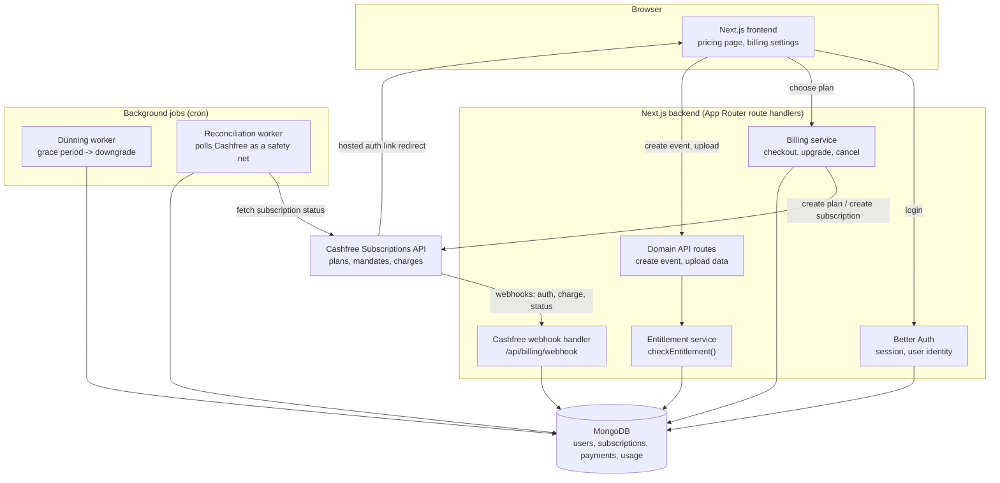
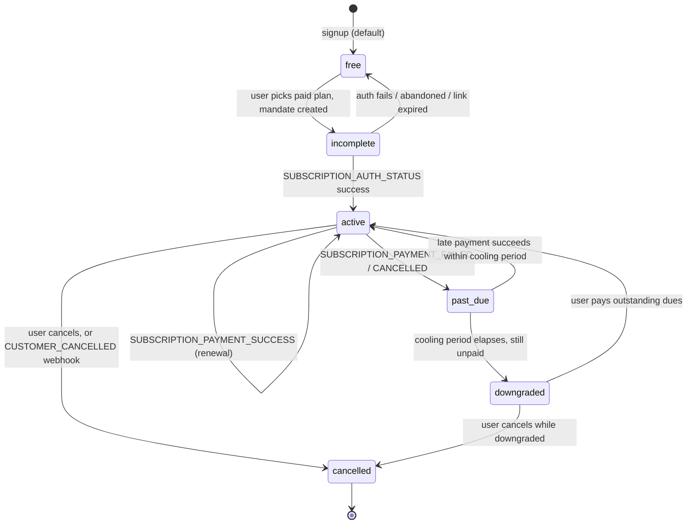
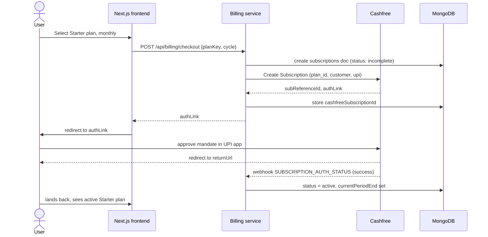
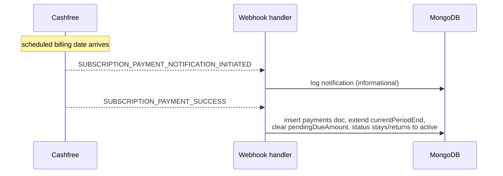
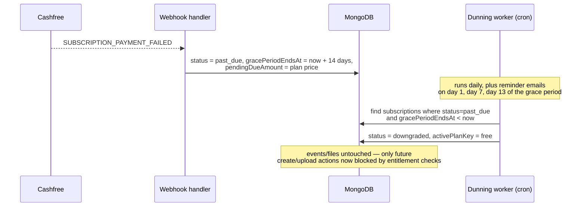
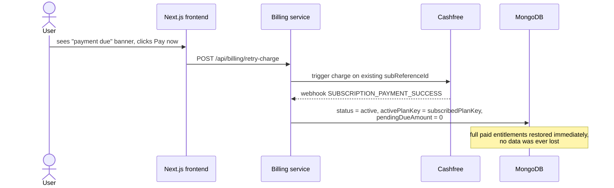
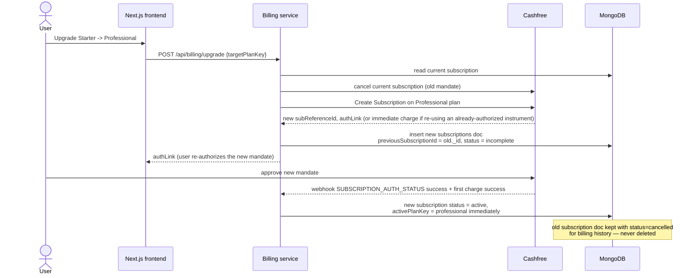
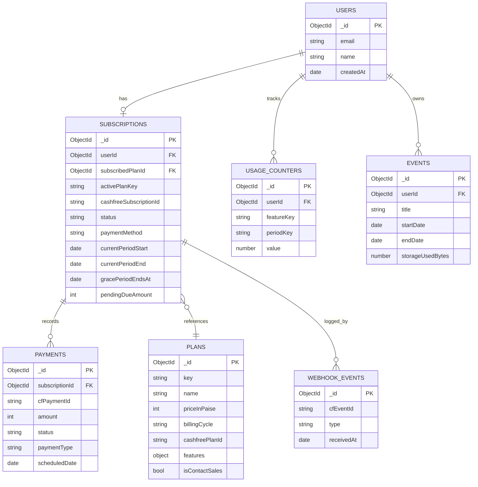

# Subscription billing architecture — Next.js + Better Auth + Cashfree + MongoDB

Stack: Next.js (frontend + backend, App Router), Better Auth (authentication), Cashfree Payments Subscriptions API (UPI Autopay now, e-NACH later), MongoDB (data store).

Goals this design satisfies:

- Recurring monthly billing now, yearly billable cycle addable later without a schema change.
- Non-payment leads to an automatic downgrade to the free plan after a cooling period — never data deletion.
- Entitlement checks (event count, event duration, storage) are config-driven, not hard-coded per plan.
- Payment-provider specific logic (Cashfree today) is isolated behind an adapter so UPI Autopay, e-NACH, or a future provider swap doesn't touch business logic.

---

## 0\. Why this exists — context, requirements, decisions

**What we're building.** A subscription layer for a Next.js SaaS: users sign up free, can subscribe to Starter (₹499/mo), Professional (₹9,999/mo), or Enterprise (sales-assisted), pay via recurring mandate through Cashfree, and get access to product functionality (event creation, event duration, storage) scaled to their plan. Non-payment must degrade access gracefully, not punitively — no data loss, ever, regardless of how long someone doesn't pay.

**Why it's designed this way, not simpler.** The obvious naive approach — an `if (user.plan === 'starter')` check scattered through route handlers, and a webhook handler that directly deletes/blocks a non-paying user — breaks on two things this business explicitly needs: (a) new plans or new gated features arriving later without a redeploy, and (b) a failed payment must never look like an active decision to punish the user, because bank-side failures (temporarily insufficient balance, a re-authentication needed on the UPI app, a lapsed mandate) are common and often not the user's fault or even something they're aware of yet. That's why entitlements are config-driven (§6) and why there's a distinct grace state before any downgrade (§3).

**Functional requirements this design must satisfy:**

- Three self-serve paid tiers (Starter, Professional) plus a sales-assisted Enterprise tier, and a default Free tier for everyone else.
- Recurring monthly billing today; yearly billing addable later without a schema migration.
- UPI Autopay as the payment method today; e-NACH addable later as a second payment method without changing the subscription data model.
- Per-plan limits across at least three independent dimensions (event count, event duration, storage) where some dimensions reset monthly and others are cumulative against the plan — and where more dimensions will be added over time as the product grows.
- If a recurring charge fails, the user keeps paid access for a **14-day grace period** before anything changes.
- If they still haven't paid after 14 days, they're moved to Free-tier limits automatically — but **nothing they've already created or stored is ever deleted or hidden** as a consequence of non-payment. Only _new_ creation/upload is blocked until they pay.
- If they pay their outstanding dues at any point — during the grace period or after being downgraded — they get their original plan's entitlements back immediately, on the same subscription record (not a new signup).
- A user can **upgrade at any time**, and the upgrade should take effect **immediately** (new limits apply right away; the user isn't stuck on old limits until a renewal date) — see §7's upgrade endpoint and §4.5.

**Decisions made for this iteration**:

| Decision            | Value                                                                                                       | Where it shows up                  |
| ------------------- | ----------------------------------------------------------------------------------------------------------- | ---------------------------------- |
| Grace period length | **14 days** from the first failed charge                                                                    | `gracePeriodEndsAt`, §3, §4.3      |
| Upgrade proration   | **Immediate effect** — new plan's limits and billing apply right away, not at next renewal                  | §4.5, `/api/billing/upgrade` in §7 |
| Yearly plans        | Deferred, but zero-schema-change when added — a second Cashfree Plan per tier with `billingCycle: "yearly"` | §2.1, §5.1                         |
| e-NACH              | Deferred, but zero-schema-change when added — `paymentMethod` enum already includes it                      | §2.2                               |

**Explicitly out of scope for this document:** UI/UX of the pricing and billing pages, tax/GST handling on invoices, refund policy specifics, and multi-seat/organization billing (this assumes one subscription per user; extending to per-organization billing would mean keying `subscriptions` on `organizationId` instead of `userId`, which is a moderate but non-trivial change to the design below).

---

## 1\. High-level architecture



**Component roles**

| Component             | Responsibility                                                                                                                                                                                                  |
| --------------------- | --------------------------------------------------------------------------------------------------------------------------------------------------------------------------------------------------------------- |
| Better Auth           | Identity only — sign up, sign in, session. Carries no plan/billing knowledge itself.                                                                                                                            |
| Billing service       | Talks to Cashfree to create plans/subscriptions, initiates checkout, requests cancellation. Never trusts the client for subscription state — only trusts webhooks and its own reads from Cashfree.              |
| Webhook handler       | The single source of truth writer. Verifies signature, deduplicates by event id, updates `subscriptions`/`payments`, is the only place subscription status changes on the paid side.                            |
| Entitlement service   | Reads `plans` (config) + `usageCounters` + `subscriptions.status` before any create/upload action. Plan name never appears in domain code — only feature keys and status.                                       |
| Dunning worker        | Cron job that walks subscriptions in `past_due` and downgrades any that have exceeded the cooling period.                                                                                                       |
| Reconciliation worker | Cron job that periodically re-fetches subscription status from Cashfree for anything stuck in a transitional state — a safety net for missed or delayed webhooks (webhooks can be delayed or, rarely, dropped). |

---

## 2\. Cashfree integration

Cashfree's Subscriptions API (`/pg` base, sandbox: `sandbox.cashfree.com/pg`, production: `api.cashfree.com/pg`) is built around three objects: **Plan** (billing terms), **Subscription** (a mandate tied to a customer + plan), and **Payment** (individual auth/charge events against a subscription).

### 2.1 Plans on your side vs. plans on Cashfree's side

Keep these separate. Your `plans` collection is your product's pricing config (features, limits). Cashfree's plan is purely a billing schedule (amount, interval, currency). Map one to the other:

- Each of your plans × each billing cycle (monthly, and later yearly) = one Cashfree plan, created once via **Create Plan** and its `plan_id` stored on your plan document.
- `PERIODIC` plan type for Starter/Professional (fixed recurring amount on a schedule). Enterprise is sales-assisted — no Cashfree plan needed until a custom contract is negotiated.

### 2.2 UPI Autopay now, e-NACH later

Cashfree's **Create Subscription** endpoint accepts a payment-method preference. For UPI Autopay you don't pass bank account details; Cashfree returns an `authLink` that you redirect the user to (or embed), the user approves the mandate in their UPI app, and Cashfree redirects back to your `returnUrl`. e-NACH follows the same subscription object shape with `payment_method.enach` details (bank account, IFSC, auth mode e.g. Aadhaar/net-banking) instead of UPI — meaning **adding e-NACH later is a new payment-method branch in the checkout call, not a schema change**. Model `subscriptions.paymentMethod` as an open enum (`upi_autopay`, `enach`, `card`) from day one so this is a non-event later.

Store `subReferenceId` (Cashfree's subscription id) immediately after creation — it's required for every subsequent operation (status fetch, cancel, manual charge).

### 2.3 Webhooks you must handle

Register one webhook endpoint; Cashfree sends all subscription lifecycle events to it. The ones this design relies on:

| Webhook                                       | When                                                                                                            | What you do                                                                                                                               |
| --------------------------------------------- | --------------------------------------------------------------------------------------------------------------- | ----------------------------------------------------------------------------------------------------------------------------------------- |
| `SUBSCRIPTION_STATUS_CHANGED`                 | Mandate moves through `BANK_APPROVAL_PENDING → ACTIVE`, or `CUSTOMER_CANCELLED`, `EXPIRED`, `ON_HOLD`, etc.     | Sync `subscriptions.status` and `mandateStatus`.                                                                                          |
| `SUBSCRIPTION_AUTH_STATUS`                    | First authorization (mandate setup) completes, success or fail.                                                 | If success, activate the subscription and grant the paid plan. If fail, leave user on free plan, surface retry CTA.                       |
| `SUBSCRIPTION_PAYMENT_NOTIFICATION_INITIATED` | Cashfree has notified the customer of an upcoming auto-debit (NPCI pre-debit notification requirement for UPI). | Informational — log only.                                                                                                                 |
| `SUBSCRIPTION_PAYMENT_SUCCESS`                | A recurring charge succeeded.                                                                                   | Insert into `payments`, extend `currentPeriodEnd`, clear `past_due`/`pendingDueAmount` if any, reactivate plan if it had been downgraded. |
| `SUBSCRIPTION_PAYMENT_FAILED`                 | A recurring charge failed (insufficient funds, mandate revoked, etc.)                                           | Insert into `payments` with failure reason, set `subscriptions.status = 'past_due'`, start the cooling period (`gracePeriodEndsAt`).      |
| `SUBSCRIPTION_PAYMENT_CANCELLED`              | Customer cancelled the debit in their UPI app before it completed.                                              | Treat like a failed charge for dunning purposes.                                                                                          |
| `SUBSCRIPTION_REFUND_STATUS`                  | Refund outcome.                                                                                                 | Update `payments` refund fields.                                                                                                          |

Every webhook handler run must be **idempotent**: Cashfree can and will redeliver. Use the payload's payment/event identifier (`cf_payment_id`, or a hash of the full payload if no id is present) as a unique key in a `webhookEvents` log collection; if it's already there, acknowledge with 200 and skip reprocessing.

Verify the webhook signature (Cashfree signs payloads — check the signature header against your webhook secret) before trusting any payload. Never update subscription state from a client-side redirect alone; the `returnUrl` is only a UX nicety, the webhook is the source of truth.

---

## 3\. Subscription lifecycle and the cooling period



**Key design decisions this encodes:**

- `past_due` is a distinct state from `downgraded`. In `past_due` the user still has their paid-plan entitlements for a **14-day grace period** (`gracePeriodEndsAt = failedChargeTime + 14 days`) — this avoids punishing a user for a transient bank issue — but sees a payment-due banner. Only once the 14 days elapse without a successful payment do they lose paid-plan entitlements.
- `downgraded` is _not_ the free plan document — it's the paid `subscriptions` document with a flag (`status: 'downgraded'`) and `activePlanKey` pointing at `free` while `subscribedPlanKey` still points at the paid plan and `pendingDueAmount` remains set. This distinction matters: when the user pays, you reactivate the _same_ subscription and its history, you don't create a fresh one.
- **No data deletion ever happens automatically.** Downgrading only changes what `checkEntitlement()` allows going forward (blocks new event creation once free-tier limits are exceeded, blocks new uploads). Existing events and stored data remain exactly as they are and remain readable/exportable. This is enforced by keeping delete operations entirely separate from the billing system — nothing in the dunning worker ever touches the `events` or file-storage collections.
- The grace period is a config value (`DUNNING_GRACE_PERIOD_DAYS = 14`), not a hard-coded constant scattered across the codebase, in case it needs tuning later (e.g. shorter for a future plan, or configurable per plan tier).

---

## 4\. Sequence diagrams

### 4.1 Subscribing (UPI Autopay mandate setup)



### 4.2 Recurring charge — success path



### 4.3 Recurring charge fails → cooling period → downgrade



### 4.4 Reactivation after late payment



### 4.5 Upgrading — immediate effect

Cashfree mandates aren't mutated in place for a plan change, so an upgrade is cancel-the-old-mandate + create-a-new-one. "Immediate effect" means all of this — cancellation, new mandate, first charge on the new plan, and the entitlement switch — happens synchronously in the upgrade request, not deferred to the next renewal date.



**What "immediate effect" means concretely here, so it isn't ambiguous later:**

- `activePlanKey` flips to the new plan the moment the new mandate's first charge succeeds — the user does not wait for their old `currentPeriodEnd` to arrive.
- The new plan's **full price is charged now** (the first charge on the newly created Cashfree subscription); this design does not compute a proration credit for the unused remainder of the old billing cycle. If a prorated credit is wanted later, that's an additive change (compute `unusedDays / cycleDays * oldPlanPrice`, store it as a credit balance applied to the next invoice) — flagged here as a deliberate simplification, not an oversight.
- `usageCounters` are **not reset** on upgrade — a user who created 5 of their 7 allowed Starter events this month and upgrades to Professional simply now has headroom up to 28; the counter value carries forward unchanged, only the limit it's compared against changes (because `checkEntitlement` reads the limit from `activePlanKey`'s plan document at check-time, not at counter-write-time).
- Because Cashfree requires re-authorization for a brand-new mandate, there's an unavoidable UX step (the user approves again in their UPI app) even though _entitlement-wise_ the upgrade is immediate from the moment they click — worth surfacing in the UI copy so it doesn't feel like a bait-and-switch on "immediate."

---

## 5\. MongoDB schema



> Naming note: your product's domain object is also called an "event" (the thing users create with a date range). To avoid confusion with Cashfree _webhook_ events in code and docs, this design calls the audit-log collection `webhookEvents` and keeps the domain collection as `events`.

### 5.1 Collections and fields

**`users`** — owned by Better Auth's MongoDB adapter. Don't hand-roll this; let Better Auth manage its own user/session/account collections and reference `userId` from your own collections.

**`plans`**

```
{
  _id,
  key: "starter" | "professional" | "enterprise" | "free",
  name: "Starter",
  priceInPaise: 49900,          // ₹499.00, store money as integer paise — never floats
  billingCycle: "monthly" | "yearly",
  cashfreePlanId: "STARTER_MONTHLY_V1",   // null for free / enterprise
  features: {
    maxEventsPerPeriod: 7,
    eventPeriod: "monthly",              // reset cadence for the count
    maxEventDurationDays: 7,
    storageCapBytes: 107374182400,       // 100 GB
    storageResetPeriod: "none"           // cumulative against the plan, not reset monthly
  },
  isContactSales: false,
  active: true,
  createdAt, updatedAt
}
```

Adding a feature later (e.g. `maxExportsPerMonth`) is one field addition here — no code deploy needed to change limits, only to introduce a brand-new feature key.

**`subscriptions`** — one open (non-cancelled) subscription per user; enforce with a partial unique index.

```
{
  _id,
  userId,                       // ref users
  subscribedPlanId,             // ref plans — the plan they're paying for
  activePlanKey: "starter",     // what entitlements actually apply right now;
                                 // equals subscribedPlanId's key unless status='downgraded' (then 'free')
  cashfreeSubscriptionId,       // cf_subscription_id
  cashfreeSubReferenceId,       // subReferenceId, needed for all follow-up calls
  status: "incomplete" | "active" | "past_due" | "downgraded" | "cancelled" | "expired",
  paymentMethod: "upi_autopay" | "enach" | "card",
  billingCycle: "monthly" | "yearly",
  currentPeriodStart,
  currentPeriodEnd,
  nextChargeDate,
  gracePeriodEndsAt: null,      // set when status becomes past_due
  pendingDueAmount: 0,          // in paise
  createdAt, updatedAt
}
```

Indexes: `{ userId: 1 }` unique-ish (partial, excluding cancelled), `{ cashfreeSubscriptionId: 1 }` unique, `{ status: 1, gracePeriodEndsAt: 1 }` for the dunning worker's scan.

**`payments`** — append-only ledger of every auth/charge attempt.

```
{
  _id,
  subscriptionId, userId,
  cfPaymentId, cfOrderId, cfTxnId,
  paymentType: "AUTH" | "CHARGE",
  amount, currency: "INR",
  status: "initialized" | "success" | "failed" | "cancelled",
  scheduledDate, initiatedDate,
  failureReason,
  rawPayload,                   // keep the full webhook body for audit/debugging
  createdAt
}
```

Index: `{ cfPaymentId: 1 }` unique — doubles as an idempotency guard.

**`webhookEvents`** — dedup/audit log, independent of `payments` so you can trace raw deliveries.

```
{ _id, cfEventId, type, payloadHash, receivedAt, processedAt }
```

Index: `{ cfEventId: 1 }` unique.

**`usageCounters`**

```
{ _id, userId, featureKey: "events_created", periodKey: "2026-09", value: 5 }
{ _id, userId, featureKey: "storage_bytes", periodKey: "lifetime", value: 73400320000 }
```

Index: `{ userId: 1, featureKey: 1, periodKey: 1 }` unique.

**`events`** (your domain object — unrelated to billing webhooks)

```
{ _id, userId, title, startDate, endDate, storageUsedBytes, createdAt }
```

---

## 6\. Entitlement enforcement

Every create/upload route calls one function before acting. It never checks plan name — only feature keys, current usage, and subscription status.

```ts
// lib/entitlements.ts
async function checkEntitlement(userId: string, featureKey: string, amount = 1) {
  const sub = await db
    .collection("subscriptions")
    .findOne({ userId, status: { $ne: "cancelled" } });
  const activePlanKey = sub?.activePlanKey ?? "free"; // no subscription doc yet = free
  const plan = await db.collection("plans").findOne({ key: activePlanKey });
  const limit = plan.features[featureKey];
  if (limit == null) return { allowed: true }; // feature not gated

  const periodKey =
    plan.features[`${featureKey}Period`] === "monthly"
      ? currentMonthKey() // e.g. "2026-09"
      : "lifetime";

  const usage = await db.collection("usageCounters").findOne({ userId, featureKey, periodKey });
  const used = usage?.value ?? 0;

  if (used + amount > limit) {
    return {
      allowed: false,
      reason:
        sub?.status === "downgraded"
          ? "Your plan was downgraded due to a payment issue. Pay outstanding dues to restore your limits."
          : "Plan limit reached.",
    };
  }
  return { allowed: true, remaining: limit - used - amount };
}
```

Increment `usageCounters` inside the same transaction/write as the domain action (creating the event, recording the upload size) — never as a separate best-effort step, or counts drift under retries.

---

## 7\. API endpoint reference

### Your Next.js route handlers

| Method & path                       | Purpose                                                                                                                                                                                                                                                                     |
| ----------------------------------- | --------------------------------------------------------------------------------------------------------------------------------------------------------------------------------------------------------------------------------------------------------------------------- |
| `POST /api/billing/checkout`        | Body `{ planKey, billingCycle }`. Creates a `subscriptions` doc (`incomplete`), calls Cashfree Create Subscription, returns `authLink`.                                                                                                                                     |
| `POST /api/billing/webhook`         | Cashfree's single webhook target. Verifies signature, dedupes via `webhookEvents`, updates `subscriptions`/`payments`. Must respond `200` fast — do slow work (emails) async.                                                                                               |
| `GET /api/billing/subscription`     | Returns the current user's subscription, active plan, usage summary — powers the billing settings page.                                                                                                                                                                     |
| `POST /api/billing/retry-charge`    | For a `past_due`/`downgraded` user — triggers an on-demand charge against the existing mandate.                                                                                                                                                                             |
| `POST /api/billing/cancel`          | Calls Cashfree to cancel the mandate; sets `status = cancelled` once the `SUBSCRIPTION_STATUS_CHANGED` webhook confirms `CUSTOMER_CANCELLED`.                                                                                                                               |
| `POST /api/billing/upgrade`         | Cancels the existing Cashfree subscription and creates a new one on the target plan (Cashfree mandates are generally not mutated in place for a plan change — treat upgrade as cancel-old + create-new, keep `subscriptions` history via a `previousSubscriptionId` field). |
| `POST /api/events`                  | Domain route — calls `checkEntitlement(userId, "events_created")` and `checkEntitlement(userId, "event_duration_days", durationDays)` before creating.                                                                                                                      |
| `POST /api/events/:id/upload`       | Calls `checkEntitlement(userId, "storage_bytes", fileSizeBytes)` before accepting an upload.                                                                                                                                                                                |
| `POST /api/internal/cron/dunning`   | Invoked by your scheduler (Vercel Cron / a hosted cron pinging with a secret header). Runs the `past_due → downgraded` sweep.                                                                                                                                               |
| `POST /api/internal/cron/reconcile` | Re-fetches subscription status from Cashfree for anything stuck `incomplete` or `past_due` beyond an expected window, as a webhook-miss safety net.                                                                                                                         |

### Cashfree endpoints you call

| Endpoint                                                                                            | Used for                                                                                              |
| --------------------------------------------------------------------------------------------------- | ----------------------------------------------------------------------------------------------------- |
| `POST /pg/subscriptions/plans`                                                                      | Create a Plan (one-time setup per plan × billing cycle).                                              |
| `POST /api/v2/subscriptions/nonSeamless/subscription` (or the newer v2025-01-01 Subscriptions path) | Create a Subscription (mandate) for a customer against a plan. Returns `authLink` + `subReferenceId`. |
| `GET /pg/subscriptions/{subscription_id}`                                                           | Fetch current status — used by the reconciliation worker.                                             |
| `POST /pg/subscriptions/{subscription_id}/payments` (on-demand charge)                              | Trigger the retry charge from `/api/billing/retry-charge`.                                            |
| `POST /pg/subscriptions/{subscription_id}/cancel`                                                   | Cancel a mandate.                                                                                     |

---

## 8\. Background jobs

- **Dunning worker** — runs at least daily (hourly is safer for a short grace period): `subscriptions.find({ status: "past_due", gracePeriodEndsAt: { $lt: now } })` → set `status: "downgraded"`, `activePlanKey: "free"`. Fire a notification email at this point and, ideally, one or two reminder emails during the grace period itself (e.g. day 1 and day N-1).
- **Reconciliation worker** — runs every few hours: any subscription stuck in `incomplete` for more than ~1 hour, or `past_due` for longer than expected without a webhook resolving it, gets an explicit `GET` status check against Cashfree and is corrected. This exists because webhook delivery, while reliable, is not a guarantee — treat it as eventually-consistent, not transactional.
- Both jobs should be idempotent and safe to run concurrently (use `findOneAndUpdate` with the expected prior status in the filter, not read-then-write).

---

## 9\. Security and correctness notes

- **Verify every webhook signature** against your Cashfree webhook secret before touching the database.
- **Idempotency everywhere**: webhook processing keyed on `cfEventId`/`cfPaymentId`; usage increments as atomic `$inc` operations, never read-modify-write in application code.
- **Never delete on downgrade.** The only thing the dunning worker is allowed to write is `subscriptions.status` and `activePlanKey`. Keep this enforced by code review / a lint rule if possible — it's the single most important invariant in this design given your requirement.
- **Money as integers** (paise), never floats, in both `plans.priceInPaise` and `payments.amount`.
- **TPV (third-party validation)**: if you ever pass bank account details at subscription creation to lock the mandate to a specific account, remember it applies to eNACH/UPI Autopay only, not cards.

---

## 10\. Decisions and what's still open

**Resolved for this iteration** (see also the table in §0):

1.  **Grace period = 14 days**, starting from the first `SUBSCRIPTION_PAYMENT_FAILED`. Note Cashfree/NPCI itself may retry a failed UPI debit before that webhook even fires, so the _effective_ time a user has before losing access can be slightly longer than 14 days from the very first attempted debit — worth mentioning in support copy so it isn't a surprise.
2.  **Upgrades take immediate effect** — new mandate created and charged right away, entitlements switch the moment the new mandate's first charge succeeds, no proration credit computed for the unused portion of the old cycle (see §4.5 for exactly what this does and doesn't cover).
3.  **Yearly plans** — deferred but zero-schema-change: a second Cashfree Plan per tier with `billingCycle: "yearly"`.

**Decisions:**

- **Downgrade path (self-serve, not non-payment)** — this document covers non-payment-triggered downgrade in detail, but a user voluntarily moving from Professional to Starter is a different flow with its own question: what happens if their current usage already exceeds the lower plan's limits (e.g. 15 events created this month, moving to a 7-event plan)?  
  Go with this approach: allow the downgrade, don't retroactively block anything already created, but block new creation until usage naturally falls under the new limit next period — require confirmation of the consequence.
- **Reminder email (also in other connected channels like whatsapp) cadence** during the 14-day grace period (this doc assumes day 1 / day 5 / day 7 / day 11 / day 13 as a starting point in §4.3).
- **Enterprise contract → subscription record** — since Enterprise is sales-assisted with no Cashfree plan, a signed Enterprise deal gets represented (a manually-inserted `subscriptions` doc with `paymentMethod: "manual"` or `"invoice"` and no `cashfreeSubscriptionId` is the simplest option, and fits the schema in §5.1 without changes).
