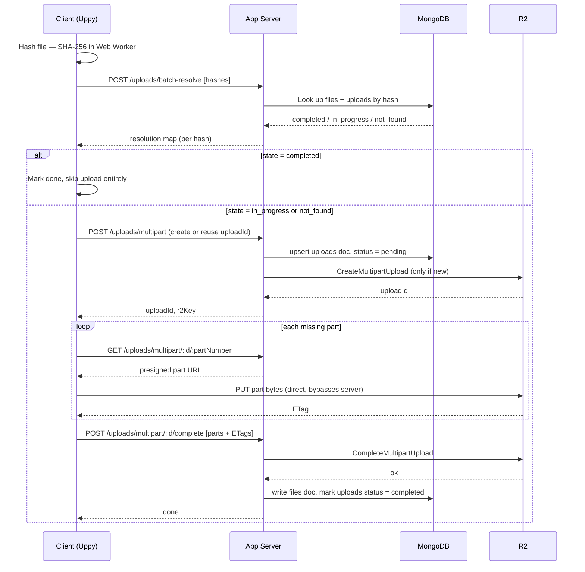
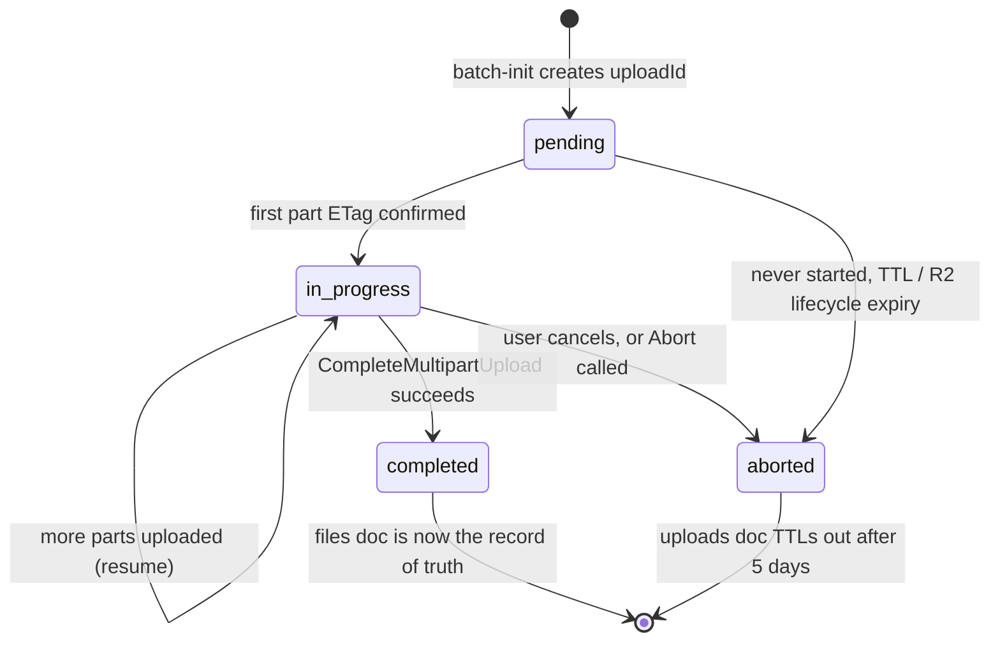

# Resumable, deduplicated bulk image upload — complete flow (v2)

This builds directly on the earlier spec (`resumable-upload-spec.md`). It adds the full Uppy wiring, the exact API surface, a finalized MongoDB schema (with one deliberate simplification explained below), and a queue recommendation.

---

## 1\. Complete flow



The single-file path (< 8MB) is the same diagram minus the part loop: one `POST /uploads/params` call replaces `create multipart` + the loop, and completion happens on the R2 PUT response itself rather than a separate complete call.

## 2\. Status lifecycle



`pending` and `in_progress` are both "not done yet" from the client's perspective — the distinction only matters server-side (has R2 seen any bytes for this uploadId or not).

---

## 3\. How Uppy is used, precisely

Uppy's `@uppy/aws-s3` plugin (v4+) doesn't send bytes through your server — it expects **you to implement a handful of functions** that return presigned URLs and multipart metadata; Uppy calls them at the right moments and handles chunking, parallelism, retry/backoff itself. This maps directly onto our API surface (section 4).

```js
import Uppy from "@uppy/core";
import AwsS3 from "@uppy/aws-s3";
import Restrictions from "@uppy/core"; // restrictions are core options, not a plugin

const uppy = new Uppy({
  restrictions: {
    allowedFileTypes: ["image/*"],
    maxFileSize: 100 * 1024 * 1024, // 100MB ceiling
  },
  onBeforeFileAdded: (file) => {
    // file.meta.contentHash and file.meta.resolution must already be set
    // by our pre-check step (section on gating below) before addFile() is called
    file.id = file.meta.contentHash; // override Uppy's default name/size/type fingerprint
    return file;
  },
}).use(AwsS3, {
  shouldUseMultipart: (file) => file.size >= 8 * 1024 * 1024,

  // --- single-file path (< 8MB) ---
  getUploadParameters: async (file) => {
    const res = await fetch("/uploads/params", {
      method: "POST",
      body: JSON.stringify({ hash: file.meta.contentHash, size: file.size }),
    });
    return res.json(); // { method: "PUT", url, headers }
  },

  // --- multipart path (>= 8MB) ---
  createMultipartUpload: async (file) => {
    const res = await fetch("/uploads/multipart", {
      method: "POST",
      body: JSON.stringify({
        hash: file.meta.contentHash,
        size: file.size,
        // if our earlier batch-resolve already found an in-progress uploadId,
        // pass it through so the server reuses it instead of creating a new one
        existingUploadId: file.meta.resolution?.uploadId ?? null,
      }),
    });
    return res.json(); // { uploadId, key }
  },

  listParts: async (file, { uploadId, key }) => {
    const res = await fetch(`/uploads/multipart/${uploadId}/parts?key=${key}`);
    return res.json(); // [{ PartNumber, ETag, Size }, ...] — sourced from R2 directly, see section 5
  },

  signPart: async (file, { uploadId, key, partNumber }) => {
    const res = await fetch(`/uploads/multipart/${uploadId}/${partNumber}?key=${key}`);
    return res.json(); // { url }
  },

  completeMultipartUpload: async (file, { uploadId, key, parts }) => {
    const res = await fetch(`/uploads/multipart/${uploadId}/complete`, {
      method: "POST",
      body: JSON.stringify({ key, parts }), // parts = [{ PartNumber, ETag }]
    });
    return res.json();
  },

  abortMultipartUpload: async (file, { uploadId, key }) => {
    await fetch(`/uploads/multipart/${uploadId}?key=${key}`, { method: "DELETE" });
  },
});
```

**What Uppy is handling for you here:** part-level retry with backoff, parallel part uploads, expired-URL re-signing on retry (it calls `signPart` again), pause/resume within a session, and progress events. **What still sits outside Uppy:** the hash computation and the `batch-resolve` pre-check — these must run _before_ `uppy.addFile()`, so files that resolve to `"completed"` are never handed to Uppy at all, and files that resolve to `"in_progress"` are added with their known `uploadId` in `file.meta` so `createMultipartUpload` can reuse it instead of starting over.

```js
// gating step — runs before any file reaches Uppy
async function addFilesToUppy(files) {
  const hashed = await Promise.all(
    files.map(async (f) => ({
      file: f,
      hash: await hashInWorker(f),
    }))
  );

  const resolution = await batchResolve(hashed.map((h) => ({ hash: h.hash, size: h.file.size })));

  for (const { file, hash } of hashed) {
    const state = resolution[hash];
    if (state.state === "completed") {
      markFileDone(file, state.r2Key); // skip Uppy entirely
      continue;
    }
    uppy.addFile({
      name: file.name,
      type: file.type,
      data: file,
      meta: { contentHash: hash, resolution: state }, // resolution.uploadId if in_progress
    });
  }
}
```

Optional plugins: `@uppy/dashboard` or `@uppy/progress-bar` for UI; `@uppy/golden-retriever` if you want same-tab, same-session reload recovery on top of the cross-session resume our own hash layer already provides (it's a nice-to-have, not load-bearing, since our design already covers the case it's meant for).

We are **not** running Uppy's Companion server — Companion is mainly for pulling files from third-party sources (Google Drive, Dropbox) via OAuth. For direct-to-R2 signed uploads, implementing the six hook functions above against your own server is the standard, lighter-weight approach.

---

## 4\. API endpoints

| Endpoint                                   | Method | Purpose                                                                  | Called by                                  |
| ------------------------------------------ | ------ | ------------------------------------------------------------------------ | ------------------------------------------ |
| `/uploads/batch-resolve`                   | POST   | Dedup + resume pre-check, batched across hashes                          | Client, before any file is added to Uppy   |
| `/uploads/params`                          | POST   | Presigned PUT URL for single-file upload (< 8MB)                         | Uppy `getUploadParameters`                 |
| `/uploads/multipart`                       | POST   | Create R2 multipart upload, or return an existing `uploadId` if resuming | Uppy `createMultipartUpload`               |
| `/uploads/multipart/:uploadId/parts`       | GET    | List parts already uploaded for this `uploadId`                          | Uppy `listParts`                           |
| `/uploads/multipart/:uploadId/:partNumber` | GET    | Presigned URL for one specific part                                      | Uppy `signPart`                            |
| `/uploads/multipart/:uploadId/complete`    | POST   | `CompleteMultipartUpload` on R2, write permanent `files` doc             | Uppy `completeMultipartUpload`             |
| `/uploads/multipart/:uploadId`             | DELETE | `AbortMultipartUpload`, mark `uploads.status = aborted`                  | Uppy `abortMultipartUpload` (user cancels) |

Seven endpoints total, six of which map 1:1 to Uppy's required hook functions — nothing extra to invent there. The only endpoint that exists purely for our own dedup/resume logic, outside Uppy's normal flow, is `batch-resolve`.

---

## 5\. MongoDB collections

### `uploads` — in-progress tracking

```js
{
  _id: ObjectId,
  fileHash: String,       // sha256, indexed
  createdBy: ObjectId,    // scopes the upload to a user — see note below
  r2Key: String,
  uploadId: String,       // R2 multipart id, null for single-PUT mode
  mode: "single" | "multipart",
  status: "pending" | "in_progress" | "completed" | "aborted",   // yes — needed
  fileSize: Number,
  fileName: String,       // original filename, display/audit only — never used as identity
  mimeType: String,
  createdAt: Date,
  updatedAt: Date,
  completedAt: Date | null
}
```

**Yes, there's a status field** — it's what `batch-resolve` reads to answer `in_progress` vs the state diagram in section 2. `files` doesn't need one: a document existing there _means_ completed, since it's only ever written once, at the end.

**Scoping note:** index on `{ fileHash: 1, createdBy: 1 }`, not `fileHash` alone. If two different users happen to upload identical content concurrently, you don't want user B's client silently attaching to user A's in-progress `uploadId` — that's an ownership/permissions problem, not a dedup one. Cross-user dedup only happens at the `files` layer, once content is confirmed complete; in-progress sessions stay per-user.

### `files` — permanent, the actual dedup source of truth

```js
{
  _id: ObjectId,
  fileHash: String,       // unique index — this is the dedup key
  r2Key: String,
  fileSize: Number,
  mimeType: String,
  createdAt: Date
}
```

If multiple users can end up "owning" the same deduplicated content (two people upload the identical image), keep that relationship in a separate, small join collection rather than mutating `files` per reference:

```js
// file_references — optional, only needed if content can have multiple owners
{
  fileHash: String,
  ownerId: ObjectId,
  linkedAt: Date
}
```

This keeps `files` canonical and immutable per hash, and avoids array-append writes on every dedup hit.

### `upload_parts` — dropped, in favor of R2 as source of truth

The earlier spec had a separate `upload_parts` collection, written to per-part, used to answer "which parts survived" on resume. **Recommend dropping it**, for two reasons:

1.  Uppy's `listParts` hook is naturally suited to just proxy R2's own `ListParts` API — R2 already knows exactly which parts it has; querying it directly removes the entire "ambiguous case" from the earlier discussion (part landed on R2, but our DB write for it never happened because the client crashed in between). There's no in-between state to get out of sync anymore.
2.  It removes a per-part Mongo write on every single chunk, which matters at volume.

```js
// server implementation of listParts
async function listParts(uploadId, key) {
  const res = await r2.send(new ListPartsCommand({ Bucket: BUCKET, Key: key, UploadId: uploadId }));
  return res.Parts.map((p) => ({ PartNumber: p.PartNumber, ETag: p.ETag, Size: p.Size }));
}
```

Trade-off: one extra R2 API call on resume instead of a Mongo read. Given resumes are the exception, not the steady-state path, this is a good trade. If you later find R2 API latency on `ListParts` is a bottleneck for a specific high-resume-rate use case, reintroducing a lightweight parts cache is a localized change, not a redesign.

### TTL indexes — unchanged

```js
db.uploads.createIndex({ createdAt: 1 }, { expireAfterSeconds: 5 * 86400 }); // 5 days
```

`files` has no TTL — permanent. R2's own lifecycle rule (7 days, aborting incomplete multipart uploads) remains the independent backstop, staggered after Mongo's TTL as before.

&nbsp;
